# 6 Administration settings

## 6.1 Users

This chapter shows user administration, their assignment to individual user groups and permission sets.

### 6.1.1 User

#### 6.1.1.1 Set up users

By clicking on New, please enter a name for each new user and assign a password to each user (in the Detail Content).
You will also need to define the appropriate user roles for each user in the Detail Content by specifying if the user acts as Viewer, Author and/or Approver.
You can assign a user to a number of user groups.

In the case of an AD connection via SAML users are automatically created with Viewer rights.

#### 6.1.1.2 Consolidate users

Users can be consolidated via the consolidate button: 

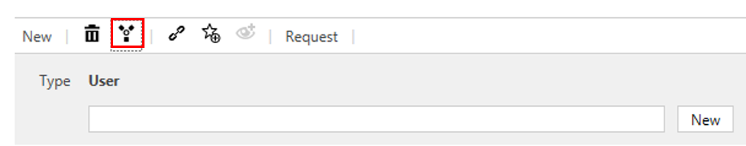

In the dialog which then appears, please choose the elements you want to consolidate with the master element and click OK.

The process of consolidating users cannot be reversed.

### 6.1.2 User groups

#### 6.1.2.1 Set up user groups

You set up user groups in the same way as you create users. Click the User groups tile.
After you have created the user group using the New option and have assigned a name to the group, you can select the users for this group in the Detail Content area. Click the hamburger icon on the Users screen to display a list with all users. Select the required users and click OK. 

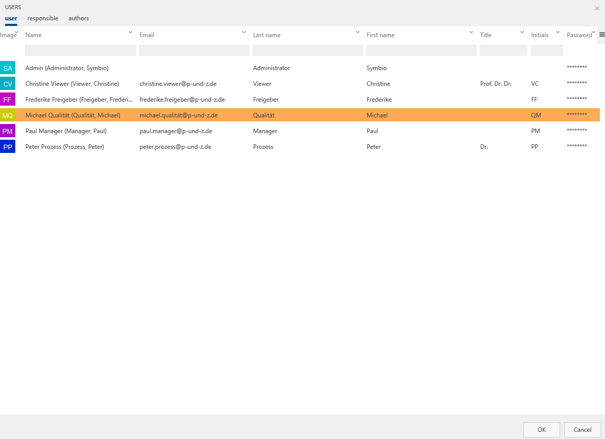

SAML user groups additionally have Application Roles which sets the Application roles of their user/members if SAML group management is activated.

#### 6.1.2.2 Consolidate user groups

Users can be consolidated in the same way es users - via the consolidate button. 

In the dialog which then appears, please choose the elements you want to consolidate with the master element and click OK.

The process of consolidating user groups cannot be reversed.

### 6.1.3 Permissions

Until Symbio 1807 permissions can be set to Viewer to make the content visible only for a certain group or to author the content for editing.  
If the user group has been defined for the viewer, only the corresponding users are allowed seeing the contents. The following applies to the authors: only registered users of the group are authorized to edit this content and to view.

Since Symbio 1808 the permissions feature has been heavily extended by introducing permission sets. After you have created a Symbio storage collection and Symbio storage, you may want to provide or restrict user access to the storage or its contents. For example, you might want to provide access only to specific members of your team, or you might want to provide access to everyone, but restrict editing for some. The easiest way to work with permissions is to create user groups and permission sets, which will help you create fine-grained permissions that suit your specific needs. Permissions in Symbio are in tight relation to application roles that distinct between different user roles in the system. This document will in detail explain how, both application roles and permissions work together and how permissions cascade through Symbio object hierarchies.

The following chapter describes Symbio 1808 permission sets feature.

#### 6.1.3.1 Application roles

When creating users in Symbio it is important that you define application roles for each user. Symbio supports following application roles:

- Viewer
- Author
- Approver
- Architect
- Administrator

Each application role has rights that are specific for that role and must be considered when working with permissions.

Viewer:
- Has right to navigate process landscape in process portal
- Has right to navigate repository
- Has right to search for content
- Has right to create manual or guide for the organization
- Has right to create link to processes

Author:
- Has right to model sub processes (create sub processes)
- Has right to make sub processes and repositories available for release
- Can modify only processes that he created or processes where he is defined as additional author. Processes which don't have author defined can also be edited
- Has right to create their own repository objects
- Has right to connect existing repository objects to process

Approver:
- Has right to delegate decision about releasing or rejecting process or object to another person
- Has right to reject the release
- Has right to accept process or repository object to release it

Architect:
- Has right to create processes with Categories and Main Processes
- Has right to create repository objects 
- Has right to setup process house
- Has right to modify and create objects with a hierarchical structure (organization, it, guidelines), repository objects with tabular structure (roles, input/output) and global tasks

Administrator:
- Has right to change every process and object in Symbio
- Has right to administer users, user groups and permission sets
- Has right to administer every aspect of Symbio configuration

For details about each of these roles please refer to Symbio Manual. 

Application roles work together with permissions which will be in detailed explained in this document.

#### 6.1.3.2 Permission sets

Permission sets allow you to quickly and easily provide common levels of permissions for one user or group of users. Permission sets define permissions that apply to processes and other elements that use permissions in Symbio. Available permissions are: New element. Edit element, Show element, Delete element, Open element, Approve element.

Symbio provides several default permissions sets that can be used for most scenarios. Default permission sets with its permissions are shown in table below:

Some permissions are part of Symbio application roles functionalities. These special permissions always force their rules as they are defined in application roles. There are two type of rules.

1. Rules that define what is forbidden in Symbio application – these restrictions cannot be later altered with permissions sets. 
2. Rules that define what user can do – this can be additionally altered with permissions sets.

Examples:
1. Application role Author has defined rule that Author role cannot create Categories or Main Processes. This cannot be modified with New Element permissions defined in permission set for user. Application role Author has also rule, that sub process can be created, but this rule can be altered with permissions, if we remove New Element from permission set then, user won't be able to create Sub process as well.

2. Application role Author has defined rule that he cannot edit processes that other authors created. Adding permission that has Editing permission to the user won't change this rule that was defined by application role Author.

##### 6.1.3.2.1 Overview permissions and inheritance

When working in Symbio you deal with lot of different types of objects: Processes (main processes, sub processes, categories), Risks, Organizations, Products, Systems, Documents, Customers, Projects etc. Some of these objects are organized into hierarchies and on top of every hierarchy lays top-level object. These top-level elements are called root objects. For example, top level object of processes hierarchy is Process house. Permissions can be applied to any element in object hierarchy except the root element that should be accessible to all users.

##### 6.1.3.2.2 Inheritance

An important concept to understand is permissions inheritance. By design, all object that exist in process hierarchies inherit the permissions settings of the parent element in hierarchy. When you assign unique permissions to objects that are lower in hierarchy those objects no longer inherit permissions from their parent object. Instead of that they have their own permissions and inheritance can be applied for their children, too.

##### 6.1.3.2.3 Permission sets administration

Administration of Permission sets is in Admin area of Symbio storage. 
If user log in as Administrator, and switches in Editor mode, he needs to go to Admin panel in right upper corner. 

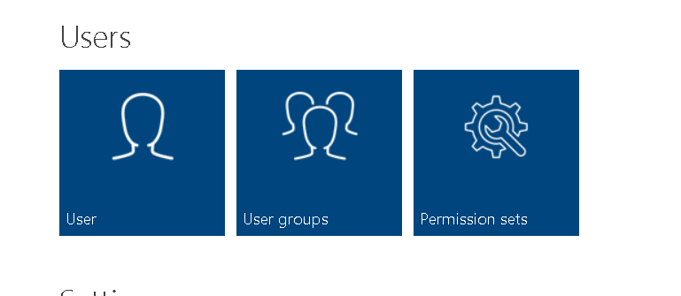

After opening admin panel, you can see all groups (Picture 2) that you can administrate. In this case you need Users group. Administration of permissions is done through tree menu items: 
1.	User, 
2.	Users group and 
3.	Permission sets. 

Administration of users provide options for creating new or modifying existing Symbio users. All information for users is entered here: personal data, password, application roles etc.

Administration of user groups provide options for creating new and modifying existing user groups. User groups are used to group users with same permissions to groups, to make administration of permissions easier. User groups are connected to permission sets as well as users, making the connection between them.

Administration of permission sets provide options for creating new and modifying existing permission sets. Selected permissions can be grouped together into permission sets to make administration of permissions easier. After you define permission sets they can be added to users or to user groups.

##### 6.1.3.2.4 Administration of users

Administration of users can be found in administration area of Symbio storage. If user is logged in as Administrator, and connected to Editor mode, he can access Admin panel in right upper corner.

After opening admin panel, all items for administration are shown. In this case you need to choose Users menu. By choosing Users, administration of Users will be open. All users that are already created are shown in the grid. When User is selected, on the right side, in Detail content, all options that can be changed for that user will be shown.

Very important option for permissions, that can be set for users, is Application roles option. Please refer to user manual for description of other options that are available for users.

To modify User groups and Permission sets of the User, you need to select User in grid and after that you need to click on Change permission button (Change permission button is located in the toolbar), and it will open dialog box for editing permission sets of the user. 

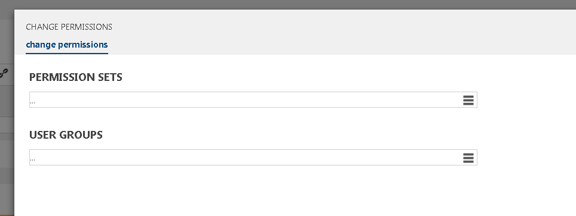

In this dialog box permissions sets and user groups are assigned to the selected user. One or more Permission sets can be added to the User, as well as one or more user groups, but User can have no Permission sets, and/or no User groups, as well. One user can be added in more than one user group. Dialog box for administrating User has two options that can be added or changed. Permission Sets and User groups. To add new permission sets, you need to click on permission sets hamburger icon, and new dialog for selecting permission sets will be open. 

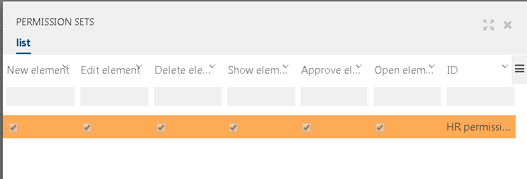

If permission set assigned to user needs to be removed, user needs to hover over permission until trash can is shown. Clicking on it, system will ask to approve that user want to remove that permission set from user group. After approval, permission set will be removed from the list. 

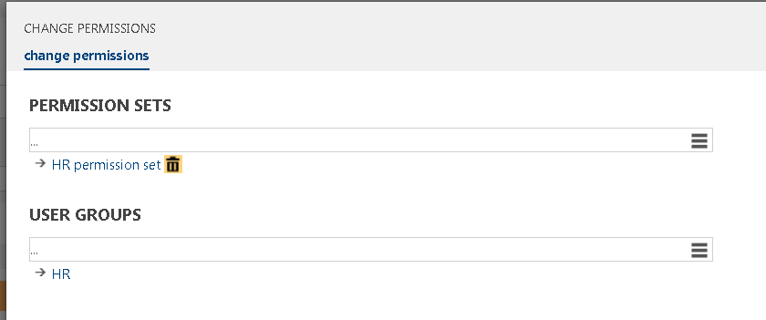

When we add permission sets to a user we define default permission sets for that user. These permission sets are applied on all elements in Symbio, where no specific rights are applied to elements. It is necessary to have in mind that rights that are assigned by default permissions, additionally can be altered by application roles that are assigned to the user. Permission sets can only limit rights that are assigned by application roles and in no case cannot extend them. One user can have more than one Permission sets. In that case, union of all permissions contained in those permission sets, will be applied to that user. In other words, user will have permissions from all Permissions sets assigned to him.

User can be added to the User group, which will be explained below in Administrating User Group chapter, and User group can be assigned to the User. That can be done using dialog box Change permissions. 
After clicking on User groups, new dialog box will be opened, and new user group can be assigned to the User, that user will be in that User group. User groups can be removed from the list the same as it is explained for removing permission sets above. 

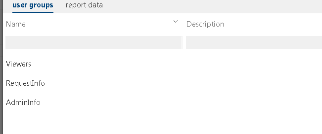

More than one User group can be assigned to the User. That means that one User can be assigned to more different User groups that have different Permission sets. Each User group will give User some specific permissions in the system, and they can, but don’t have to, exclude themselves  . In other chapters it will be seen how users can have different permissions depending on membership in User groups.

##### 6.1.3.2.5 Administration of User groups

To edit user group and add or edit Permission sets of the user group, you need to select desired row and clicks on Change permission button. Change permission button is located in the toolbar, and it opens dialog box for editing permission sets of user group. 

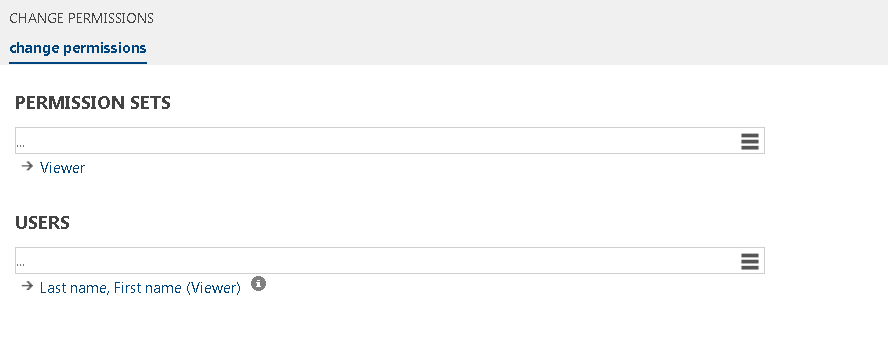

Dialog box for administrating User group, is similar to dialog box for editing Permission sets with similar options. There are two options that can be added or changed. Permission Sets and Users. To add new permission sets, you need to click on hamburger on the right side of permission sets part, and new dialog for selecting permission sets will be open. 

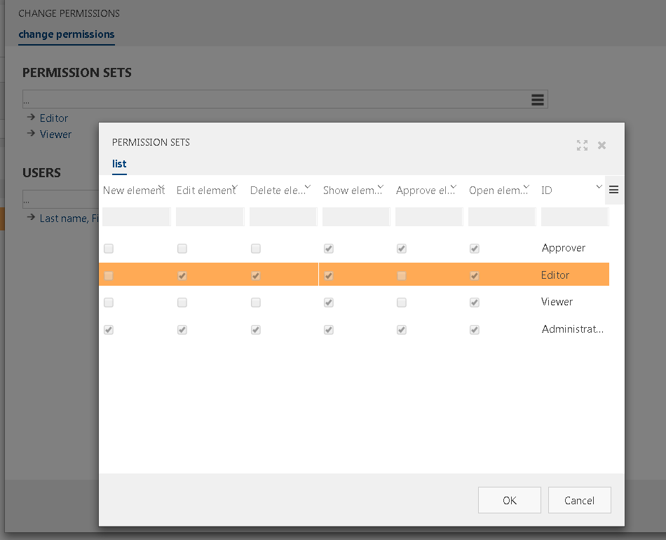

It is possible to navigate to Permission sets list directly from this dialog box, by clicking on the linked name of that Permission set. After clicking on the link, system will open the list of all Permission sets and selected Permission set marked with orange colour. From there you can further administrate Permission sets.

One or more users can be added by selecting hamburger on the right side of Users lookup field. New dialog will be open, and user can be added to current user group. 

User groups are used to set special permissions to the object, and that will be explained below in chapter “Permissions on objects”.

##### 6.1.3.2.6 Administration of permission sets

Permission sets can be created, edited or deleted. All permission sets are showed in list when user is logged in as Administrator.

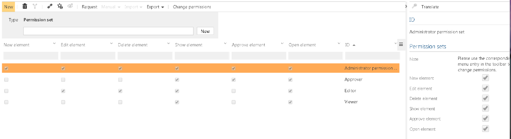

After selecting permission set in list, details of that permission set will be displayed in Detail content on the right side, showing what permission sets are selected. To edit permission set, user needs to select desired permission set, and click on Change permission button, that is in the toolbar, when the new dialog, for editing permission set, will be open. 

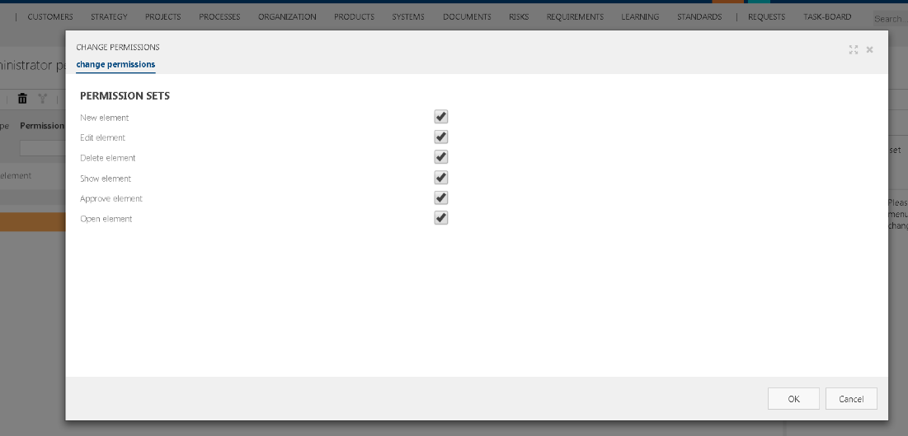

Here user can select or deselect permission set options. 

New element – the user will have permission to see, open, create new and edit the element, New element option cannot be selected separately, all Edit element, Show element and Open element will be automatically selected

Edit element – the user will have permission to see, open and edit the element. Edit element option can be selected without New Element option, but not without Show and Open element, those selection are done automatically. 

Delete element – the user will have permission to see, open and delete the element. After selecting Delete element option, Show element and Open element will be automatically selected, and it is not possible to unselect them without unselecting Delete element option as well. 

Show element – the user will have permission only to see elements, without any details about selected element. If there is no option to see only name of the elements, without showing some details, user will not be able to see anything. This option is always selected when some other option is selected. And it is only option that can be selected by itself.

Approve element – the user will have permission to see, open and approve the element. After selecting Approve element option, Show element and Open element will be automatically selected, and it is not possible to unselect them without unselecting Approve element option as well.

Open element - the user will have permission to see and open the element. After selecting Open element option, Show element will be automatically selected, and it is not possible to unselect it without unselecting Open element option as well. Open element option is usually used for users that should only see all elements and their details.

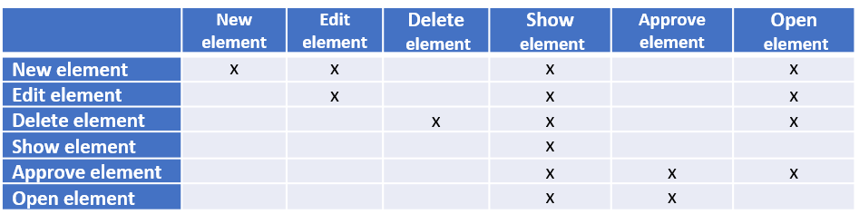

After selecting desired option clicking on OK button will save the changes and Cancel button will discard them.
For creating new permission set, you enter the name of Permission set and click on button New. New row in grid below will be shown, but without any permission set chosen yet. In the right part, in Detail panel, message is shown that says “Please use the corresponding menu entry in the toolbar to change permissions.” 

Procedure for adding new permission sets is the same as editing permission sets, that is explained above.
It is also possible to leave Permission set without selecting any options - user can create empty permission set. 

##### 6.1.3.2.7 Permissions on objects

Permission sets can be assigned to object in every element, as for example category, process, sub process etc.. on all types of object in Symbio.
Selecting desired element for what Permissions should be changed, in toolbar button Change permissions will be shown. After clicking on it, new dialog box will be open, and it will be possible to changes permissions for that selected element.

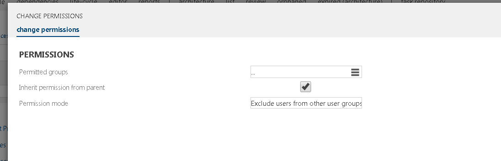

There are three options that can be set in Change permission of an element. 

Permitted groups - Here User groups, with specific Permission sets and Users,can be assigned. It can be added more User groups. Users in those groups will have Permissions from that User group, on that selected object. 

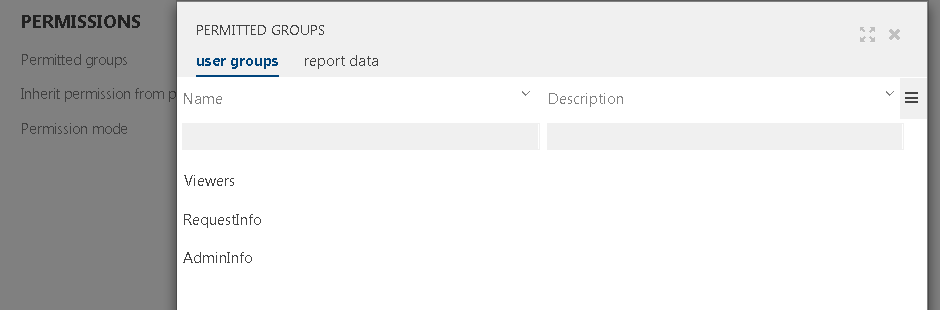

Inherit permission from parent - This option can be selected or deselected. By selecting this option, the inheritance of the current object from its parent is controlled.  If a user group is set and this option is set, all users in the user group get the permissions of the user group plus the permissions that would inherit from the parent, i.e. the permissions they would have without any permission setting at the current object. 
If the option is not set, the users of the user group get *only* the permissions from the permission set of the user group, i.e. the permissions from the parent object have not influence on the current object for the users in the current user group.

Permission mode – For this option, one of two options can be chosen. Default option, that is selected when dialog box is opened first time is Exclude users from other user groups. That means that only users from chosen User groups will be able to see selected object. Other option is Standard permissions for other users. If this option is selected, all users (if their rights allow them) will see that object, but only users, from chosen user groups for that object, will have permissions from that are assigned to chosen User group.

##### 6.1.3.2.8 User scenarios

-	Human resources user

  In this scenario it will be explained how user groups and permission sets can be used, and how can user groups and permission sets help to hide or show only specific part of the system from specific user or user group. This will be shown on example of Human resources, and how only HR group can see some categories.

Steps:
  1. Administrator creates Permission sets “HR permission set”, which has all permission selected. This Permission set will later be added to users and user groups. 

      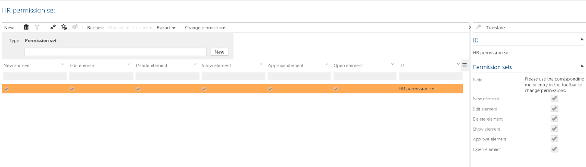

  2. Administrator create user ‘HR assistant’. User role is Architect. All other attributes that are needed are filled in. 

      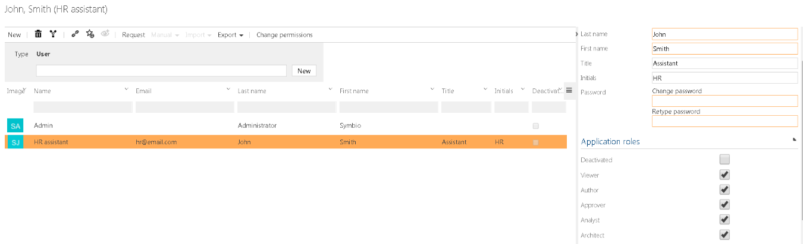

  3. Administrator changes permissions on user that he has created. For permission sets he selects Permission set that he created in step one “HR permission set”, and user group will be added after he creates new User group.

  4. Administrator creates new User group “HR” from Admin panel. In Change permission dialog box, he chooses for Permission sets permission set that he created in step 1 “HR permission set”, and in User part he adds new user “HR assistant” that he created in step 2.

     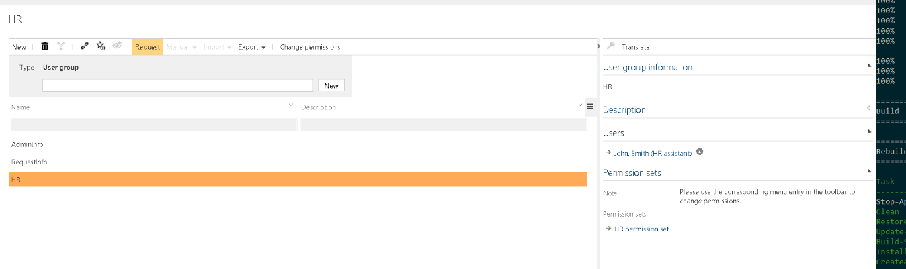

  5. After he created all necessary steps for using permission sets correctly on object Administrator navigates to Processes and select Category “HR Processes”, where are all processes that are involved with HR team. In toolbar Administrator goes on Changes Permission button. 

  6. On Change Permission dialog box he chooses User group “HR” for permitted groups, select option for Inheritance and select option “Exclude users from other user groups”. 

      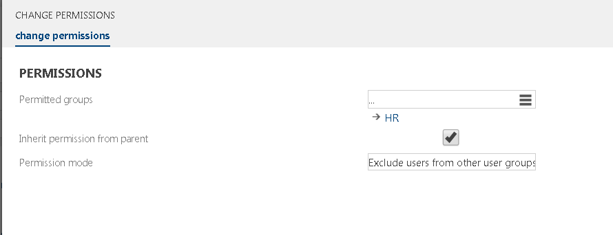

  7. After click on ok button, changes are applied and because Admin user is still logged in, he does not have permission to see HR Processes Category, Category in graphic view is disabled, and all processes inside it are not visible. In Tree view nothing is visible.

      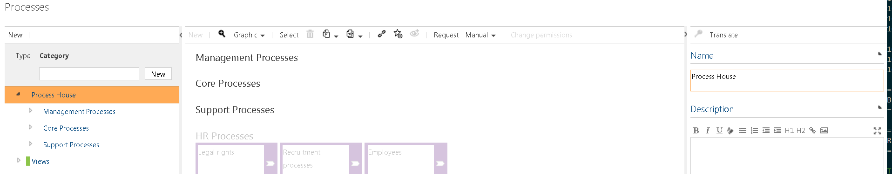

  8. Next step is to log out as Administrator and log in as new HR user and go in Editor mode. Navigate to processes as HR user. Category for HR Processes is visible and usable. User can see, open, add new and edit all elements, which Admin user couldn’t do after settings permission to HR Category. 

      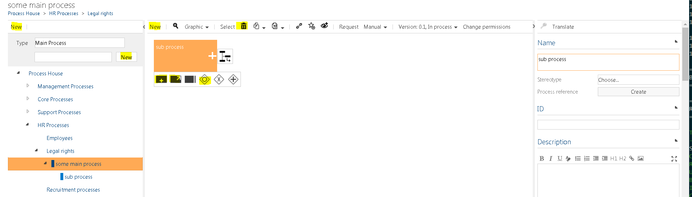

Using this example Administrator could create any User group with necessary Permission sets, assign to the group specific Users. Different kinds of group, with different Permission sets could provide to specific users to only they can see and/or modify some parts of system.

- External user

  In this scenario it will be explained how user groups and permission sets of the user will provide possibility for some user to just see some specific part of the system. This will be shown on example of External user and how External user can see only specific part of the system.

Steps:

1. Administrator creates Permission sets “External user permission set”, which has none permission selected. This Permission set will later be added to External Users. Administrator then creates new Permission set "Viewer user permissions" which has Open and Show element permission selected. This Permission set will later be added to External User group.

2. Administrator create user ‘External user’. User role is Viewer. All other attributes that are needed are filled in.

      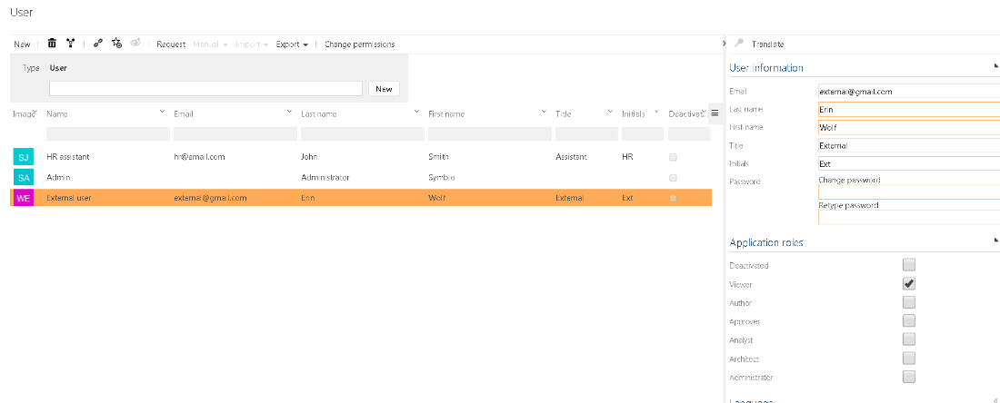

3. Administrator changes permissions on user that he has created by selecting on Change permissions button. In dialog box for permission sets he selects Permission set that he created in step one “External user permission set”, and user group will be added after he creates new User group. After this step, if user would logged in, nothing will be shown to the user, only navigation bar. 
Administrator creates new User group “External” from Admin panel. In        Change permission dialog box, he chooses for Permission sets permission set that he created in step 1 “Viewer user permissions”, and in User part he adds new user “External user” that he created in step 2. 

      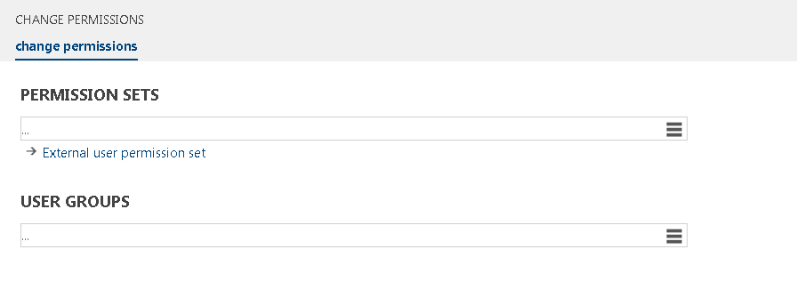

      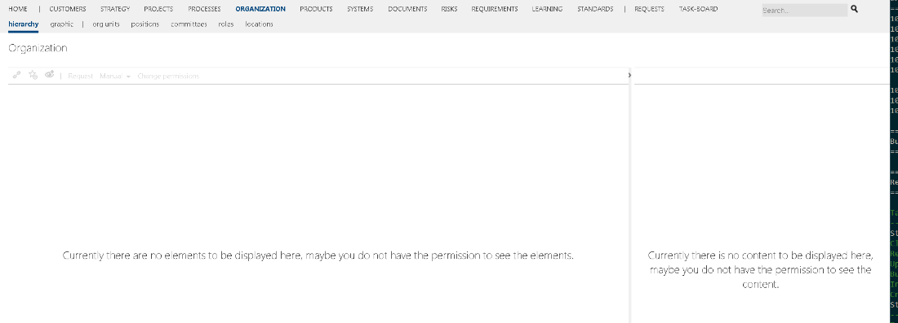

4. After he created all necessary steps for using permission sets correctly on object Administrator navigates to Processes and select Category “External Processes”, where are all processes that External user should have permissions to see and open. In toolbar Administrator goes on Changes Permission button 

      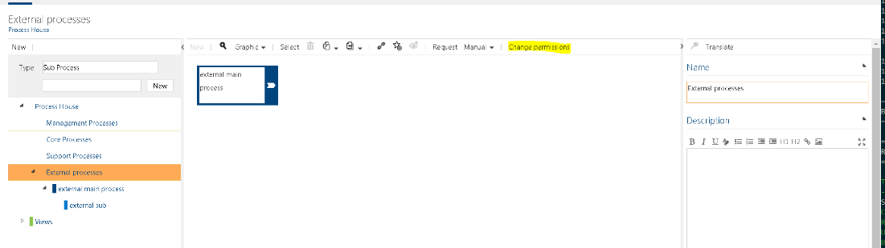

5. On Change Permission dialog box, he chooses User group “External” for permitted groups, select option for Inheritance and select option “Standard user permissions”.

6. After click on ok button, changes are applied and because Admin user is still logged in, he has permission to see External Processes Category, because Standard user permission has been chosen.

7. After Setting permission to the External processes, Administrator must get Permalink of that category, so he would send direct link to the External user. Permalink icon is located in toolbar of category, or any process. Dialog box for Link creation is opened, and there is a button create link, on what Administrator clicks on, and below new link is created. Next to the link, after Administrator hover on the link, Copy icon is shown. 
After clicking on the icon, user gets the message that Link is copied to the clip board. Administrator can paste that link directly to the External user or save it in some document.

      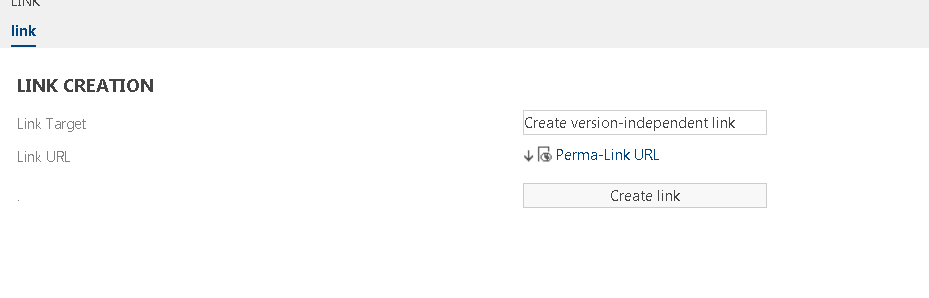

8. Administrator pasted link to the External user and next step is to log out as Administrator and log in as new External user. External user paste link that he got, from Administrator, in to the browser. After he presses enter button, process category that he is allowed to see and open are loaded. User can see and open, but this user cannot see any other part of the system. 
Using this example Administrator could create any User group with necessary Permission sets, assign to the group specific Users. Different kinds of group, with different Permission sets could provide to specific users to only they can see and/or modify some parts of system.

      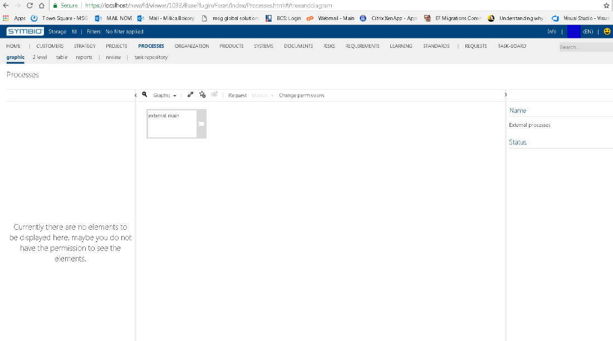

## 6.2 Settings

### 6.2.1 Facets

In Symbio, facets are used to display processes, organization, repository items, etc. It is possible to set permissions so that only specific user groups can add or edit processes, roles, etc. 

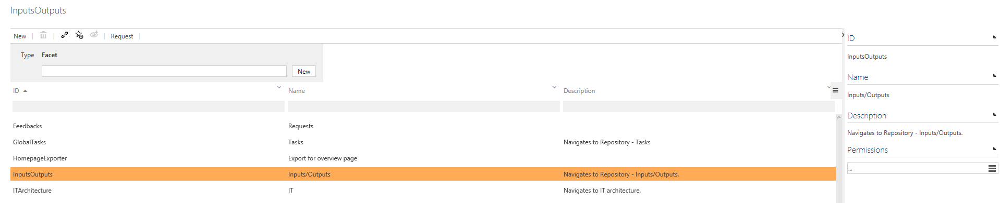

### 6.2.2 Variants

Global and local variants are set up via the tile Variants on the administration page.

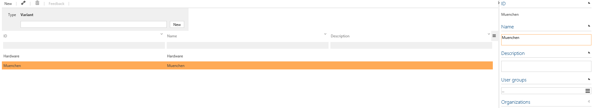

Additionally, the administrator can define tags via the tile Tags to be used together with variants.

### 6.2.3 Tags

Only users with administration rights can create tags. Tags can be used in the user fly out menu to filter processes and repository items in list views (e.g. start page). Existing tags be connected to processes and repository items.

### 6.2.4 Languages

In Symbio, English (1033) and German (1031) are supported. The entire user interface (UI) is localized and the process data culture is activated for both languages. Releasing a process/repository item is only allowed if mandatory attributes are set for both cultures and in case of importing process data only configured cultures will be imported.
English (1033) is the default language.
Other languages can be added as well. It is also possible to remove a language here, except the default language.
Note: If the Symbio installation administrator has activated the translation feature via the Web.config, language-dependent attributes are automatically translated online, whereby the source language corresponds to the set default language. As delivered, the default language is English, i.e. the user can only translate from English to German, but not vice versa.

### 6.2.5 System settings

The following is a short description of the Symbio system settings.

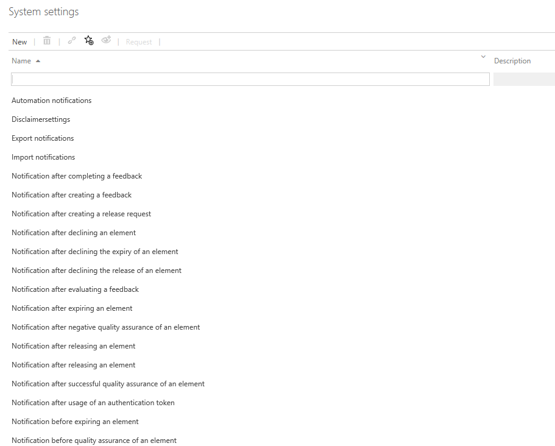

#### 6.2.5.1 Disclaimer settings

The disclaimer is disabled in Symbio default settings. 
Activate the checkbox Disclaimer activated to enable the disclaimer in the header bar and press F5 to refresh the Browser window. 
To add a disclaimer text, please use the disclaimer input box.

#### 6.2.5.2 Notifications

Feature to enable the following notifications. Customized mail template text can be configured.

Example for notification - notification after creating a feedback:

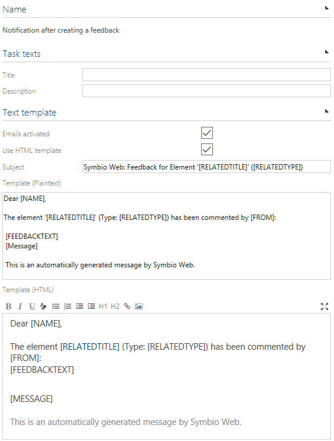

#### 6.2.5.3 Outgoing Email settings

Outgoing email settings need to be configured to make use of email task/request notifications. Mandatory fields are highlighted. Nevertheless, username and password for a mail server account should be used under Authentication instead of using an anonymous authentication mode.
Example:

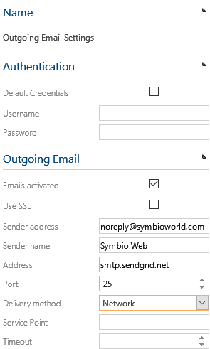

#### 6.2.5.4 Privacy settings

The privacy settings currently consist of two settings which can be disabled if company guidelines require it because of work council or other reasons.

- Request enables the option for users to provide feedback on process elements like main/sub processes and repository items. Even in Viewer mode.

  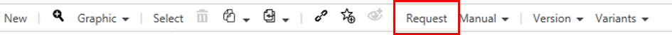

- Global feedback enables the option to provide general Symbio Web application feedback via survey by using the smiley in header bar.

  

  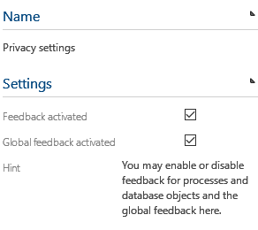

#### 6.2.5.5 Process released notification of external systems

Feature to enable e-mail notifications about tasks. Customized mail template text can be configured.

#### 6.2.5.6 Region settings

The region settings are not set in Symbio default settings so the web server´s regional setting (region and time zone) are used. If regional settings are set, then time stamps in the user interface will reflect these, e.g. in attributes of processes or release tasks. The user can still overwrite these settings by setting user-dependent regional settings in the user’s profile in Symbio users management.

#### 6.2.5.7 Theme settings

The default Symbio theme can be customized by changing the colors of the header and navigation bars. It is also possible to replace the Symbio logo with your own logo.
To activate new theme settings, please press on Compile button and then press F5 to refresh the browser window to make the changes visible. To reset the theme back to the Symbio theme, press the Reset button.
We recommend, for example, embedding the corporate identity only in the productive database in order to make a clear difference to the testing system.

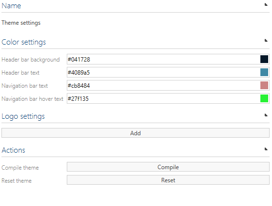

#### 6.2.5.8 SAP WPB connection

Feature to enable a plug-in which synchronizes SAP Workforce Performance Builder eLearning items to Symbio training repository objects. If you consider using this plug-in, please contact us.

#### 6.2.5.9 Task notifications

Feature to enable the following notifications about tasks. The notifications are enabled within Symbio and the email setting here has no effect.

- Task notification after completing a feedback
- Task notification after creating a feedback
- Task notification after declining the expiry of an element
- Task notification after declining the release of an element 
- Task notification after evaluating a feedback
- Task notification after expiring an element
- Task notification after negative quality assurance of an element
- Task notification after releasing an element
- Task notification after successful quality assurance of an element
- Task notification after usage of an authentication token
- Task notification before expiring an element
- Task notification before quality assurance of an element
- Task notification before releasing an element
- Task notification on approval of feedbacks
- Task notification on validation of feedbacks

Example for task notification - Task notification after releasing an element:

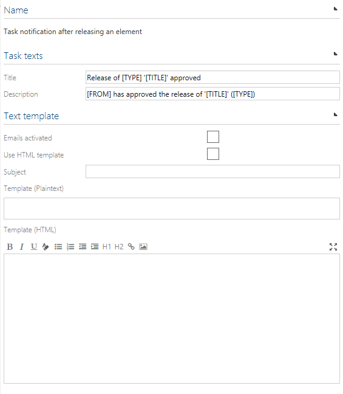

## 6.3 Services

### 6.3.1 Automation

Automation tasks are used for example:
- importing of Active Directory users (useful to have all users in the database at once) 
- running of maintenance database tasks in case of configuration/method changes to avoid an extra Symbio Web update deployment
- rendering and storing of all existing diagrams for better performance especially in viewer mode
- handle events of Symbio using Automation hooks

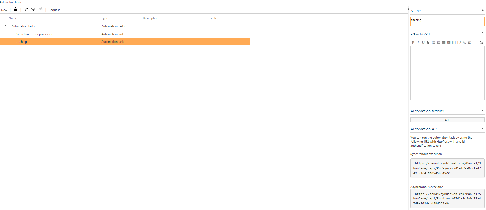

#### 6.3.1.1 Set up an automation task

1. Please open the menu New, enter a name and click on New.

      

2. You can now describe the automation tasks.

3. Add the automation file to the group Automation actions. You can choose one of the following types:

   a. Task file (XML format): Plugins can be executed

   b. Conversion file (XML format): Here you can change units in the database

#### 6.3.1.2 Requirements for automation tasks via PowerShell etc.

If you do not want to start the automation task via the Symbio surface but via a link like e.g. PowerShell, an authentication token is necessary for the automation task to authorize the caller.

1. Please open the menu New, enter a name and click on New.

      

2. Furthermore, the token must have the appropriate rights. 
Please adjust the application roles in the detail area:

      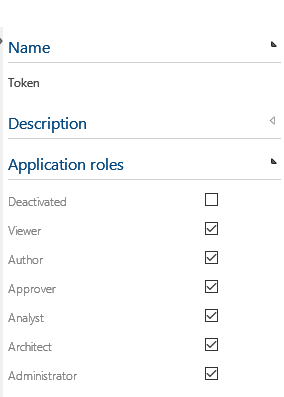

3. Due to safety reasons, the validity of the token must be configured, too. 
By default, the validity is 90 days. When the validity of the token has run out, the automation task cannot be started.  

      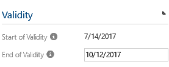

      a. If emails are activated, the Symbio Administrator will receive an email as soon as the automation task is started from a new IP address for the first time

      b.	The token can be revoked for an IP address as well

      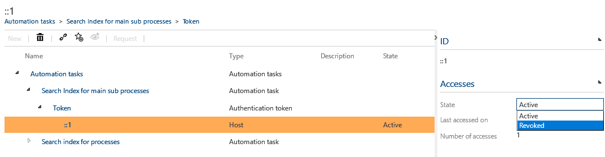

#### 6.3.1.3 Run automation object

There are two ways to start an automation object:
- directly in Symbio
- Outside of Symbio via PowerShell, C# or JavaScript

##### 6.3.1.3.1 Run automation object in Symbio

Please click on Run automation to start it directly in Symbio.

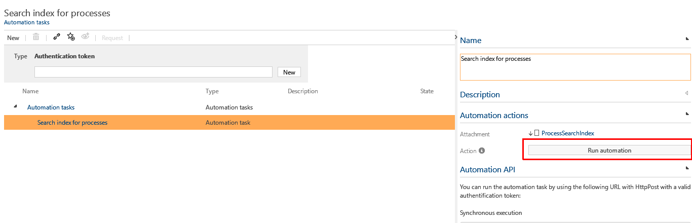

##### 6.3.1.3.2 Run automation object outside of Symbio

The group Automation API offers some information for starting the action outside of Symbio. 
1. Automation via PowerShell is started as follows:
Please copy the text you see in the grey PowerShell box in a PowerShell and run it.

      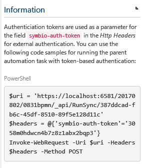

2. The automation is started and the export file can be downloaded via the closed task.

      a. It is also possible to see the result directly in the PowerShell or export it to save the way to Symbio. For this, the last line in the PowerShell has to be adjusted:

      Invoke-WebRequest -Uri $uri -Headers $headers -Method POST | select -expand Content

      b.	For an export into a file please use:

      Invoke-WebRequest -Uri $uri -Headers $headers -Method POST | select -expand Content | Out-File D:\temp\export.xml

      Note: Please adjust target directory and target file. 
      As the export of larger databases into a separate file can take some time, the default PowerShell TimeOut of 100 should be increased. See c.

      c. For an export from large databases which takes longer than 100 seconds please use:

      Invoke-WebRequest -Uri $uri -Headers $headers -Method POST -TimeoutSec [int]::MaxValue | select -expand Content | Out-File D:\temp\export.xml

3. As soon as the automation task has been started via the token, the IP address of the caller will be saved. In this case it is the local host address (IPv6).

      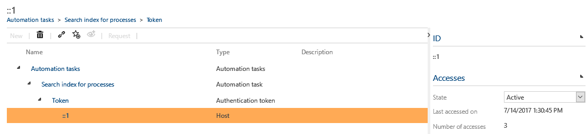

#### 6.3.1.4 Examples of automation tasks

##### 6.3.1.4.1 Generating diagram graphics for caching in the database

An automation task can be used to generate diagram graphics for caching in the database. For this, please create an automation task as explained in Fehler! Verweisquelle konnte nicht gefunden werden. and link it to the example “Set_all_diagram_saved__svg_attributes.xml“.

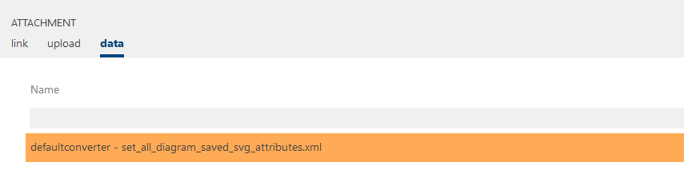

The automation task can now be started as explained above.

Attention: All graphs are generated for all languages and diagrams, which can take a long time depending on the number of diagrams and their complexity. Therefore, it can be useful to generate the diagrams in several steps or only on one part of the diagrams. To do this, edit the task file or connect a customized file to the automation object. 

1. Possible restrictions/subdivisions are: By deleting diagram types in the line:

       <Setting Name="DiagramTypes" Value="MTX_PROCESS_HOUSE MTX_SUB_CATEGORY MTX_MAIN_PROCESS MTX_MID_PROCESS MTX_SUB_PROCESS MTX_DETAIL_PROCESS MTX_RISK_STRUCTURE_ARCHITECTURE MTX_REQ_ARCHITECTURE MT_ORG_CHRT MTX_IT_ARCHITECTURE MTX_KNOWLEDGE_STRUCTURE_ARCHITECTURE" />
      Generating can be limited to specific diagram types

2. By entering and editing the list of LCIDs in line:

       <Setting Name="Lcids" Value="1031 1033" />

      Generating can be limited to specific languages.

3. It is possible to select the diagrams for which the generation is to be carried out. For example, the following task content will be used to generate a generation for all released diagrams:

      

### 6.3.2 Converter

Feature to convert an existing process database (e.g. ARIS) into a Symbio database. Architecture, processes and objects are adopted or dropped according to predefined logic. Please contact us if you consider using that feature.

### 6.3.3 Selection list services

- will be published soon -

### 6.3.4 Storage connections

In case of specific company organizational structures, it is useful to “split” databases. For example, the master database can send released items to a slave database. A HTTPS connection is required.

By distributing data from the master to the slave, standardized contents can be maintained in the master and distributed to the slave DB. To do this, the databases must first be set up and then linked with each other. 

In the admin area under "Database Connections" the administrator creates a new slave database (IMPORTANT THE URL OF THE SLAVE DB AS ID e. g. https://url/Pundz/Slave1). The connection to the slave DB is then requested in Detail Content. In the same view the Admin of the Slave-DB accepts this request and both DBs are linked with each other. All released contents can now be copied to the slavedb by the admin by clicking on "Distribute". All contents of the master DB cannot be edited by the subordinate DBs.

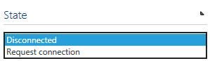

### 6.3.5 Service Hooks

Service hooks are configured callbacks for specific events. The events are defined in Symbio and depend on the service hook type.

#### 6.3.5.1 Application Hooks

In case of an application hook the custom callback is a selected automation task. To create an application hook to the following steps:

1. Open the New menu, enter a name and click on New:

    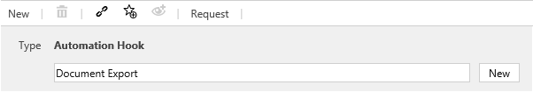

2. Define the event. The hook has to be a callback. You can select one of the following events:

    a. Process released

    b. Document released
3. Define the time of the execution, after or before the state change

4. Add the automation task in the Automation tasks group 

Once you have configured the settings the hook is active for the selected event. This means when you release a process all hooks of this event type Process released will be executed parallel during the state change phase.

### 6.3.6 ID Providers

#### 6.3.6.1 Before you start

After successful installation and connection of the ID Provider Service, a table with 2 columns is created in the ID Provider database. In this table, a new entry should be added for each consuming Symbio instance.

Simply use the following statement and replace the colored fields with your data:
insert into enter ID Provider Name.Subscribers (subscriber, token) values (NEWID (),'enter desired token name')

Now note the name of your token from the database and the URL to your ID provider services. For example, if you install the service under 'IDProvider' and create the token named "myToken", the script would look like this:
insert into IDProvider.Subscribers (subscriber, token) values (NEWID (),'myToken')

URL = https://IDProvider.com/
Token = myToken

#### 6.3.6.2 Create ID Provider

Navigate to a database in Symbio. Then click on the cogwheel at the top right into the admin area of Symbio.

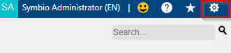

Here you will find a tile with the name 'ID Providers'.

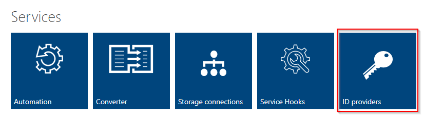

Now you are in the overview of your ID provider. Click New and choose a name for your ID provider.

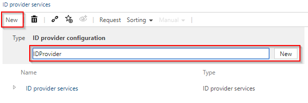

Click on New to create it. In the next step, please select the provider you have created and enter the URL and token from chapter 1.1 on the right side of the detail content.

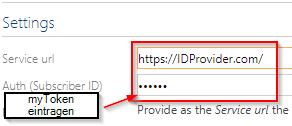

#### 6.3.6.3 Create ID Provider Configuration

There is a configuration to configure the ID provider, for example, which facets and objects it affects. A configuration is created under the service. Select the service and click on New to create the configuration.

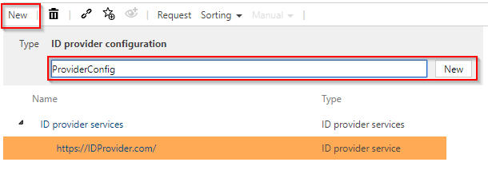

If you select this created configuration, you can define in the detail content how this ID should look like and which facets or objects it concerns.

###### Format:

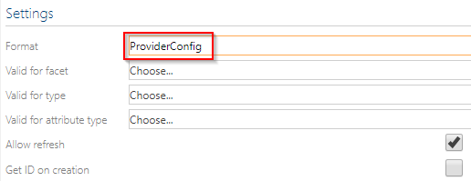

This item describes how the composite unique ID should look like.
In this field you can use various placeholders to create an individual ID. You will find hints and examples below in the detailed content.

 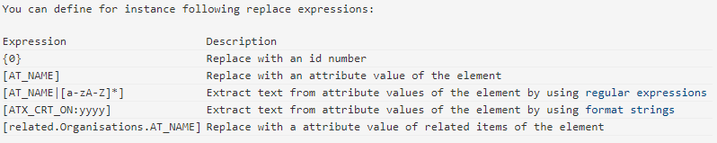

To illustrate this, a prefix 'Role-ID-' is selected and '{0}' is set behind it.

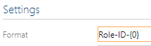

Thus, for example, this prefix is always used with each newly created ID for a role, followed by an ascending number.

###### Facet and Type:

You can also configure under "Facet" and "Type" for which facet and underlying object this ID should be generated. For example, roles.

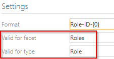

###### Valid for Attribute Type:

The field "Valid for Attribute Type" defines for which attribute this ID is entered in a role. In this example, the created ID is to be written to the ID attribute of the object.

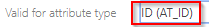

It could also be written in the name field or some others. Clicking on the field displays all options.

###### Allow refresh:

Select this option if you want to allow this ID to be updated automatically after changing the connected objects in the ID.

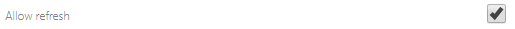

###### Get ID on Creation:

This option should be selected if you want an ID to be assigned automatically when a new object is created.

#### 6.3.6.4 Last but not least

The configuration of your ID provider is successfully completed by automatically saving and entering all parameters.

Note: The ID provider must be installed separately. Details can be found under the following link:
http://docs.symbioworld.com/content/Articles/UniqueID/install-intro.html

### 6.3.7 Authentication providers

If the user management should be managed by the Microsoft Active Directory, then SAML settings need to be configured here. For SAML and ADFS configuration instructions, please refer to our Symbio Web installation manual and the SAML Check-List.
If the SAML group management is activated, the user’s application roles depend on the SAML user group where the user is member of. If the user is member of more than one group then highest role will win.

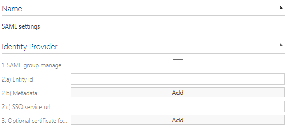

## 6.4 Configure

### 6.4.1 Extended Configuration

Additional configuration options are available for the administrator in the tile "extended configuration". This includes hiding various information, renaming the standard interface and adding new attributes. 

To use the advanced configuration, please proceed as follows:
- In the admin area, open the tile 'Advanced configuration'

  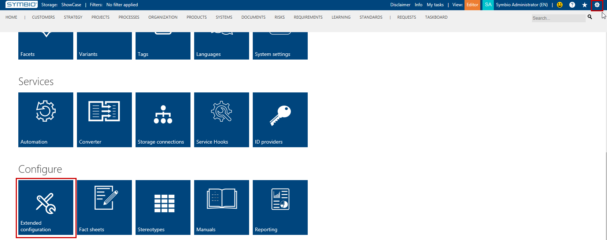

- Create a new type with one of the configuration options

  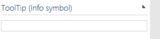

The next sections describe some of the configurations in more detail.

#### 6.4.1.1 Hide

To apply all changes, the configuration has to be activated and applied afterwards.

##### 6.4.1.1.1 Hide graphic options

The configuration "Hide graphics options" allows the administrator to minimize the graphical selection in processes. All standard graphics in Symbio and the user-defined fact sheets can be managed with this configuration. 

1. Select type „Hide graphics options“
2. Enter name for configuration entry (e.g. detailed view Sub Process)
3. Define settings 
4. Activate configuration entry

      

      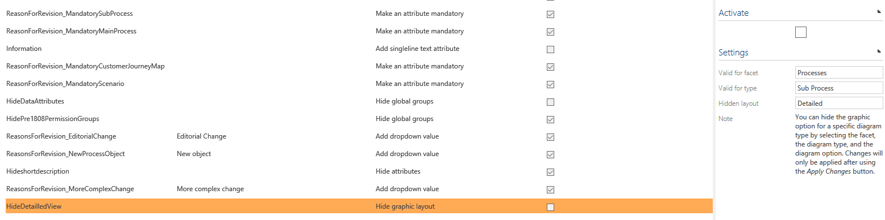

5. Apply changes (this only works for configuration entries which are activated in the Detail Content; all configuration entries are always applied).

      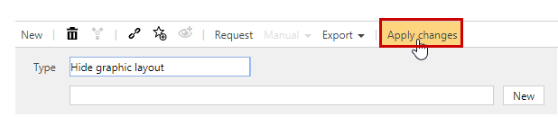

##### 6.4.1.1.2 Collapse views

With this configuration, individual areas such as Detail Content or the navigation tree can be collapsed for Viewer and/or Editor.

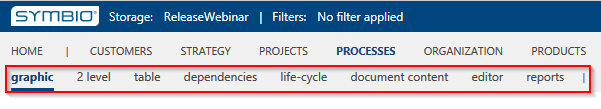

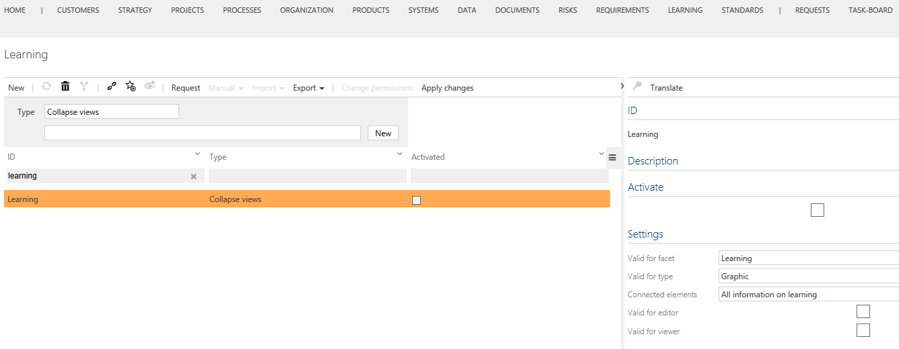

##### 6.4.1.1.3 Hide attributes

The configuration Hide attributes allows you to delete content in the Detail Content, e. g. 'Risk assessment'.

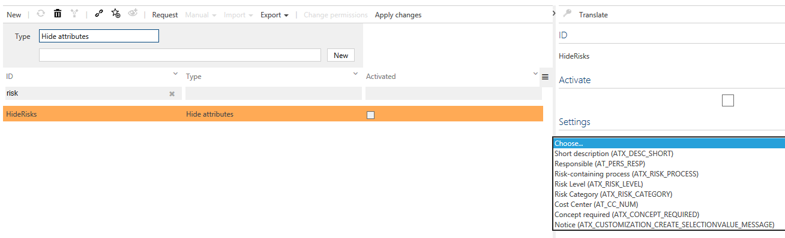

##### 6.4.1.1.4 Hide referenced objects

The configuration Hide referenced objects you can hide certain elements you do not need for modeling.
Example: Hide 'Requirements' in Detail Content 
1.	Create configuration entry with meaningful name (e.g. Requirements DC)
2.	Define settings: Valid for facet= requirements; valid for type= requirements

      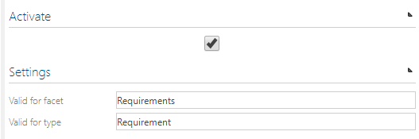

3. Check Activate
4. Apply changes

##### 6.4.1.1.5 Hide global groups

Hides complete groups, e.g. 'Responsible Role', in detail Content.
Hiding can be done for all users or only for the viewer mode.

##### 6.4.1.1.6 Hide navigation element

Entire navigation elements can be hidden. These include e.g. systems 
or input/output.

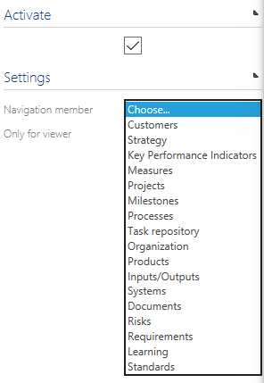

#### 6.4.1.2 Rename

The administrator renames the information names using this configuration. The new name replaces the selection and is now used throughout the system. 
You can also use this function to rename user attribute groups.

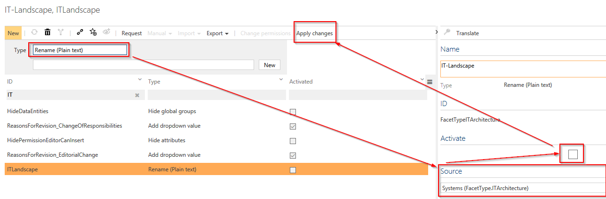

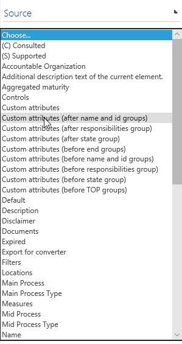

#### 6.4.1.3 Add

1. The Administrator can set up user-defined attributes.

      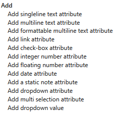

2. In Detail Content, the administrator can select the element types to which the user-defined attribute is to be added. 
Multiple selection allows you to assign the configured attributes to the required types.

      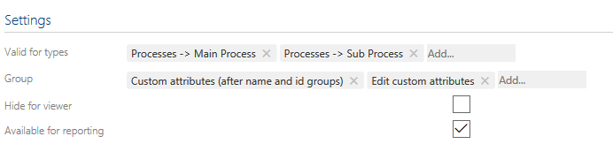

3. To any of the new configurated attributes there is the possibility to add “tooltips” to describe the attribute or give hints. The administrator can also use "edit custom attributes" to add the user-defined attributes to the editing of released elements. Thus the user-defined attributes for released attributes can be changed afterwards without versioning. These changes are displayed in the lifecycle.
The following user-defined attribute groups are available:

      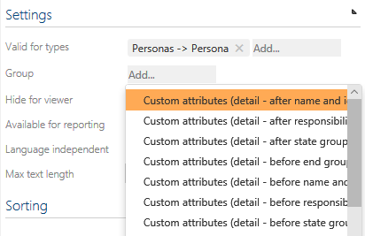

      User-defined attribute groups can be renamed using the configuration option Rename.

      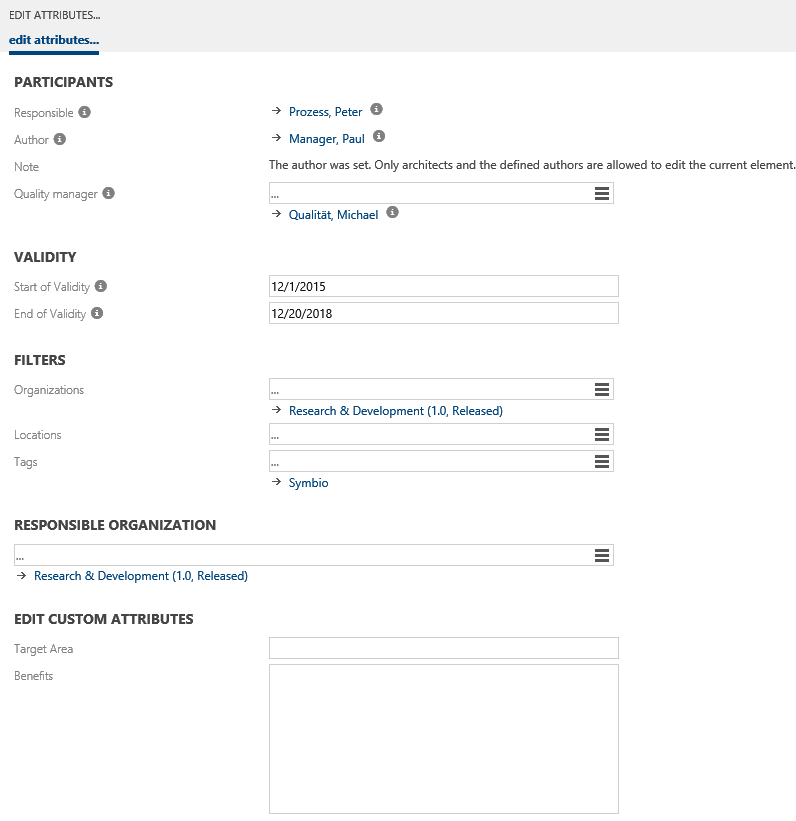

4. By activating “Hide for Viewer” this custom attribute will only be displayed for the editors

5. By activating “Available for reporting” the custom attribute will be analyzed in the estandard reports as well. If this is not activated, this attribute won´t be a part of the reporting

6. By activating “language independent”, this attribute will be for every language and can´t be translated.

7. To apply all changes, the configuration has to be activated and applied afterwards.

      

Here, there are some examples explained in detail:

##### 6.4.1.3.1 Add single line attribute

1. Select attribute type 

2. Define ID and set up configuration entry via New.
Defining the ID in capital letters determines the last part of the API name.
Please do not use special characters or '-'.

      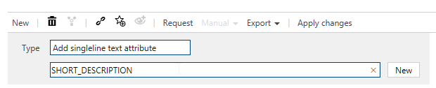

      The API name for reusing in for example manuals would then be:
'ATX_CUSTOM_SHORT_DESCRIPTION'

3. Define settings in the Detail Content 
Check the chapter 6.20.3 Add for the details

      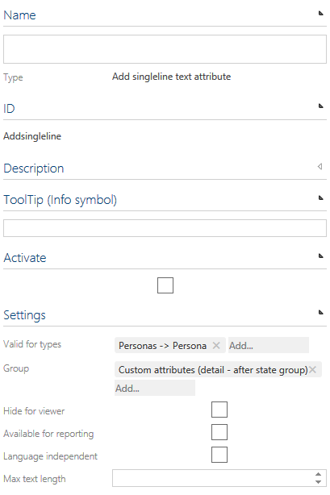

      Name: must be maintained in all languages. You can use the Translate button

      Tool Tip: if maintained the attribute will appear with an info symbol and a note when using the mouse over.
      Sorting: if there are several user-defined attributes per user group, the order can be determined here.

      Activate: must be checked; otherwise the attribute is not considered when changes are applied.

      Settings: Valid for facet, valid for type, group, language independent, maximal length.

##### 6.4.1.3.2 Add selection list attribute

In addition, the following is to be observed here:
- Language independent should be checked
- Apply the changes bevor assigning values

##### 6.4.1.3.3 Add selection list value attribute

In addition, the following is to be observed here:
- When a new value attribute is created (ID is VALUE) the API name AVTX_CUSTOM_VALUE 
- The selection list attribute must be assigned

#### 6.4.1.4 Change

By configuring 'Change', the administrator can change settings in Symbio. To apply all changes, the configuration has to be activated and applied afterwards.

##### 6.4.1.4.1 Make an attribute mandatory

The admin can make any attribute mandatory. For this, the type 'make an attribute mandatory' needs to be selected and in detail content the settings can be defined. After applying this, all user has to manage the mandatory fields. For example you can set a description to mandatory so any author has to fill in a description for the process.

##### 6.4.1.4.2 Make an attribute informative

The administrator can use this extension to store certain content as informative and thus define it as read-only. This means that these contents cannot be edited. For example, systems can be set as write-protected by this configuration and the content can be retrieved from the BCM interface.

##### 6.4.1.4.3 Change user selection

The admin adjusts the users in Symbio and can activate or deactivate the inheritance of the persons responsible. 
You can also set that only the selected user types are allowed to edit the process.

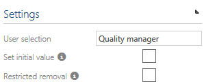

### 6.4.2 Features

Updates and new features will be available in the Symbio Cloud on a continuous basis. Thus, the Symbio version numbers are now omitted.  

As soon as features have been made available you can test the functions and activate or deactivate them yourself. 

NOTE: New features are flagged as deactivated by default. 

There are different 'periods' of features:

- Experimental: this feature is in an experimental stage. It is recommended to use this exclusively in a test environment.
- Preview: the development of this feature is completed, but it is still in a comprehensive internal test phase. Please use only in a test environment.
- Released: this feature is completely tested and finally released. It may be used in a productive environment.

#### 6.4.2.1 Activate and deactivate features

Highlight feature in the list and select required value (Deactivated or Activated) in 'Activation' dropdown of Detail Content.

#### 6.4.2.2 Is obsolete / Is one way

Features flagged up as 'Is one way' can only be activated. Once the feature is activated, it cannot be deactivated again.

In case a feature is out of use, it is flagged 'Is obsolete'.

### 6.4.3 Release cycle 

Individual settings can be made for the release cycle of processes and objects.

First, create a new Type in the list. Then, go to Detail Content and select a type (or types) for which your settings should be applied.

There are following options:

Option 1: 
Set the number of days after which the process receives the state 'Valid' (after release) in field 'Valid from day span'.

Option 2:
Activate 'Prohibit direct release' if the workflow should be started in any case. The state 'Released' will then never be selectable in release dialogue.

Activate your settings by checkbox and click on 'Apply changes' in the toolbar.

### 6.4.4 Fact sheets

Please navigate to fact sheets [here](docs\admin\sysadministration\fact-sheets\creating-factsheets.md) 

### 6.4.5 Stereotypes

- will be pusblished soon -

### 6.4.6 Manuals

Default manuals are available. Customized manual templates can be added here.

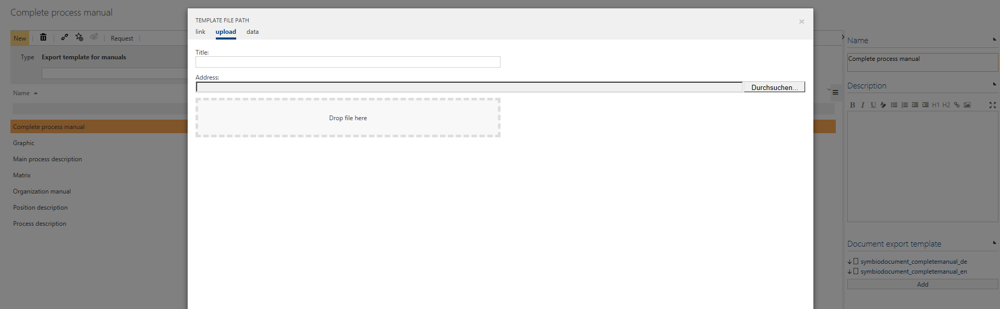

### 6.4.7 Reporting

- will be pusblihed soon -

### 6.4.8 Navigation

With this feature the help function can be specified in the header (question mark icon). 

Create a new Category with a help entry below in the list. Specify the new help entry in the Detail Content,defining your required target and type of help. Then specify the facet and sub type for which it should be applied to. 

- content will follow soon - 

### 6.4.9 Document Templates

With the document templates you can define templates for certain elements (e.g. processes, documents, risks, requirements, etc.), which the editor then adds content to. The administrator has the function to define the structure and the layout.

To create a template, the option "Document templates" is available in the admin area.

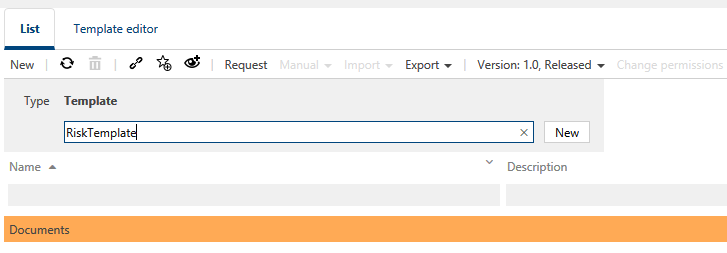

After the document template has been created, the administrator must define some attributes in Detail Content. These include the author (if not already set), the person responsible, and the assignment. Here the admin defines for which elements the document template may be used. No template can be edited without assignment. 

Further content in the detail area is the header and footer of the document. Here the administrator can display attributes such as Page <PAGE> of <NUMPAGES> for the page number. 

The administrator can set up the structure in the template editor. The chapters can be created hierarchically. Sections can be inserted within chapters. In sections, text blocks or blocks for linking properties can be inserted or combined column by column.

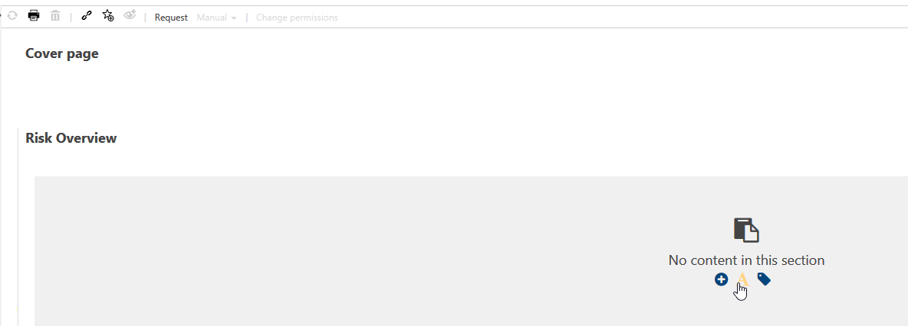

By selecting the text modules, the admin can create an HTML area that can be edited freely. Any text, images and the like can be created here. The text module is identical to the description in Detail Content. 

In the module for linking properties, the administrator can select a property (e.g. name, description, ID) for the element assigned to the document template.

For all chapters, sections or modules, the administrator can set the check mark to "read-only" in the detail content so that the editor cannot edit them or insert new content. 

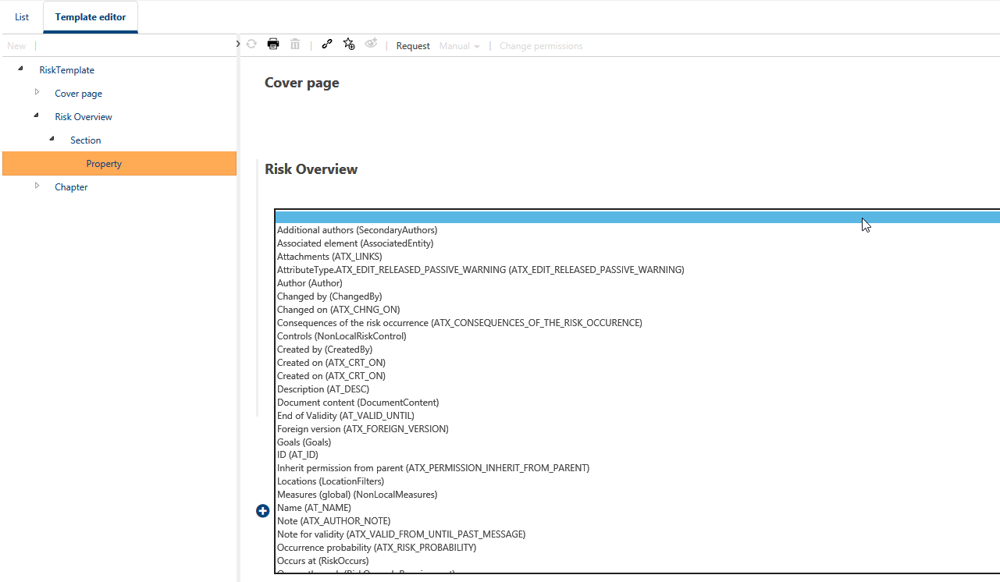

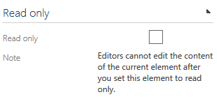

After the document template has been created and the structure has been set up, the editor can use this template. However, the template must first be released in a release workflow. A document is available for editing in the editor as soon as the template has been released.

### 6.4.10 Validation rules

- will be pusblished soon - 

### 6.4.11 Dynamic attributes 

Custom-designed feature to use dynamic/user-defined attributes in processes. If you consider using those, please contact us.

## 6.5 Importer

### 6.5.1 AML import

In Symbio, it is possible to import processes from ARIS. Importing of ARIS data mostly needs a customized config file to import ARIS data successfully.
ARIS data should be imported to an empty database unless you are absolutely sure that the GUIDs which will be imported do not exist in the target database already.  

#### 6.5.1.1 Configuration for AML import

To import ARIS data, it is required to set up the AML-import converter first. To do so navigate to administration page and choose AML import.

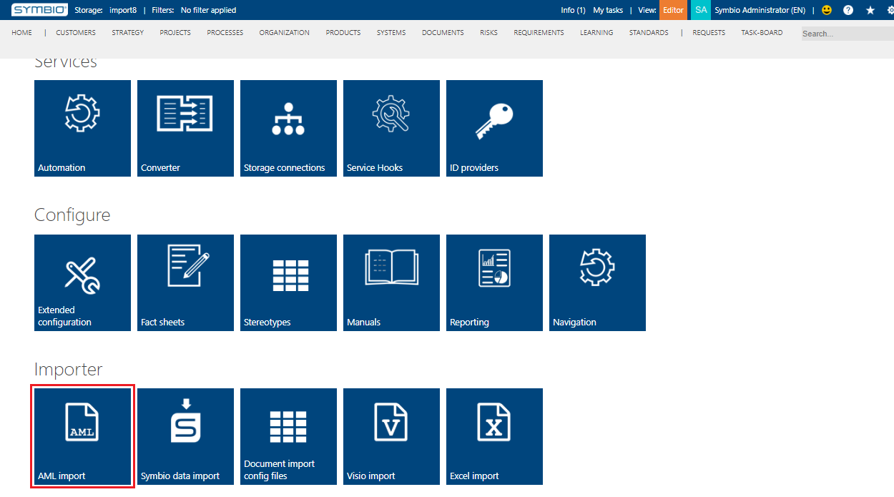

Create a new AML-import configuration. Enter name and click on New. 

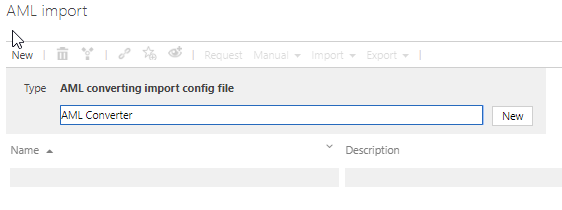

After the new configuration has been created, click on Add in the detail content and follow the dialogue window to add the file. Custom configuration file is important for ARIS data to be imported successfully.

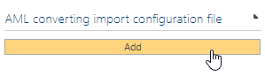
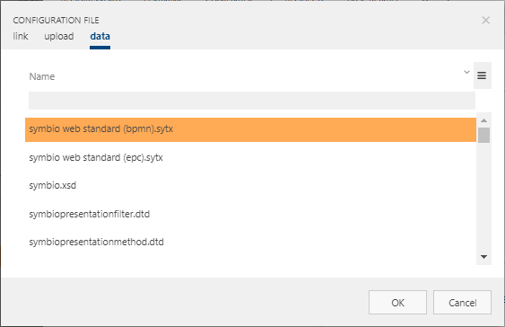

#### 6.5.1.2 Import AML data

When previous steps are completed, Symbio is ready to import data from ARIS. Choose Processes > Architecture in navigation menu and proceed to import setup. ARIS import is available in the toolbar with additional administration functionality.

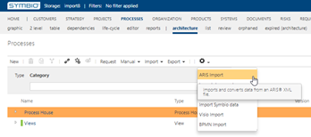

Dialogue window will be opened where import process can be set up. 
To start the importing process please follow these steps.
- Choose the XML file exported from ARIS, click Add
- Choose configuration file (created in previous step)   
- Start the import process by clicking OK

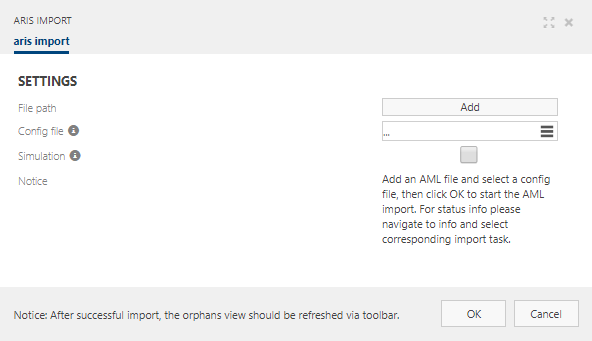

The process will run in background and will take some time depending on ARIS xml file size. You can watch the event log, as well as download the report of the process in Info-board.

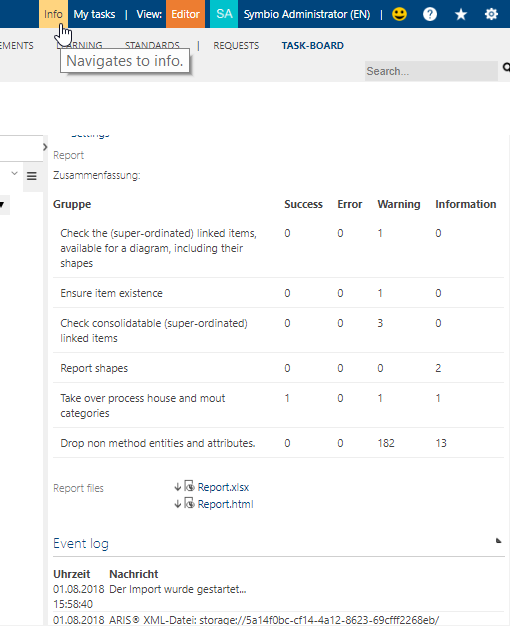

After successful import you will find imported processes under Processes > Orphaned. If processes are not visible, please refresh the list. It can be also customized that imported Aris processes are part of the process house.

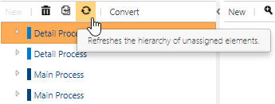

### 6.5.2 Symbio data import

Mapping files to import Symbio data (.symx) can be added here. For instance, repository data can be managed between the testing database and working database. The import will be done in the toolbar with the additional administration functionality.

### 6.5.3 Docment import config files

Feature to import Microsoft Word documents which require specific config files.

### 6.5.4 Visio import

Feature to import Microsoft Visio files. Default converter for BPMN/EPC exist but specific config files are required to import customer’s Visio files. The data type of for migration must be in VSDX.

### 6.5.5 Excel import 

Feature to import Microsoft Excel files from external systems (e.g. MEGA) which require specific config files to map items as required.

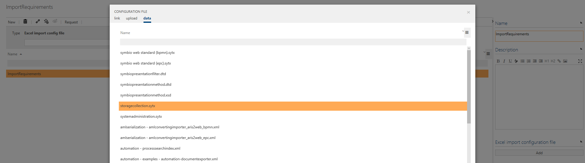

