# 7 System settings

The following is a short description of the Symbio system settings.

## 7.1 Disclaimer settings

The disclaimer is disabled in Symbio default settings. 
Activate the checkbox Disclaimer activated to enable the disclaimer in the header bar and press F5 to refresh the Browser window. 
To add a disclaimer text, please use the disclaimer input box.

## 7.2 Notifications

Feature to enable the following notifications. Customized mail template text can be configured.

Example for notification - notification after creating a feedback:

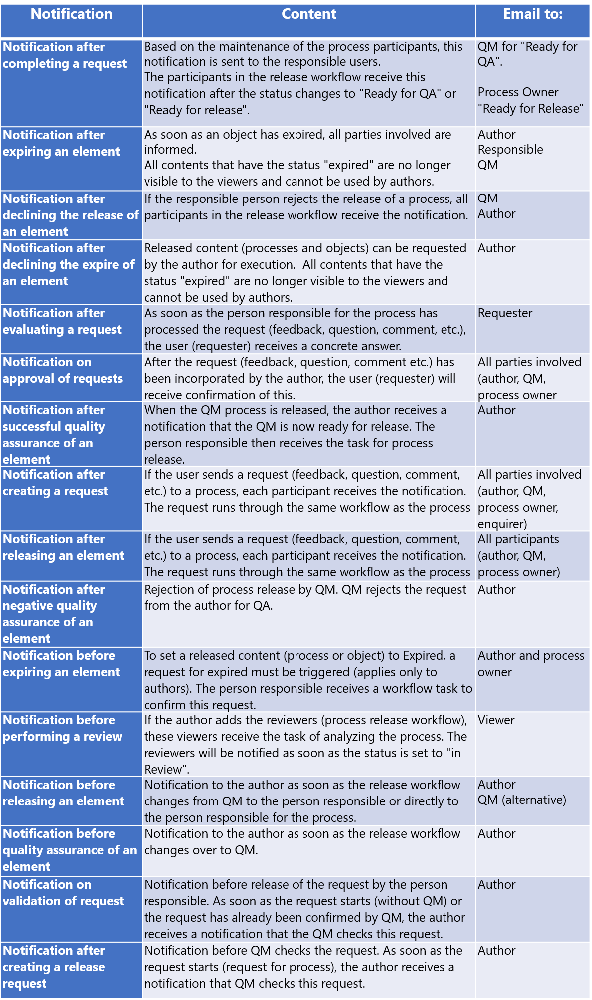

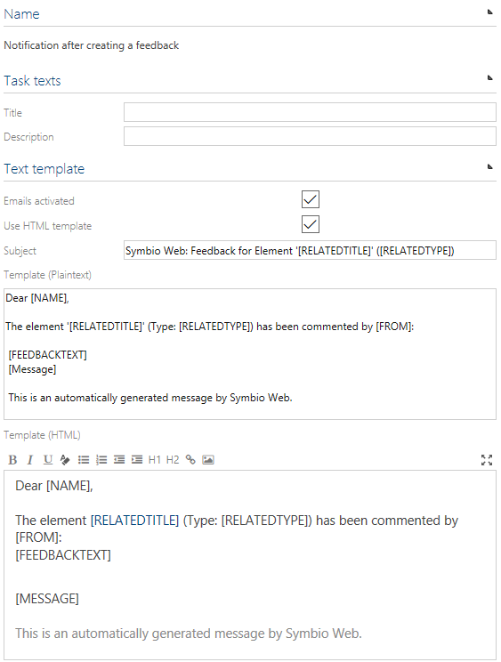

## 7.3 Outgoing Email settings

Outgoing email settings need to be configured to make use of email task/request notifications. Mandatory fields are highlighted. Nevertheless, username and password for a mail server account should be used under Authentication instead of using an anonymous authentication mode.
Example:

## 7.4 Privacy settings

The privacy settings currently consist of two settings which can be disabled if company guidelines require it because of work council or other reasons.

- Request enables the option for users to provide feedback on process elements like main/sub processes and repository items. Even in Viewer mode.

  

- Global feedback enables the option to provide general Symbio Web application feedback via survey by using the smiley in header bar.

  

  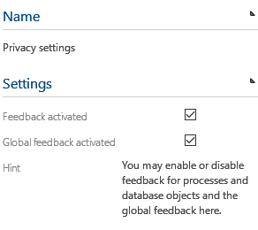

## 7.5 Process released notification of external systems

Feature to enable e-mail notifications about tasks. Customized mail template text can be configured.

## 7.6 Region settings

The region settings are not set in Symbio default settings so the web server´s regional setting (region and time zone) are used. If regional settings are set, then time stamps in the user interface will reflect these, e.g. in attributes of processes or release tasks. The user can still overwrite these settings by setting user-dependent regional settings in the user’s profile in Symbio users management.

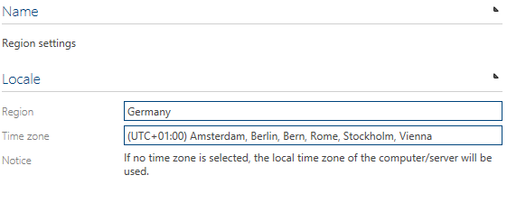

## 7.7 SAML settings

If the user management should be managed by the Microsoft Active Directory, then SAML settings need to be configured here. For SAML and ADFS configuration instructions, please refer to our Symbio Web installation manual and the SAML Check-List.
If the SAML group management is activated, the user’s application roles depend on the SAML user group where the user is member of. If the user is member of more than one group then highest role will win.

## 7.8 Theme settings

The default Symbio theme can be customized by changing the colors of the header and navigation bars. It is also possible to replace the Symbio logo with your own logo.
To activate new theme settings, please press on Compile button and then press F5 to refresh the browser window to make the changes visible. To reset the theme back to the Symbio theme, press the Reset button.
We recommend, for example, embedding the corporate identity only in the productive database in order to make a clear difference to the testing system.

## 7.9 SAP WPB connection

Feature to enable a plug-in which synchronizes SAP Workforce Performance Builder eLearning items to Symbio training repository objects. If you consider using this plug-in, please contact us.

## 7.10 Task notifications

Feature to enable the following notifications about tasks. The notifications are enabled within Symbio and the email setting here has no effect.

- Task notification after completing a feedback
- Task notification after creating a feedback
- Task notification after declining the expiry of an element
- Task notification after declining the release of an element 
- Task notification after evaluating a feedback
- Task notification after expiring an element
- Task notification after negative quality assurance of an element
- Task notification after releasing an element
- Task notification after successful quality assurance of an element
- Task notification after usage of an authentication token
- Task notification before expiring an element
- Task notification before quality assurance of an element
- Task notification before releasing an element
- Task notification on approval of feedbacks
- Task notification on validation of feedbacks

Example for task notification - Task notification after releasing an element:

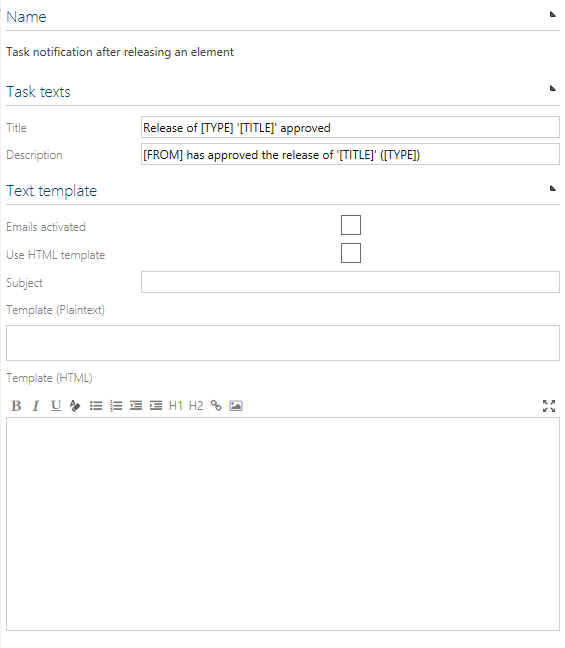

## 7.11 SAP Solution Manager 7.2 Interface Configuration

### 7.11.1 Introduction

The SAP Solution Manager 7.2 - Symbio interface allows the synchronization of business processes and their structure between SAP Solution Manager and Symbio application.
Symbio being the business window into the IT world of Solution Manager 7.2. 

Solution Manager 7.2 supports the so-called branch management. One branch is a version of business process models, documentation, systems… It also supports the release process, meaning it is possible to release one branch to a higher parent branch. This setup allows you to clearly differentiate between business process content that is productive and content that is still work in progress. The minimum branch setup consists of a production and maintenance branch. Further branches such as development or import branch can be added due to specific requirements. The picture below describes one Solution Manager 7.2 solution and its connection to Symbio. The set of branches are all stored in one container that is called the Solution. The solution it the single source of truth in Solution Manager 7.2.

Solution Manager 7.2 also supports reference content. The usage of the SAP reference content is a good possibility to accelerate a project, especially in the prepare and explore phase. The provided content can be downloaded from the Solution Manager to Symbio and be processed there.
An example of the reference content are SAP’s best practice packages that deliver predefined processes for SAP solutions.

### 7.11.2 Synchronization flow

The reference content is imported to the import branch. The user would choose the content from the import branch he wants to transfer to the development branch which will communicate with Symbio. Then the content from the design branch is synchronized to Symbio. In Symbio the business user would be able to change, add and delete content. When he is finished with modeling he would upload the changed content back to the design branch. 

### 7.11.3 Hierarchical relationship

The hierarchical relationship between Symbio and Solution Manager is shown in the picture below. 

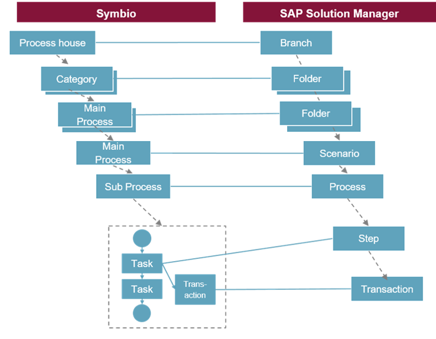

Symbio Process house is synchronized with Solution Manager branch. The administrator can configure to which branch the Symbio storage is connected to, on the settings page.

### 7.11.4 Supported and planned elements

The elements that are supported by the interface can be organized into three groups:

1. Hierarchical elements
- Process house
- Category
- Main Process
- Sub process

2. Business process elements
- Start Event
- End Event
- Intermediary Event
- Local Task
- Global task(from the repository)
- Gateways (Or, Either-or, And)
- Sub Process as a reference to another sub process
- Sub process as placeholder
- Conditions

3. Corona elements
- Roles

Additional elements that are planned to be supported by the standard interface, are the corona elements
- Documents
- Systems
- Transaction
- Additional elements can be added on customer request

### 7.11.5 Example of the synchronization

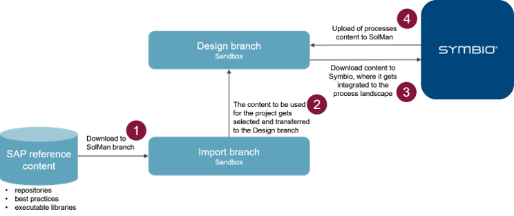

This example will show the third and fourth step of the picture. The first two steps have already been done in Solution Manager 7.2.

There is a hierarchical structure in the design branch:

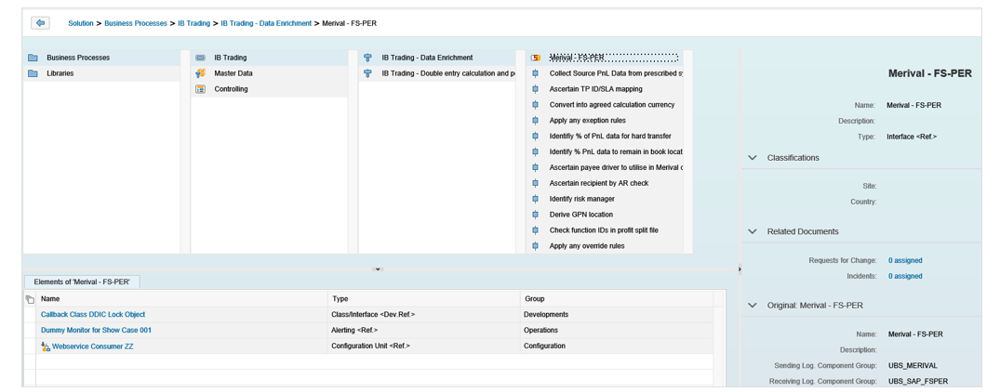
Hierarchical view Solution Manager

Also the processes have diagrams attached:

Diagram view for Solution Manager

When the storage is created in Symbio we have to configure the branch in order to synchronize the content from the design branch. This is done in the Storage settings:

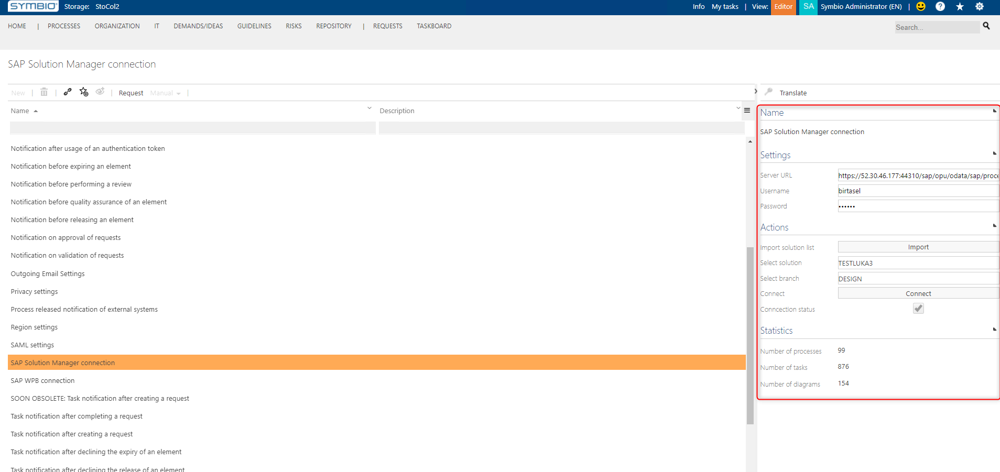

When the connection is successful the user can import the content from Solution Manager 7.2 to Symbio.

Navigate to Processes->architecture->SAP to find the 'Synchronize with SAP Solution Manager'-button.

When clicking the button, a pop-up screen will appear. By clicking OK the synchronization from Design branch to Symbio will start:

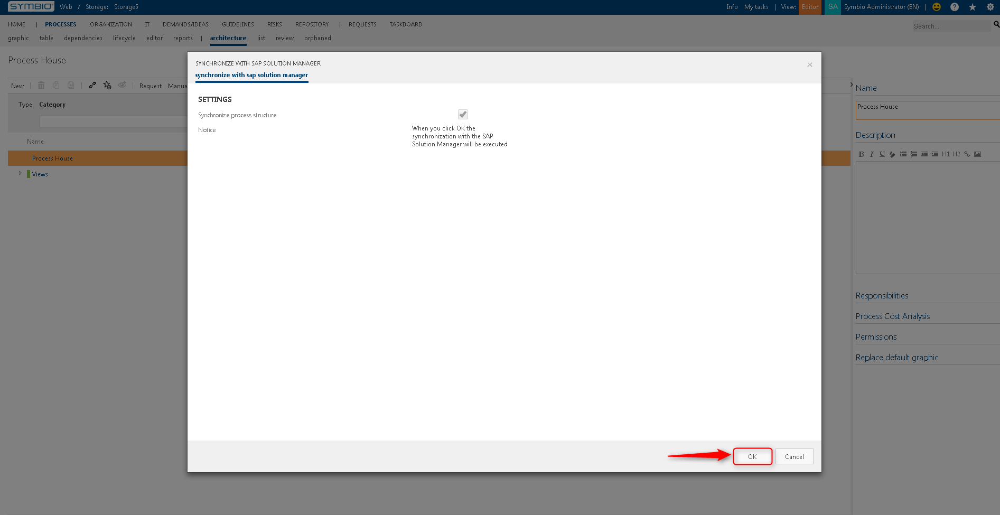

The process of the synchronization can be seen on the Info page:

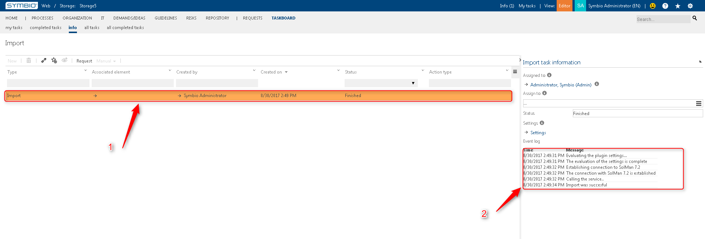

After the import ran successfully, the user can navigate back to the process structure and see the imported content.

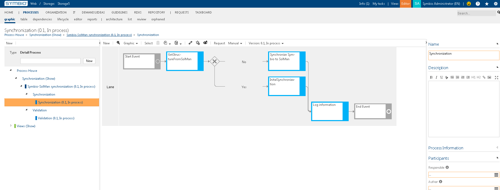

Global tasks are located in Repository -> tasks

Lanes are located in Repository -> roles

Now the user can add, change or delete the structure in Symbio. 
In this example a task will be added. Also a new role will be attached to this element.

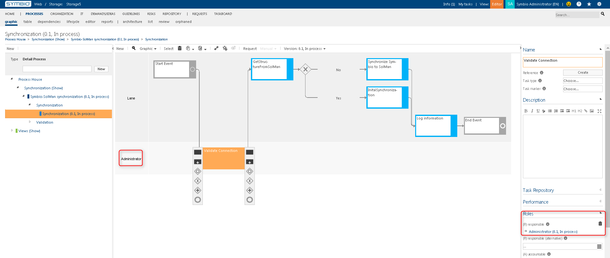

After the changes are done, the process content can be uploaded back to the Design branch of Solution Manager 7.2. This is done the same way the import was done.
Navigate to Processes->Architecture->SAP-> Synchronize with SAP Solution Manager-> click ok on the pop-up window.

The result of the synchronization can be seen on the Info page.

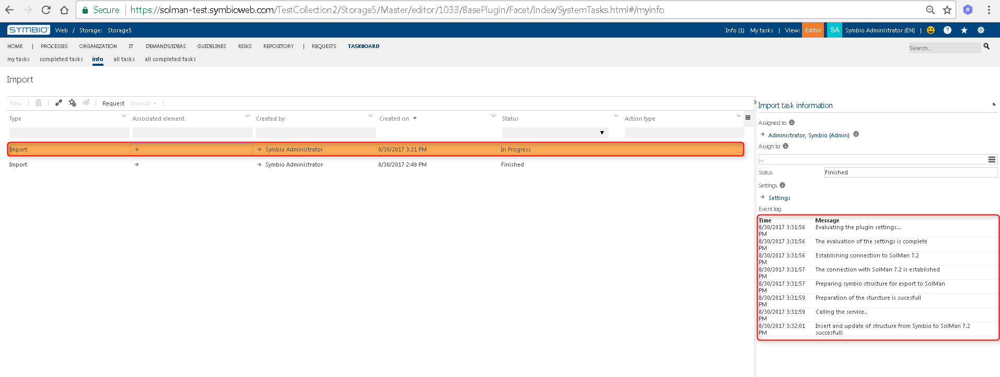

When the synchronization was successful you can compare the structure and the diagrams.

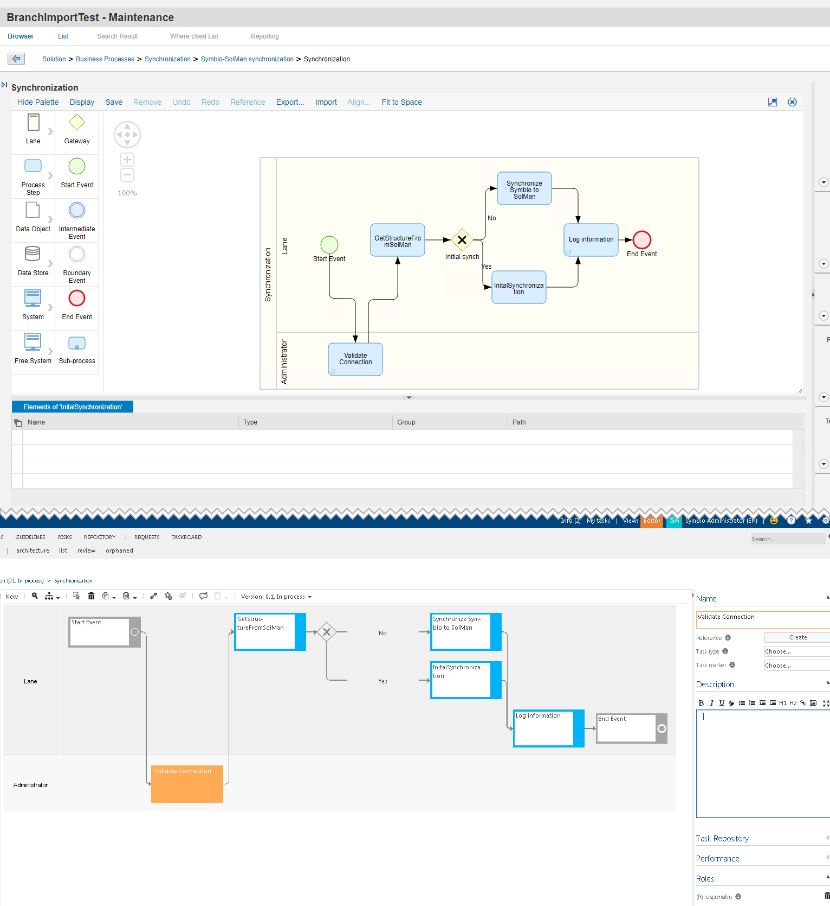