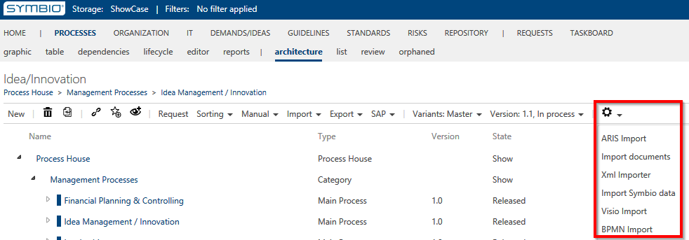
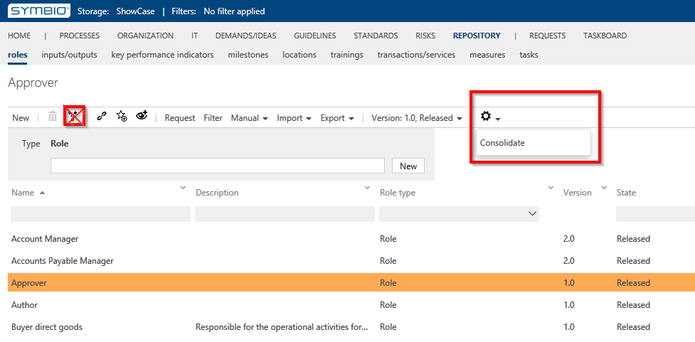

# Data management within the storage

Within the database, the administrator has specific functions to manage the contents of the database.

## Import Data in Symbio

In the architecture view of the process house, there is an additional function for the administrator to import data. The Import needs a customer specific configuration and should be imported into an empty database. This can be checked and tested, afterwards the data can be exported to the working database as symx data.

## Consolidate repository objects

Administrators are also able to consolidate released or expired objects. Architects can only do this for objects in processing. Consolidation should not be carried out by several users at the same time for each facet.

