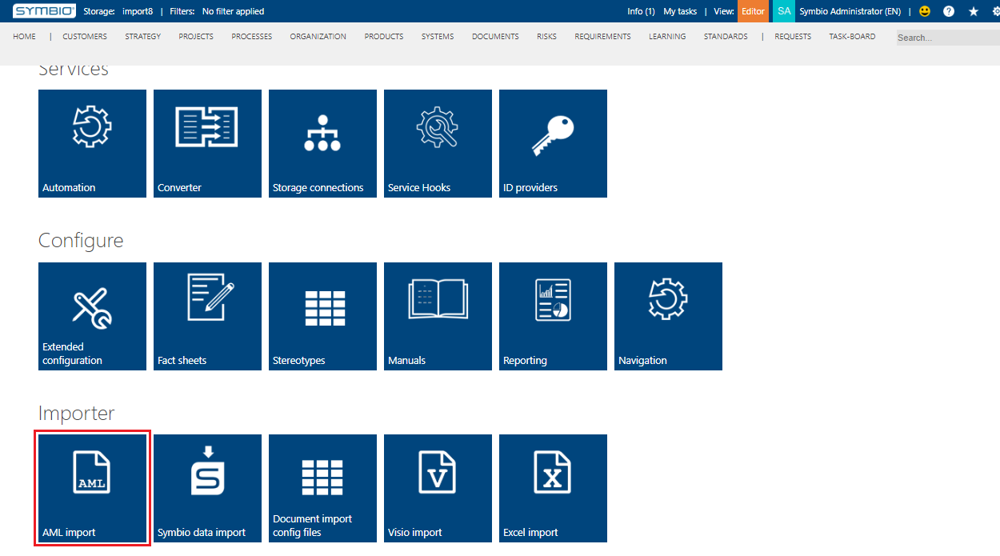
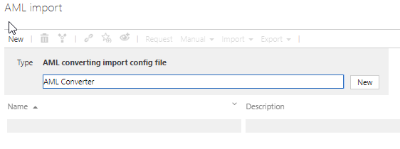
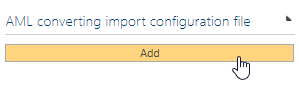
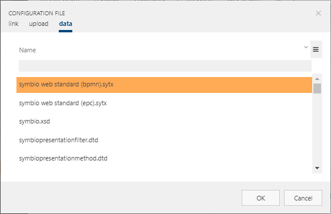
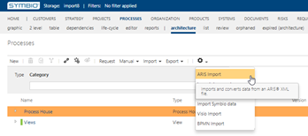
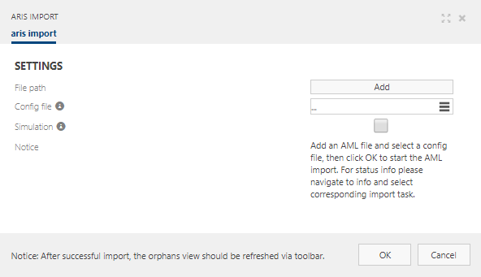
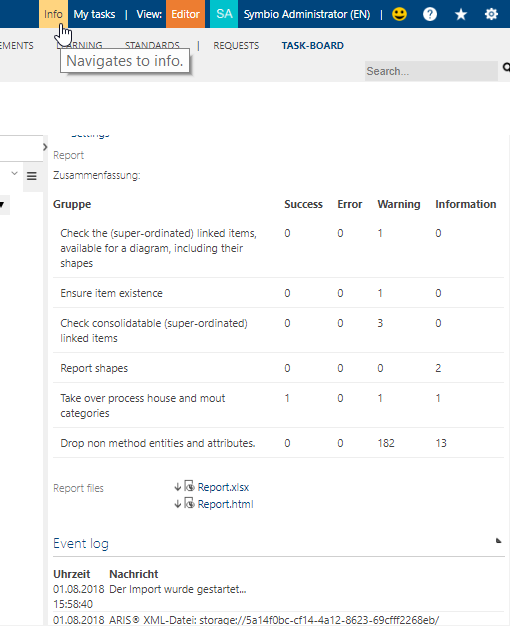
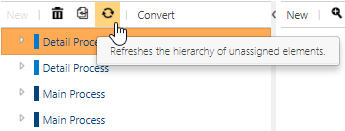
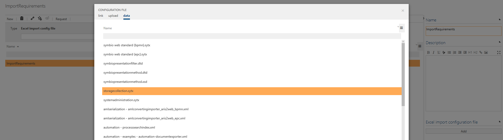

# Importer

## AML import

In Symbio, it is possible to import processes from ARIS. Importing of ARIS data mostly needs a customized config file to import ARIS data successfully.
ARIS data should be imported to an empty database unless you are absolutely sure that the GUIDs which will be imported do not exist in the target database already.  

### Configuration for AML import

To import ARIS data, it is required to set up the AML-import converter first. To do so navigate to administration page and choose AML import.

Create a new AML-import configuration. Enter name and click on New. 

After the new configuration has been created, click on Add in the detail content and follow the dialogue window to add the file. Custom configuration file is important for ARIS data to be imported successfully.

### Import AML data

When previous steps are completed, Symbio is ready to import data from ARIS. Choose Processes > Architecture in navigation menu and proceed to import setup. ARIS import is available in the toolbar with additional administration functionality.

Dialogue window will be opened where import process can be set up. 
To start the importing process please follow these steps.
- Choose the XML file exported from ARIS, click Add
- Choose configuration file (created in previous step)   
- Start the import process by clicking OK

The process will run in background and will take some time depending on ARIS xml file size. You can watch the event log, as well as download the report of the process in Info-board.

After successful import you will find imported processes under Processes > Orphaned. If processes are not visible, please refresh the list. It can be also customized that imported Aris processes are part of the process house.

## Symbio data import

Mapping files to import Symbio data (.symx) can be added here. For instance, repository data can be managed between the testing database and working database. The import will be done in the toolbar with the additional administration functionality.

## Document import config files

Feature to import Microsoft Word documents which require specific config files.

## Visio import

Feature to import Microsoft Visio files. Default converter for BPMN/EPC exist but specific config files are required to import customer’s Visio files. The data type of for migration must be in VSDX.

## Excel import 

Feature to import Microsoft Excel files from external systems (e.g. MEGA) which require specific config files to map items as required.

