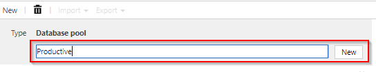
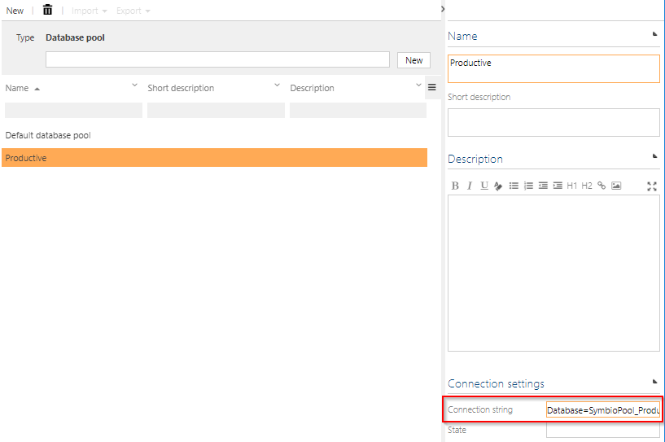
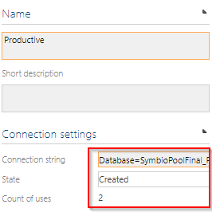
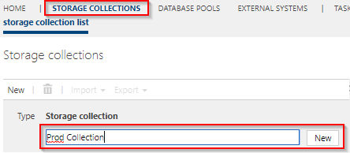
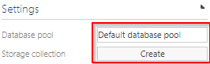
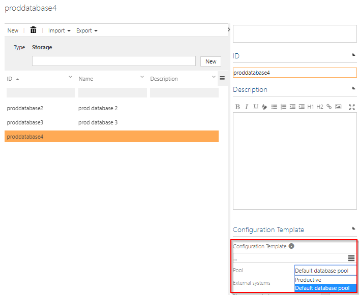

# Database pools

## Create database pools in Symbio

If everything is configured correctly,the the Database Pools tab will be available. 

Create a new database pool for a production system, for example.

  

Note:
Our general recommendation is to create a separate pool for each productive database. This makes it easier to recover data.

## Set up database pools in Symbio

By default, a standard database pool is created, which contains the connection string from the WebConfig. 
A connection string must be entered for the database pool in the detail content. This connection string points to the database in which future connected storages will be stored.

Each database pool has its own status, which can be found in the detail content of the selected database pool. If the status is “New” or “Create”, it cannot yet be used. In status “Created”, it is now accessible and usable. Finally, there is the status suspend. With this status, the database pool is no longer selectable, but still exists. Furthermore, you will find a counter of the storages using the database pool.

## Assign a database pool to storages or storage collection

Once the database pool has been created, a storage collection can be created. Select a database pool in the detail content. If no specific database pool shall be used, its recommended to use the standard database pool for the collection.

Individual storage within a storage collection can also be assigned to different database pools. To do this, select the corresponding database pool from the drop down in the detail content of the storage to be created.

It is important to note that each database collection or database can only be assigned to one pool.
