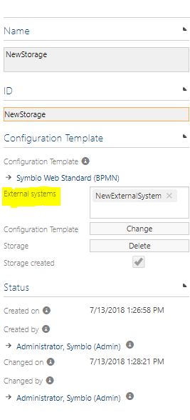
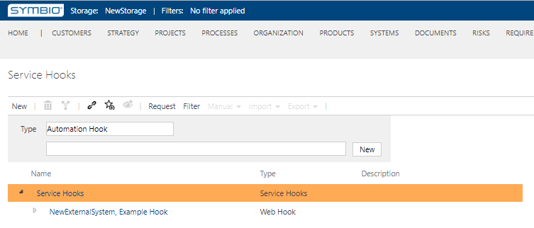

# Connect the external systems

Here you will learn how to connect a created external system to storage

---

Navigate as an Editor to **SysAdmin area**, choose storage collection and click on the **Storages** tile.

Crate new Storage or pick existing one. In detail content set **External systems**. Multiple external systems can be assigned to a storage.

Now, navigate to **Admin area** and then select **Service Hooks**.
Expand the Service Hooks and you will see added external system.

