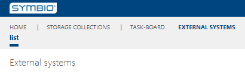
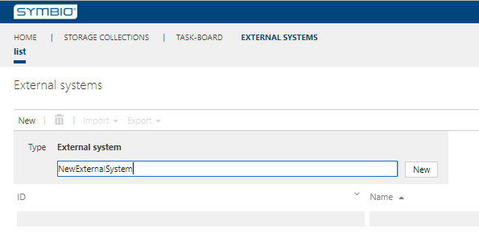
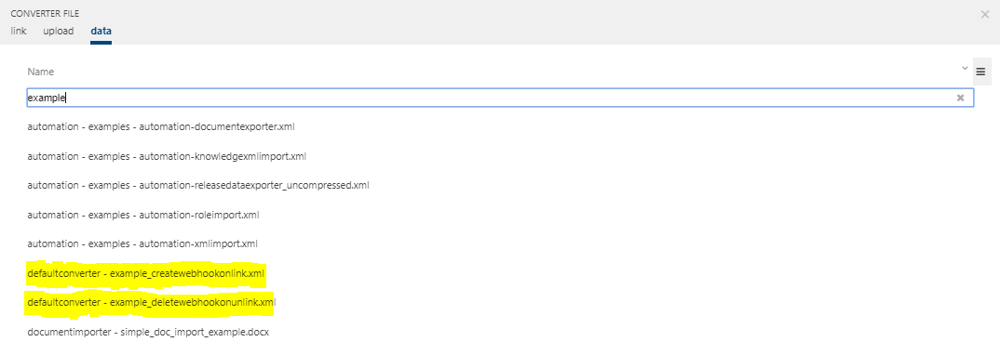
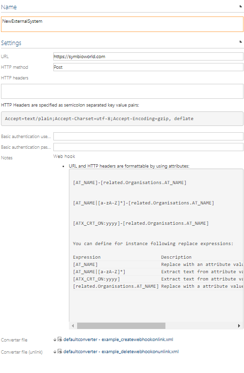

# Creating external systems

The following example shows how to create external systems

---

Navigate as an Editor to **SysAdmin area** and click on the **External systems** tile.

Assign a desired name and click the New button or confirm with the Enter key.

After creating new External system, in **Detail content** you can configure it.

Converter files can be attached to external systems.

Thus you have successfully created a external system.