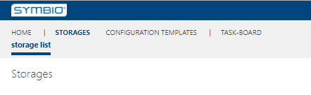
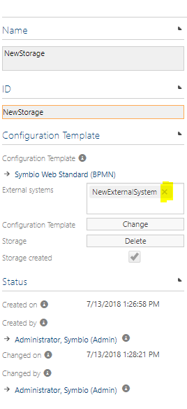
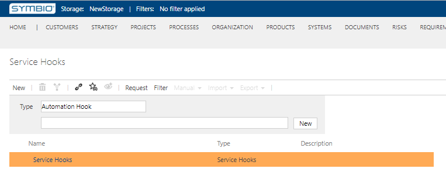

# Disconnect the external systems

Here you will learn how to disconnect added external system

---

Navigate as an Editor to **SysAdmin area**, choose storage collection and click on the **Storages** tile.

Select a storage for which you want to disconnect a external system. In detail content **External systems** remove added external system.

Now, navigate to **Admin area** and then select **Service Hooks**.
Expand the Service Hooks and external system will not be visible any more.

