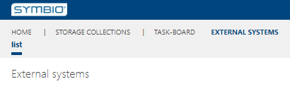

# Updating external systems

The following example shows how to update external systems

---

## Requirements
- You must have an existing external system.
- The .syex file of the external system must contain an update definition in the update folder.

## Steps
1. Navigate as an Editor to **SysAdmin area** and click on the **External systems** tile.
   

1. Select the external system you would like to update and change the values in the details pane.
   

## Result
After you have made changes to the external system, two things will happen:
- The changes will be sent to the external system.
- The updates included in the update converter steps in the .syex file will also be run on each connected storage.
  This is useful for updating the created webhooks in the connected storages as an example.