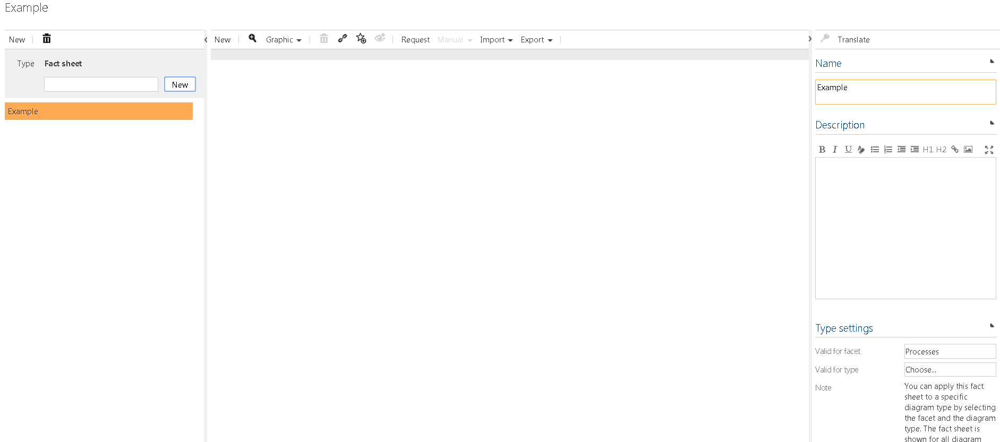
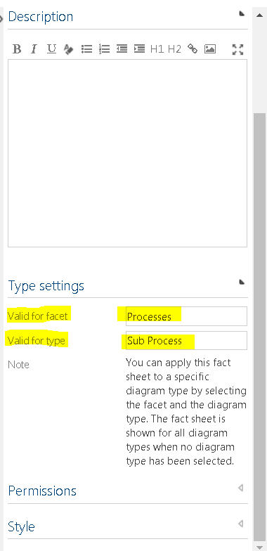

# Creating fact sheets

The fact sheet function allows the administrator to configure individual views for users. 

The configuration of a fact sheet is like the start page configuration, except that for the descriptions there are only the text, list and placeholder widgets available as building blocks.

The following example shows how to create and edit fact sheet for processes. Fact sheets can only be created by administrators.

---

Navigate to admin area and click on the **Fact sheets** tile.

On the left side of the screen **insert a name** for the fact sheet and click on **New**.

After creating new fact sheet, you will see in **Detail content** on the right side, options for that new fact sheet, such as **Name**, **Description** and **Type Settings**, **Permissions** and **Style**.
In **Type Settings**, you must choose the **facet** and **element type** for which the fact sheet is valid for. In our example, we will choose facet *Processes* and element type *Sub Processes*.

After you choose facet and element type you can move to the middle part of the screen, in the **graphics view**.

In the toolbar click on  **New**, and **choose** from the dropdown list the desired widget.

In our example, we will choose **Text Widget**, **Picture Widget** and **List Widget**.

---

When you click on each of widgets in the graphic view, you can **define in the detail content options** for each widget:

- **Name**: The title shown as a header in the widget, when displaying the fact sheet.
-- **Description**: The description is shown below the header in the widget, when displaying the fact sheet.
- **Size**: The dimensions of the widget in units. The maximum width is 8.
- **Style**: Set a background and text color for the widget
using the color picker, or using hex/rgb color values.

Furthermore, each widget offers additional options:

### Text Widget

A text widget is a widget that displays are user-defined text.

- **Text**: Set a pre-defined text shown on each fact sheet. You can add additional format strings that are replaces when displaying the fact sheet to the actual value of the current element. For instance *[AT_NAME]* will be replaced to the *Name* of the sub process.

### List Widget

A list widget provides an enumeration of related elements. Please note that each list widget which is configured for built-in facets will decrease the overall performance.
In **List widget settings** you can set

- **Limit**: Maximum number of displayed related elements.
- **Valid for related type**: The related element type you would like to enumerate.

### Table Widget
A table widget allows you to create dynamic tables for your data. Its content is based on which facet view you choose from. If you want a more customized experience, the facet view table customization allows you to create even more custom facet views to choose from. More [information about the customization here.](../../features/general-design/custom-views-for-table-widget/custom-views-for-table-widget.md)  
In the **Table widget settings** you can select:

- **Limit**: The maximal number of table rows. Some facet views might ignore this setting. 
- **Wrap text**: If not set, the row content will always be in one line without any line breaks.                                              
- **Alternating row style**: Set this if you want gray highlighting of every second row.
- **Table type**: Select a table type, then configure the corresponding table type setting.
     
**Facet view settings**
- **Facets**: The facet for which your facet view is valid for.
- **Facet views**: The facet view contains your dynamic data.

### Diagramm Widget

A diagram widget shows a specified diagram of the current element. In **Diagram widget settings** you can select:

- **Diagram graphic**: The diagram you would like to display.

### Picture Widget

A picture widget shows all images that have been added to a link attribute. In **Picture widget settings** you can select:

- **Link attribute**: The link attribute for which you would like to take the images from. A link attribute can contain multiple urls or file uploads. The widget will place the images in a column-based layout.

### Placeholder Widget

A placeholder widget provides empty spaces in your fact sheet to allow more flexible layouts.

### iFrame Widget

An iFrame widget will embed an external site into your fact sheet. You can specify:

- **Url**: An url to the external site. The preferred format is https://www.symbioworld.com

### Report Widget

A report widget will embed an report you set up in the Reporting view in the admin area. You can specify a connection to the:

- **Reports**: Connect a report you would like to display in the fact sheet.

---
After setting up a fact sheet you can [use the fact sheet](use-factsheets.md)

