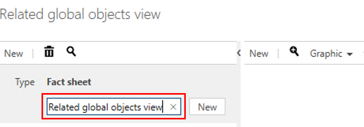
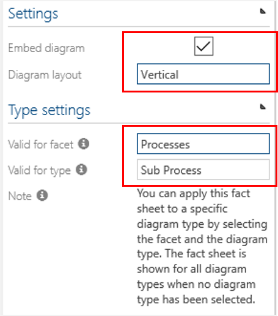
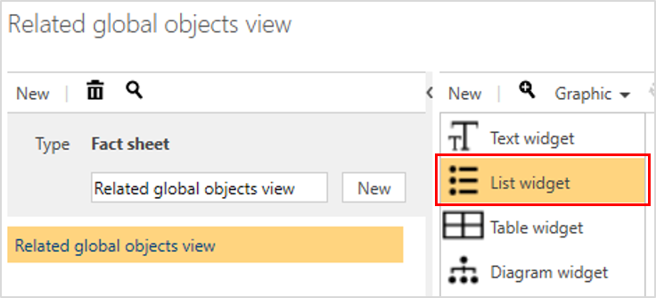
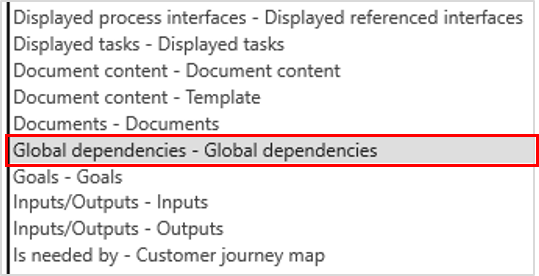
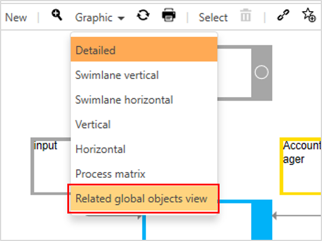

# Fact sheet - Related global objects

With this feature, the Administrator designs a layout to represent global objects on top of a Main Process or Sub Process. 

Please procede as follows:

1. Create a new fact sheet.

     

2. Define Settings and Type settings in the Detail Content.

    

3. Create list widgets to define the layout of the Fact sheet.

     

4. Choose 'Global dependencies' from dropdown of the list widget settings.

      

5. To verify your layout, please navigate to PROCESSES and choose this fact sheet from 'Graphic' dropdown. See results and make adaptions of fact sheet design, if required.

      