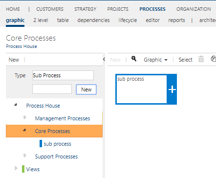
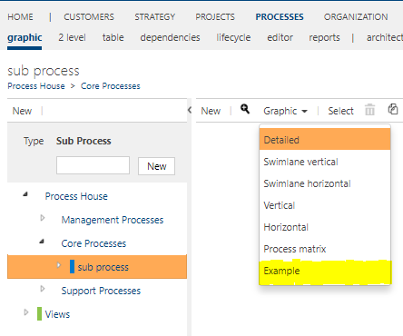
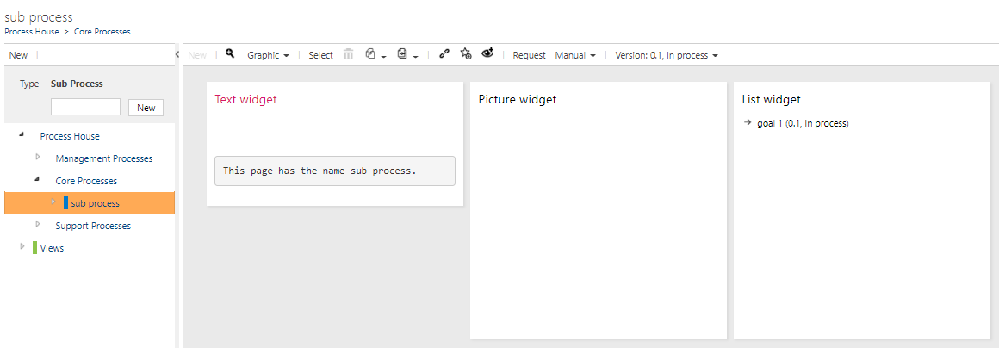

# Use fact sheets

Here you will learn how to use a created fact sheet

---

Navigate to the **graphic view** of **processes**.

**Select the process** you would like to display  a fact sheet.

Expand the **Graphic** button in the toolbar and select the fact sheet in the dropdown.

After selecting the fact sheet, you will see it in the graphic view.

