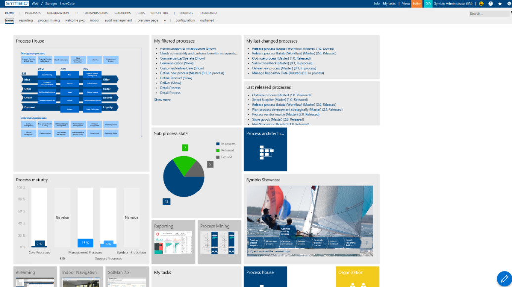
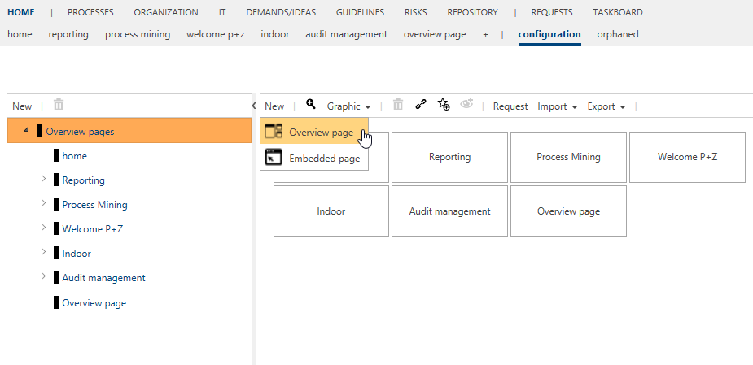
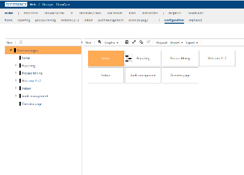
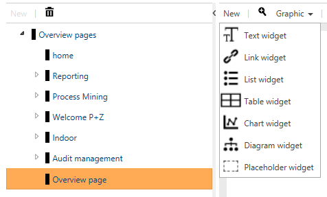
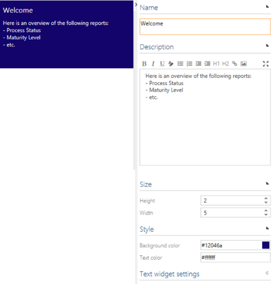
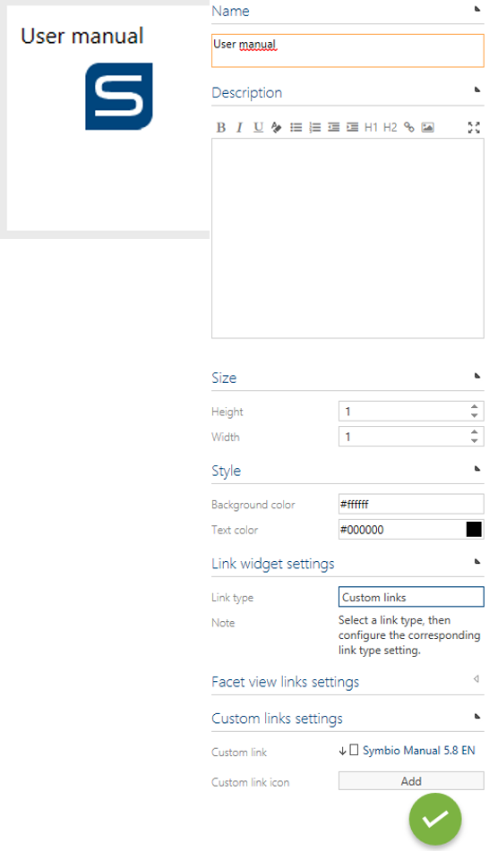
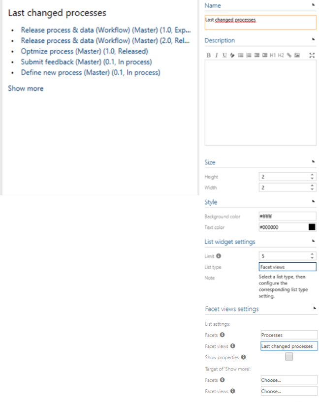
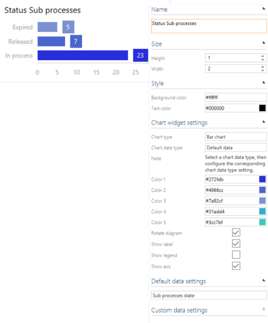
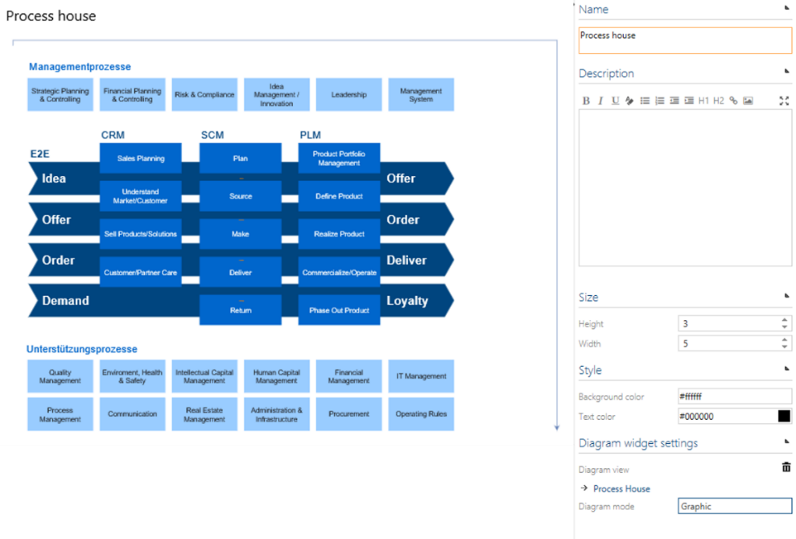
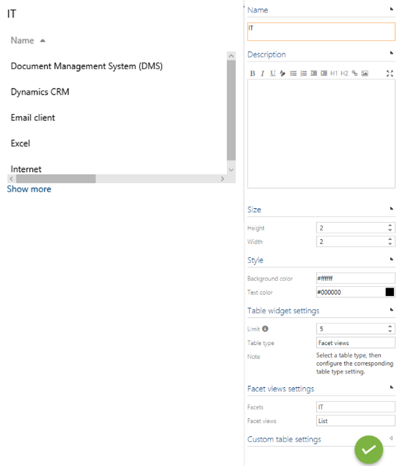

# Home site

Administrators can create different home sites and adjust the design of the widgets on the home site. 

## Create and edit home sites

Administrators can create and edit overview pages and embedded pages.

Using the pen in the lower right corner of the home site or the button configuration in the sub navigation bar you will enter the editing mode of the page you are currently on. 
If you want to create a completely new home site, please click on the + in the sub navigation or click on New.

Each start page can be configured for a specific audience by using permission on user groups (see 'Permit home sites'). 

In the editing mode, you can adjust the background color of the home site.

Please save your changes by clicking on the green pen in the lower right corner.

## Insert and edit home site widgets

Administrators can create, edit and move widgets.

The following widgets are available via the button New:

By clicking on the widget, the Detail Content appears where you can determine the design and the content (i.e. maturity level analysis) of the widget. 
You can also choose name, description, size, background and text color. 
Depending on the kind of the widget there are various design and content capabilities. For example, they can be set to specific sizes, e.g. 2x2, 3x3. Maximum is a column count of 8.

Moving widgets to another position on the page is done by clicking on them and then using the arrow which appears. At the moment, widgets can only be moved to the left.

### Text widget

Here, please find an example of a text widget.

### Link widget

Here, please find an example of a link widget.

### List widget

Here, please find an example of a list widget.

### Chart widget

Here, please find an example of a chart widget.

### Diagram widget

Here, please find an example of a diagram widget.

### Table widget

Here, please find an example of a table widget.

## Permit home sites

Symbio supports the configuration of home sites for different user groups. In the Navigation tree, the admin creates a new site and creates the page as described above. After the page has been configured, an authorization group is assigned to the page. According to this principle, the administrator constructs the home sites for the groups and then authorizes the page in detail content.

## Import home sites

If you have modified our default home site, you need to remove our default home site in new storages before import.

Moreover please use XML export and not SYMX for Startpages.