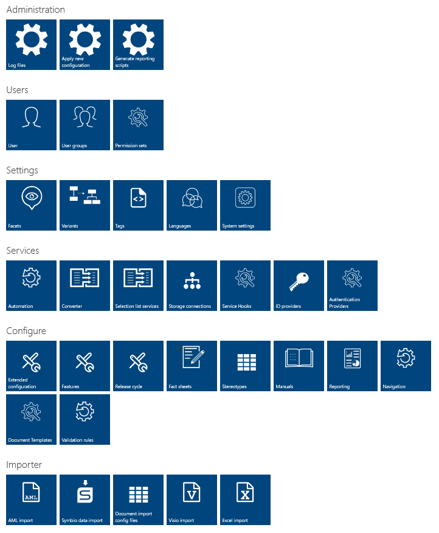

# Symbio Administration

To enter the configuration area for the Symbio Administrator please click on the clog wheel symbol in the upper right corner:

The following is a short description of the various administration and configuration possibilities in the administration area.

For Symbio version info, navigate to the bottom of the page. The version number includes the build date, the commit ID and the commit date of last code changes.
Please reference to it in case of incidents if on-premise.

## Log files

Log files from Symbio application folder can be retrieved here. By default, only errors will be logged. Please contact your Symbio IT Administrator if the logging level needs to be increased to include warnings and informational log messages by changing settings in the Web.config file during downtime.

## Apply new configuration

If the configuration/method (SYTX) has been changed only and the changes are not directly visible, the Admin can force the configuration change here but it should not be necessary.

## Generate reporting scripts

SQL Reporting Services Database relevant only. Please contact us if you like to use Reporting within Symbio.
