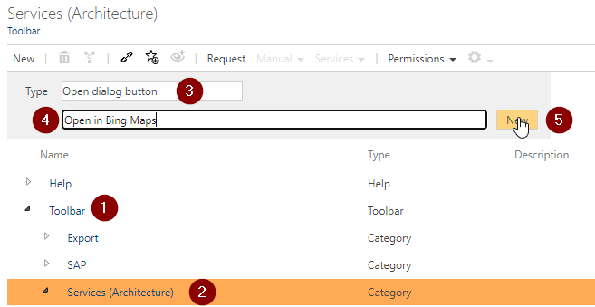
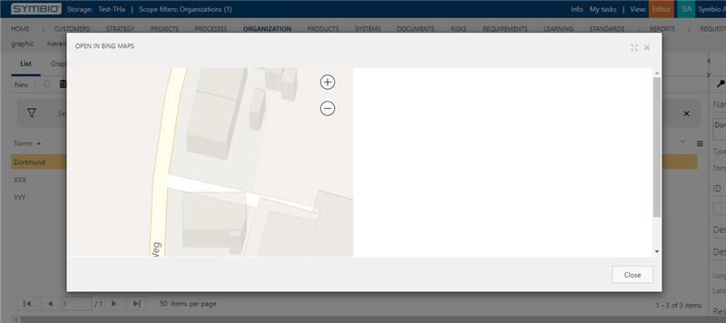

How to create a button to show a location in Bing Maps

1. Go to the admin area.
2. Click in the `Configure` category on `Navigation`.
3. Create a new button:
    - Expand `Toolbar` element (see 1 on graphic)
    - Select `Services (Architecture)` element (see 2 on graphic)
    - Select type `Open dialog button` (see 3 on graphic)
    - Enter the name `Open in Bing Maps` (see 4 on graphic)
    - Click on `New` to create the button

    
4. Go to the detail content of the created button element and do the following changes:
    - `Activated`: Activate the checkbox to enable the button
    - `Valid for facet`: Select the `Locations` facet
    - `URL`: Use the following URL:
    ```
    https://www.bing.com/maps/embed?h=400&w=500&cp=[ATX_LATITUDE]~[ATX_LONGITUDE]&lvl=20&typ=d&sty=r&src=SHELL&FORM=MBEDV8
    ```

Now you can open the locations (Organizations -> Locations), create or select a location with longitude and latitude and open the dialog by clicking on `Services` -> `Open in Bing Maps`.

