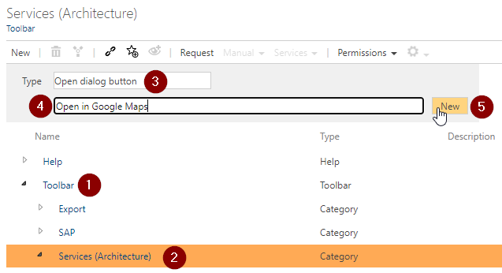
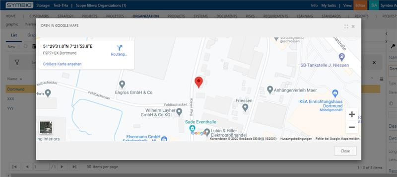

How to create a button to show a location in Google Maps

1. Create a Google API Key
    - Go to the [Google Cloud Platform Console](https://cloud.google.com/console/google/maps-apis/overview).
    - Click the project drop-down and select or create the project for which you want to add an API key.
    - Click the menu button  and select **APIs & Services > Credentials**.
    - On the **Credentials** page, click **+ Create Credentials > API key**.  
    The **API key created** dialog displays the newly created API key.
    - Click **Close**.  
    The new API key is listed on the **Credentials** page under **API Keys**.  
    (Remember to [restrict the API key](#restrict_key) before using it in production.)
2. Go to the admin area.
3. Click in the `Configure` category on `Navigation`.
4. Create a new button:
    - Expand `Toolbar` element (see 1 on graphic)
    - Select `Services (Architecture)` element (see 2 on graphic)
    - Select type `Open dialog button` (see 3 on graphic)
    - Enter the name `Open in Google Maps` (see 4 on graphic)
    - Click on `New` to create the button

    
5. Go to the detail content of the created button element and do the following changes:
    - `Activated`: Activate the checkbox to enable the button
    - `Valid for facet`: Select the `Locations` facet
    - `URL`: Use the following URL:
    ```
    https://www.google.com/maps/embed/v1/place?q=[ATX_LATITUDE],[ATX_LONGITUDE]&key={YOUR_CREATED_GOOGLE_API_KEY}
    ```

Now you can open the locations (Organizations -> Locations), create or select a location with longitude and latitude and open the dialog by clicking on `Services` -> `Open in Google Maps`.

