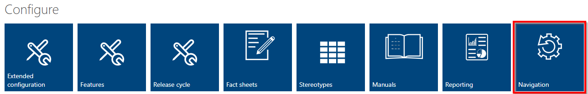

## Navigation

You can easily add navigation items to the toolbar with small configuration steps. There are predefined locations in the Toolbar (e. g. Services) where you can add your own buttons. You can use the following button types:

- **Open dialog button**: This button you can use if you want to open an external page inside of a dialog. You can use [ATX_NAME] replacements to insert attributes from the selected element into the URL.
- **Execute hook button**: This button you can use if you want to execute an hook manually. There are different types of hooks, e. g. web hooks, automation hooks, ....

You can find the settings for the navigation in the admin area:

### Examples

We collected the following examples how you can create bring a button into the toolbar:

- [How to create a button to show a location in Bing Maps](../bingmaps)
- [How to create a button to show a location in Google Maps](../googlemaps)
