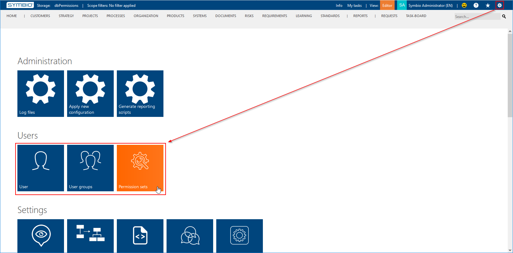
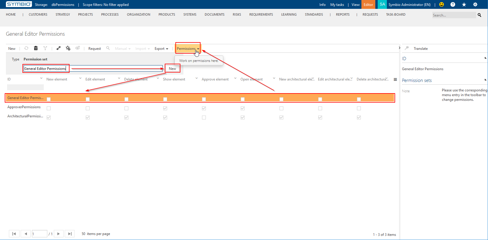
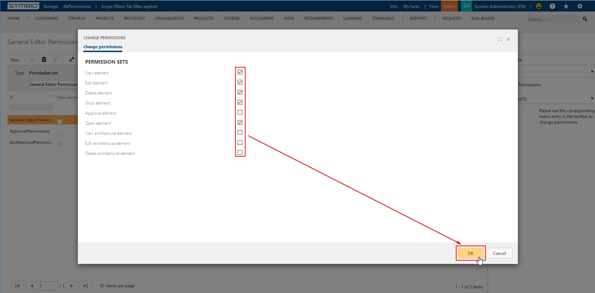
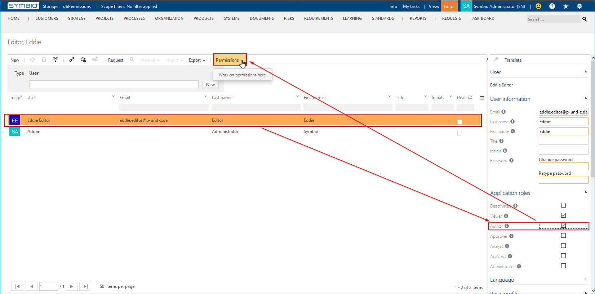
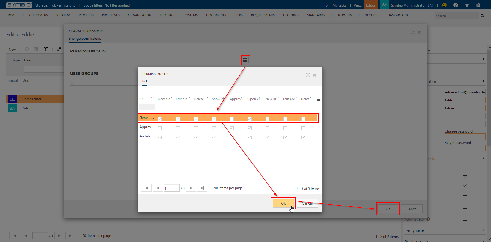
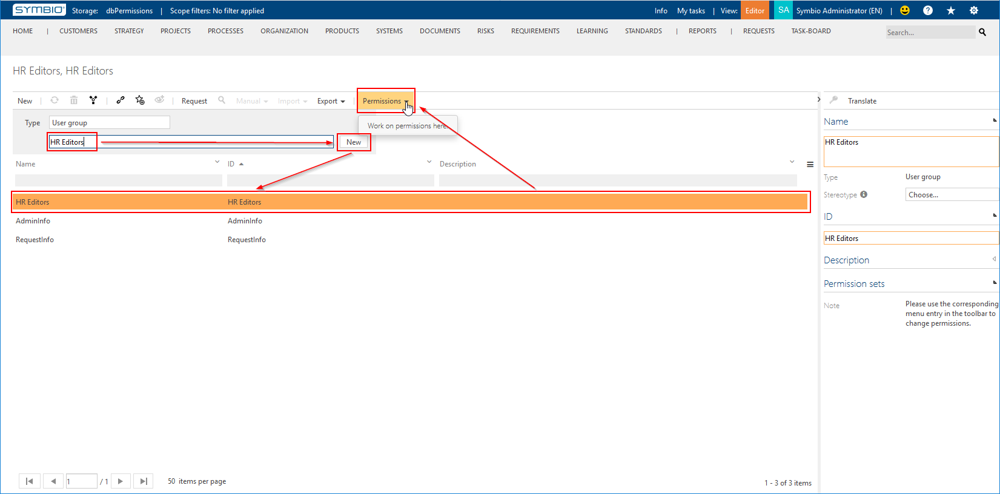
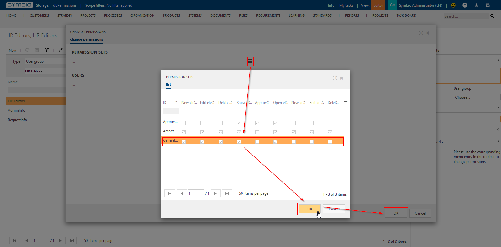
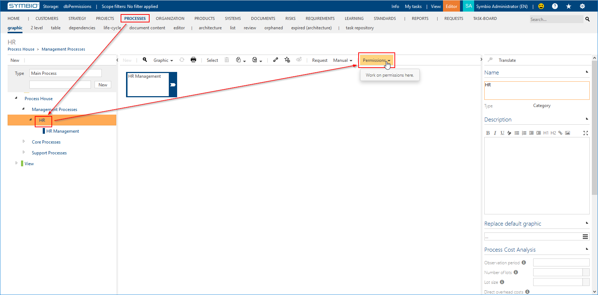
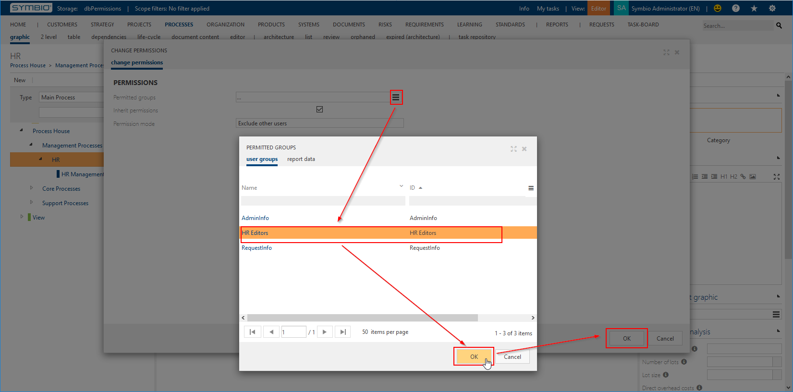

# Creating and Assigning Permission Sets

Permissions are granted by
* creating permission sets
* assigning these permissions sets to
  * users as global fallback permissions
  * user groups as local permissions
* assigning these user groups to hierarchical element nodes as inheritable local explicit permissions

To manage those points go to the Admin area in Symbio and select the appropriate section:

## Permission Sets

To create a new permission set enter a name and click "New";
to set the permission set's permission levels select it and click "Permissions" in the toolbar:

When setting permission levels select the desired permissions and then click "OK":

## User Default Permissions

To assign default permissions to a user select them and ensure that the correct role is set (e.g. to be able to actually "Edit element" you must be able to switch into "Editor" mode), then click on "Permissions":

_Beginning with the February 2020 Release of Symbio you maintain a user's application role using the "Change permissions" dialog._

In the dialog "Change Permissions" select the 'burger' button after "Permissions Sets" and in the dialog "Permissions Sets" select the permission set to add; click "OK" to add the selected permission set and "OK" again to apply the changes to the user:

## User Group Permissions

Concerning permissions, user groups are the binding element between users and actual elements.

To authorize users on specific elements you will have to:
* assign appropriate permission sets to a dedicated user group (see below),
* assign users to this dedicated user group,
* assign this dedicated user group to elements to protect (see next sections).

Create the dedicated user group, select it, and click "Permissions" in the toolbar:

In the dialog "Change Permissions" select the 'burger' button after "Permissions Sets" and in the dialog "Permissions Sets" select the permission set to add; click "OK" to add the selected permission set and "OK" again to apply the changes to the user group:

## Hierarchical Permissions

To actually secure a hierarchical subtree select the desired facet, the node to protect, and then "Permissions" in the toolbar:

In the dialog "Change Permissions" select the 'burger' button after "Permitted Groups" and in the dialog "Permitted Groups" select the user group to add; click "OK" to add the selected user group and "OK" again to apply the changes to the selected node:

