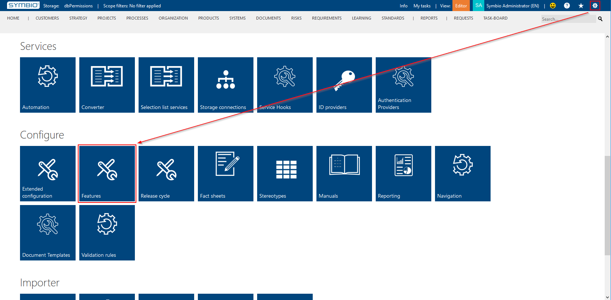
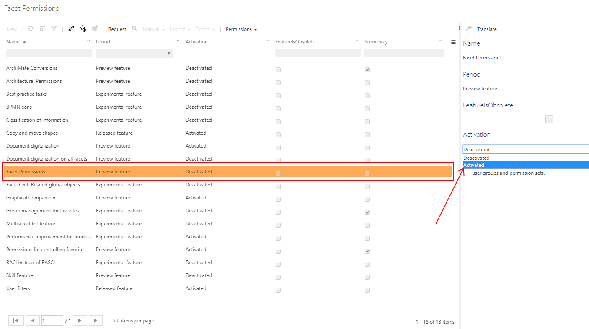
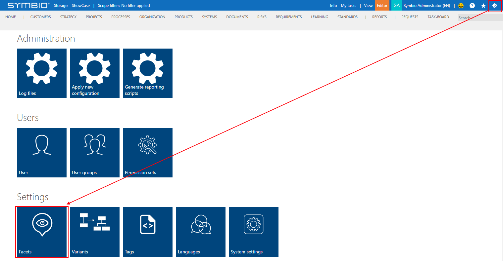
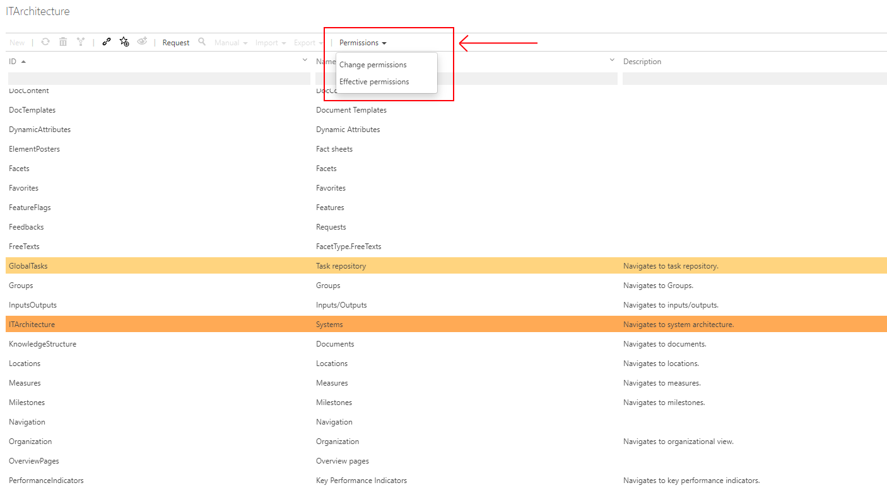
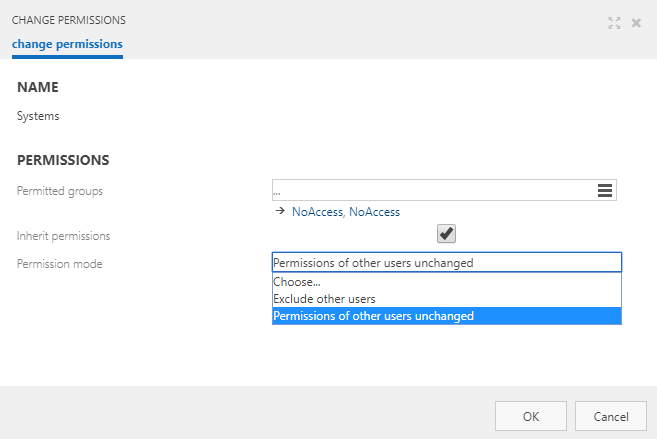

### Purpose of the Feature "Permissions for Facets"

After activating the feature, you can assign permissions to each facet as you would for other elements. 
Once you did so, these permissions are the defaults for elements within the facet and are added to 
the default permissions of the user. In addition to the normal consequences of permissions for elements,
the facet is completely hidden if the user does not have "Show" permission for the facet, i.e. the facet is not 
visible, for example, in the navigation or in relations in the detail content of another element.

If you only want to hide a facet in the navigation (e.g. in viewer mode), but want to grant "Show" 
(and more) permissions for the elements of the facet, you cannot use the facet permissions for this. 
For this purpose, you should use the "Hide Navigation" customization.   

### Activating the Feature "Permissions for Facets"

__You need to be an Administrator to activate this feature.__

* Go to the Admin area in Symbio and click on "Features":

* Select "Architectural Permissions" and change "Activation" to "Activated":

_Please note the consequences of activating this feature; read the explanation under "Activation" carefully._

### Changing permissions in Facet administration

* Go to the Admin are in Symbio and click on "Facets":

* Select facet to change permissions for and open Permissions menu from the toolbar

_Please note that Permissions menu in the toolbar was deactivated when Feature "Permissions for Facets" is not active._

After selecting the Permissions menu item, new Permissions dialog will be opened. Permission dialog allows following options for defining permissions.

* Name (shows the name of the selected item for which permissions are defined, in this case selected facet)
* Permitted groups (define what groups will be configured for selected item permissions, the selected item will be showed if user group have at least show permission)
* Inherit permissions ( does not affect permissions for facets)
* Permission mode
  * Exclude other users (only users of selected user groups will have access to the selected item)
  * Permissions of other users unchanged (users that are not part of the selected user groups are unaffected by permissions defined here)

### Examples:

### 1. Access to navigation and other elements in facet

Only users from user group OrganizationAccess can access and edit elements from organization facet.

* Selected item: facet Organization
* Permission group: OrganizationAccess with permission set that have Show, Open, New and Delete permissions
* Inherit permissions: not important
* Permission mode: Exclude other users

_In this example only users that are part of user group OrganizationAccess can access menu item that is related to Organization (graphic, hierarchy, document content). Other sub-items in navigation like roles, groups, and locations are facets of their own, so the permissions for them should be done separately. Also for this users Organizations are visible and editable from the other parts of Symbio such as process diagrams. Other users that are not part of this user group will have no access to Organization facet. Because no permissions are defined on roles, groups and locations, these menu-items will be accessible for other users._

### 2. Hiding top level navigation items

To completly hide Organization menu item from navigation, all menu sub-items should be also hidden. In this case same permissions should be applied to all Organization, Roles, Groups and Locations facets:

* Selected item: facet Organization, Roles, Groups, Locations
* Permission group: OrganizationAccess with permission set that have Show, Open, New and Delete permissions
* Inherit permissions: not important
* Permission mode: Exclude other users

_In this example all others users not part of the user group OrganizationAccess will not be able to see or access Organizations and other sub-menu items from navigation. Also in other parts of Symbio organizations will not be visible._