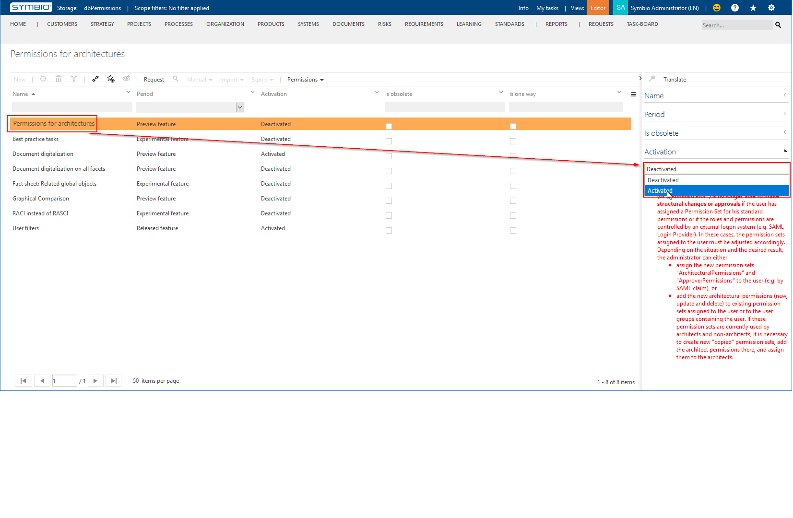

# Permission Levels Explained

Symbio supports several permission levels. Some of them are available as features that need to be activated separately.

## General Permissions

* __New element__: If this permission level is granted, a user can create new elements.
* __Edit element__: If this permission level is granted, a user can not only view but also edit an _already existing_ element's content, e.g. properties, diagram content, etc.
* __Delete element__: If this permission level is granted, a user can delete existing elements.
* __Show element__: This controls whether an element is visible to a user or not. The element will be shown as a symbol and/or by name if this permission level is granted.
* __Approve element__: If this permission level is granted, a user can approve changes to an element.
* __Open element__: This controls whether an element can be viewed in detail or not. The element's content, e.g. properties, diagram content, etc., can be viewed if this permission level is granted.

These permission levels are context-sensitive, e.g. you need to be able to switch into "Editor" mode (i.e. you also need at least the role "Editor") to utilize granted Edit/New/Delete/Approve permissions, and they only affect non-architectural elements.

To affect architectural elements you either need to be at least assigned to the role "Architect", or have the feature "Permissions for architectures" activated _and_ appropriate permission levels assigned (see below).

### Included Permissions

| Permission Level | Includes         |
|------------------|------------------|
| New element      | show, open, edit |
| Edit element     | show, open       |
| Delete element   | show, open       |
| Show element     | -                |
| Approve element  | show, open       |
| Open element     | show             |

## Permissions for architectures

These permissions affect architectural elements, e.g. Process House, Sub Categories, Main Processes, Risk Domains, etc.

* __New architectural element__: If this permission level is granted, a user can create new architectural elements.
* __Edit architectural element__: If this permission level is granted, a user can not only view but also edit an _already existing_ architectural element's content, e.g. properties, diagram content, etc.
* __Delete architectural element__: If this permission level is granted, a user can delete existing architectural elements.

### Included Permissions

| Permission Level             | Architectural Includes | General Includes      |
|------------------------------|------------------------|-----------------------|
| New architectural element    | edit                   | show, open, edit, new |
| Edit architectural element   | -                      | show, open, edit      |
| Delete architectural element | -                      | show, open, delete    |

### Activating the Feature "Permissions for architectures"

__You need to be an Administrator to activate this feature.__

* Go to the Admin area in Symbio and click on "Features":
  

* Select "Permissions for architectures" and change "Activation" to "Activated":
  

_Please note the consequences of activating this feature; read the explanation under "Activation" carefully._
