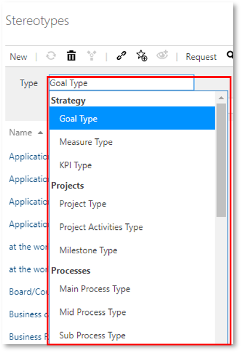
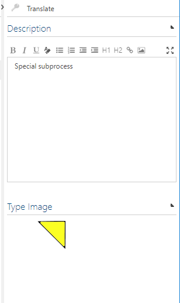
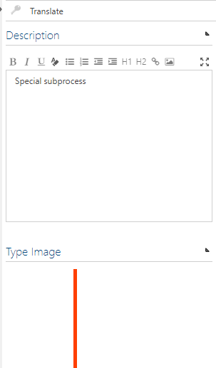

# Creating the Stereotypes

The following example shows how to create and edit stereotypes for processes or objects.

In the Admin area, go to the __Stereotype__ tile in the section 'Configure'.

Go to the dropdown to select the process or object to which a stereotype should be added:

From the drop-down list, select the desired __Type__ for which the stereotype should be applicable.
Assign a name and click the New button or confirm with the Enter key.

Now you can enter a description on the right side like an image.

 

*`Note: The image must be transparent and have a size of 100 * 250 pixels.`*

Thus you have successfully created a stereotype.