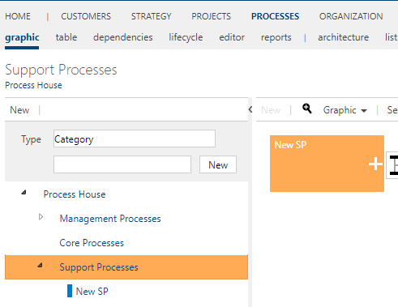
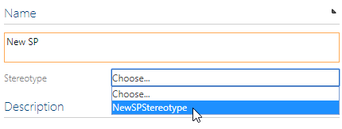
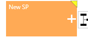
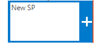

# Using the Stereotypes

Here you will learn how to use a created stereotype

---
Navigate to the process and from there to the graphic.

Select the process that should have a stereotype. The process type must be the same type as the stereotype.

Expand the 'Name' area in the detail content. You can now select the stereotype in the dropdown.

Once the change is saved, you can see the image on your process.

 

You have just successfully used a stereotype.