# Storage collections and databases

Please open the browser and call up the configured website.

The link /_sysadmin/_admin will get you into the central administration.
Example : https://localhost/_sysadmin/_admin

You log in as Administrator.

Existing storage collections are displayed and you can create new collections by clicking.

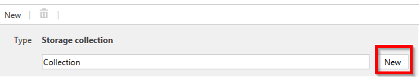
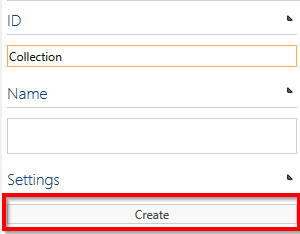

A dialog box opens. Enter the name of the new storage collection into the text box and confirm with “New”.

Click the Create button on the right-hand side under “Settings” in the Detail Content area.

The HOME main navigation displays all storage collections. Click the tile to navigate to the newly created storage collection.

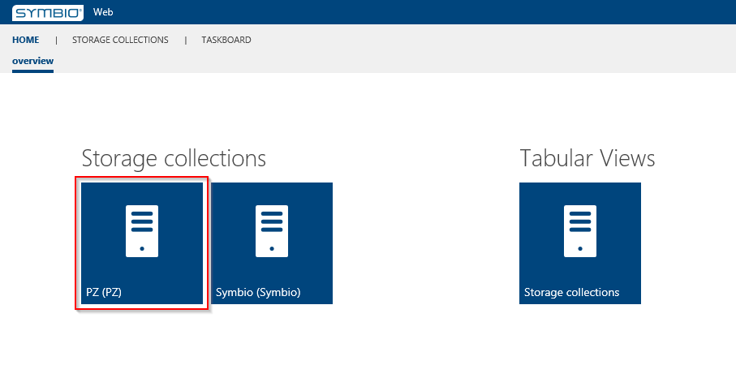

A new database is created in the storage collection under Tabular Views => Storages.

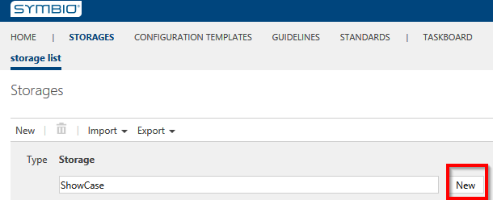

## Configuration templates

### Embed configuration template

Before you create a database, it is absolutely necessary to select a configuration template and then integrate it. Please select the configuration template in the detail area of the database to be created and select a corresponding template.

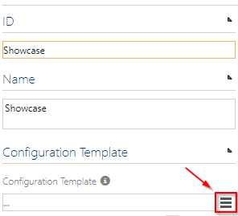

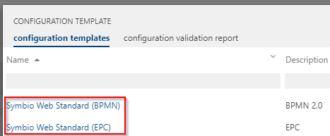

Symbio comes with predefined configuration templates after installation. However, the configuration may differ from the standard. If there is a special configuration, please navigate via the home page to the tile "Configuration Templates".

### Add new configuration template (optional)

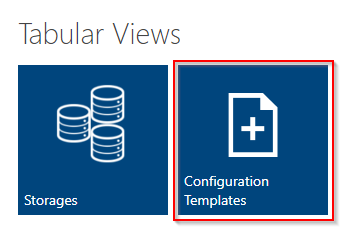

Here an extension by a new template is necessary first. A corresponding configuration file is uploaded. It is recommended to store these SYTX files in the App_Data directory of Symbio. Afterwards the file can be selected via the Upload Screen without having to specify a directory.

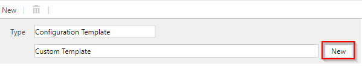

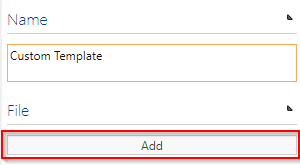

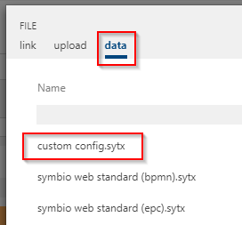

The newly created configuration template can now be selected when creating a database.

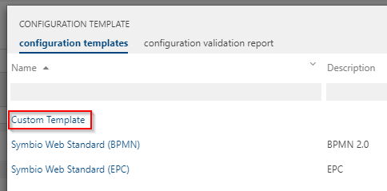
