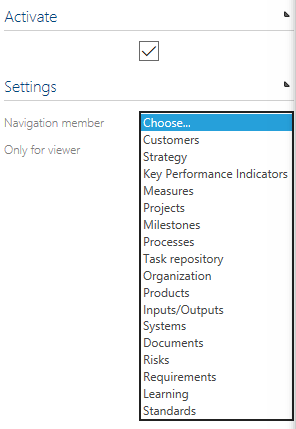
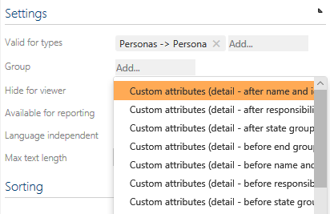
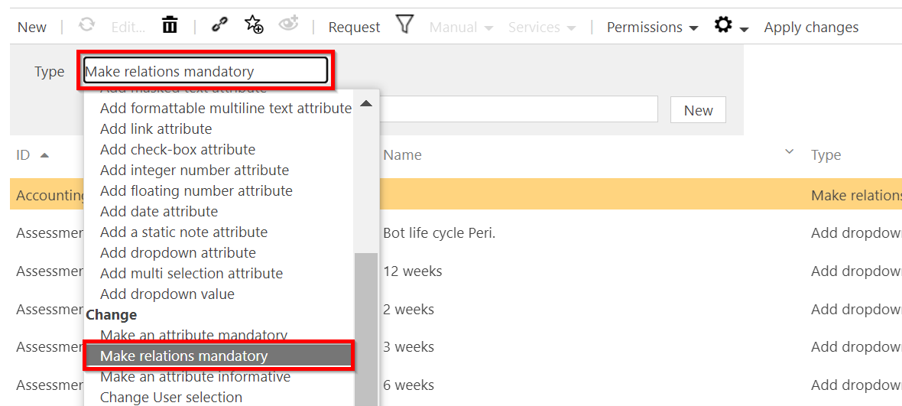
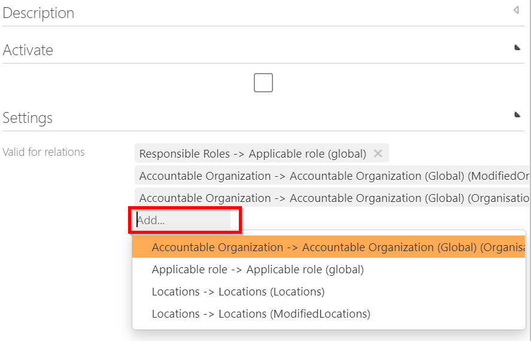
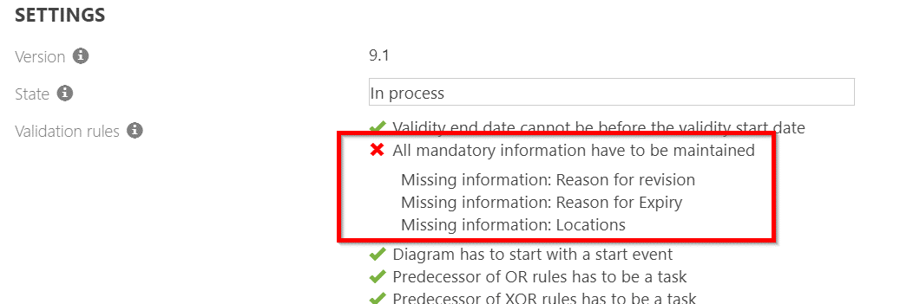
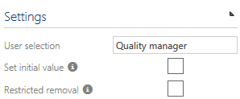
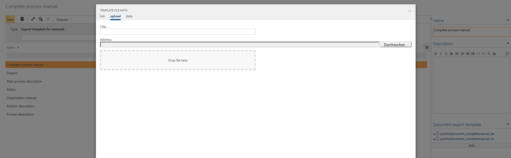
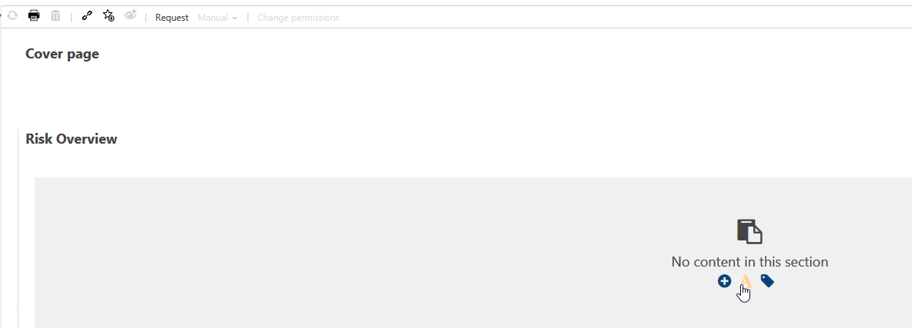

# Configure

## Extended Configuration

Additional configuration options are available in the Admin area. This includes hiding various information, renaming the standard interface, adding new attributes or changing them. 

To use the advanced configuration, please proceed as follows:

- Navigate to the Admin area and open the tile 'Extended configuration'

  

- Create a new type with one of the configuration options __Hide, Rename, Add__ or __Change__. 

  

The next sections describe these configurations in more detail.

__NOTE__: To apply all changes, the configuration has to be activated by click on check box and additionally applied afterwards.

### Hide

This configuration allows to hide views or specific attributes in the Detail Content. If this should be hidden for viewers only, please activate the checkbox 'Only for viewer' accordingly.

#### Hide graphic layout

The configuration "Hide graphics options" allows the administrator to minimize the graphical selection in processes. All standard graphics in Symbio and the user-defined fact sheets can be managed with this configuration. 

1. Select type „Hide graphic layout“
2. Enter name for configuration entry (e.g. detailed view Sub Process)
3. Define settings 
4. Activate configuration entry

      

      

5. Apply changes (this only works for configuration entries which are activated in the Detail Content; all configuration entries are always applied).

      

#### Collapse views

With this configuration, individual areas such as Detail Content or the navigation tree can be collapsed for Viewer and/or Editor.

#### Hide attributes

The configuration Hide attributes allows you to delete content in the Detail Content, e. g. 'Risk assessment'.

#### Hide referenced objects

The configuration Hide referenced objects you can hide certain elements you do not need for modeling.
Example: Hide 'Requirements' in Detail Content 

1.	Create configuration entry with meaningful name (e.g. Requirements DC)
2.	Define settings: Valid for facet= requirements; valid for type= requirements

      

3. Check Activate
4. Apply changes

#### Hide global groups

Hides complete groups, e.g. 'Responsible Role', in detail Content.
Hiding can be done for all users or only for the viewer mode.

#### List widget: Hide global corona types

This configuration is related to the feature __Fact Sheets: Global related objects__ that allows to display global (sub process-related) information aggregated on top of a process.

Here you have the option to hide specific global objects, e.g. Inputs/Outputs, for reasons of a clearer presentation.

Please refer to [Features - Process design](https://docs.symbioworld.com/admin/features/introduction/introduction/) for more details.

#### Hide navigation member

Entire navigation members can be hidden. These include e.g. systems 
or input/output.

### Rename

The administrator renames the information names using this configuration. The new name replaces the selection and is now used throughout the system. 
You can also use this function to rename user attribute groups.

### Add

1. The Administrator can set up user-defined attributes.

      

2. In Detail Content, the administrator can select the element types to which the user-defined attribute is to be added. 
Multiple selection allows you to assign the configured attributes to the required types.

      

3. To any of the new configurated attributes there is the possibility to add “tooltips” to describe the attribute or give hints. The administrator can also use "edit custom attributes" to add the user-defined attributes to the editing of released elements. Thus the user-defined attributes for released attributes can be changed afterwards without versioning. These changes are displayed in the lifecycle.
The following user-defined attribute groups are available:

      

      User-defined attribute groups can be renamed using the configuration option Rename.

      

4. By activating “Only for Viewer” this custom attribute will only be displayed for the viewers

5. By activating “Available for reporting” the custom attribute will be analyzed in the estandard reports as well. If this is not activated, this attribute won´t be a part of the reporting

6. By activating "Searchable" this attribute will be considered in the Symbio standard search. 

7. By activating “language independent”, this attribute will be for every language and can´t be translated.

8. By activating "Editable in Released state", this attribute may be edited even afterwards in released state.

9. NOTE: We recommend to enter a Max text length, otherwise the default length of 81 characters will be automatically set. 

10. To apply all changes, the configuration has to be activated and applied afterwards.

      

Please find more details below: 

#### Add single line text attribute

1. Select attribute type 

2. Define ID and set up configuration entry via New.
Defining the ID in capital letters determines the last part of the API name.
Please do not use special characters or '-'.

      

      The API name for reusing in for example manuals would then be:
'ATX_CUSTOM_SHORT_DESCRIPTION'

3. Define settings in the Detail Content 

      

      Name: must be maintained in all languages. You can use the Translate button

      Tool Tip: if maintained the attribute will appear with an info symbol and a note when using the mouse over.
      Sorting: if there are several user-defined attributes per user group, the order can be determined here.

      Activate: must be checked; otherwise the attribute is not considered when changes are applied.

      Settings: Valid for facet, valid for type, group, language independent, maximal length.

#### Add multiline text attribute

This is to add a multiline text attribute. Please see description above re. "single line text attribute" - and don't forget to enter the Max text length. Otherwise, 81 characters are set by default.

#### Add masked text attribute

This is to configure a single line text attribute that allows to hidden entries for your own password management.

#### Add formattable multiline text attribute

This is to add a multiline text attribute that allows HTML formating, similiar to the "Description" field.

#### Add link attribute

This allows to add links, similar to the "Attachments" section. We recommend to activate "Language independent". Please note that uploaded files do not exceed 10 MB.

#### Add check-box attribute

This is to add an additional check-box. If the check-box should be activated by default, select the option "Default value". We also recommend to activate "Language independent".

#### Add integer number attribute

This is to add a field for editing integer numbers. As an option, a Min and Max value can be specified. If you enter integer or decimal numbers outside this range, they are rounded down to the Max value or rounded up to the Min value. Furthermore, a "Default value" number can be set, that appears by default. We also recommend to activate "Language independent".

#### Add flowting number attribute

This is to add a field for editing flowting numbers, i.e. decimal numbers, with +/- sign etc. As an option, a Min and Max value can be specified. If you enter number outside this range, they are rounded down to the Max value or rounded up to the Min value. Furthermore, a "Default value" number can be set, that appears by default. We also recommend to activate "Language independent".

#### Add date attribute

This is to add a date attribute. We recommend to activate "Language independent" as well as the "Editable in released state" option. NOTE: If the field "Default value" remains empty, the date 01.01.0001 is automatically set for new created elements (for existing elements, however, no default value is displayed).

#### Add static note attribute

This is to add a static and unchangeable note, e.g. as a specific hint or comment for the process modeler.

#### Add dropdown attribute

This is to add an additional dropdown field. Suitable dropdown values can only be added after activiation by "Adding dropdown values".
NOTE: the following is to be observed here:
- Language independent should be checked
- Apply the changes bevor assigning values

#### Add multi selection attribute

This is to add an additional multi selection field. Suitable values can be added after activation by "Adding dropdown values".
NOTE: the following is to be observed here:
- Language independent should be checked
- Apply the changes bevor assigning values

#### Add dropdown value

In addition, the following is to be observed here:
- When a new value attribute is created (ID is VALUE) the API name AVTX_CUSTOM_VALUE 
- The selection list attribute must be assigned

### Change

By configuring 'Change', the administrator can change settings in Symbio. To apply all changes, the configuration has to be activated and applied afterwards.

#### Make an attribute mandatory

The admin can make any attribute mandatory. For this, the type 'make an attribute mandatory' needs to be selected and in detail content the settings can be defined. After applying this, all user has to manage the mandatory fields. For example you can set a description to mandatory so any author has to fill in a description for the process.

#### Make relations mandatory

The administrator can use this configuiration type to extend Validation Rules with relations that must be maintained to Change the State (Release) of a Process. 

1. Select the type Make relations mandatory and provide a name for the configuration.

 

2. In Detail Content, the administrator can select the relations that have to be mandatory maintained. Multiple selections are possible.

 

After applying the changes, the Validation Rule “All mandatory information have to be maintained” will consider also the mandatory relations. 

 

#### Make an attribute informative

The administrator can use this extension to store certain content as informative and thus define it as read-only. This means that these contents cannot be edited. For example, systems can be set as write-protected by this configuration and the content can be retrieved from the BCM interface.

#### Change user selection

The admin adjusts the users in Symbio and can activate or deactivate the inheritance of the persons responsible. By click on the check box, he can define that Responsibles are automatically taken over from the upper hierarchical level.

It is also possible to set that only the selected user types are allowed to edit the inherited person responsible.

#### Change shape type

This offers the possibility to make geometry and colour adaptions of the process flow objects. Please contact us for more details.

#### Adapt name display format 

This is to show the ID as a prefix in the navigation tree in front of process name:

Configuration example:

#### Adapt shape display text format 

This is to show the ID as a prefix in the shape in front of process name (currently only available for Sub Processes):

Configuration examples:

#### Change default layout

Generally, the default layout for processes is 'Vertical'. If you like to change this, you can set your individual default layout here. This is also applicable for further facets, e.g. Organizational units, where you can choose between Graphic/Detailed view. 

#### Show shape numbers

This setting is a prerequisite for using the Feature __Method: Numeration of process flow objects__that allows to display shape numbers on shapes in different graphical views.

Please add a new type __Show shape numbers__ in the 'Change' section and, in the Detail Content, select the layouts for which it should be applied.

After configuration, the feature activation will follow.  

Please refer to [Features - Process design](https://docs.symbioworld.com/admin/features/introduction/introduction/) for more details.

## Features

Updates and new features will be available in the Symbio Cloud on a continuous basis. Thus, the Symbio version numbers are now omitted.  

As soon as features have been made available you can test the functions and activate or deactivate them yourself. 

NOTE: New features are flagged as deactivated by default. 

There are different 'periods' of features:

- Experimental: this feature is in an experimental stage. It is recommended to use this exclusively in a test environment.
- Preview: the development of this feature is completed, but it is still in a comprehensive internal test phase. Please use only in a test environment.
- Released: this feature is completely tested and finally released. It may be used in a productive environment.

### Activate and deactivate features

Highlight feature in the list and select required value (Deactivated or Activated) in 'Activation' dropdown of Detail Content.

### Is deprecated / Is one way

Features flagged up as 'Is one way' can only be activated. Once the feature is activated, it cannot be deactivated again.

In case a feature is out of use, it is flagged 'Is deprecated'.

## Release cycle 

Individual settings can be made for the release cycle of processes and objects.

First, create a new Type of Release cycle setting in the list. Then, go to Detail Content and select a type (or types) for which your settings should be applied, e.g. Main Processes and Sub Processes.

For individual configuration, the following options are available:

__Option 1: Valid from day span__

Set the number of days after which the process finally has the state 'Valid' (after release). So the state changes from "Released" to "Valid". 

__Option 2: Prohibit direct release__

Activate this checkbox if the workflow should be started in any case, even if the same User is entered as Responsible and Author. The state 'Released' will then never be selectable in the release dialogue.

__Option 3: Approver users / Approver user groups__

This functionality allows to add further single Approver users or Approver user groups to the release cycle. Furthermore, the state 'Ready for Approval' is added to the dialog window.

The new order of participants of the release cycle will then be: Author - QA (if set) – Approver/Approver group – Responsible.

Please note that this field Approver/Approver group is optional by default. In case it should be a mandatory field, this has to be set up via the Extended Configuration (in the 'Change' dialog).

__Option 4: Quality Manager users / user groups__

This functionality can be used to restrict the usage of single quality manager users and/or quality manager user groups in the release cycle. If disabled, the corresponding dialog views in detail content will be deactivated.

NOTE: If you have maintained Approvers or Quality Managers before and set up the customizations, so that their maintenance is no longer possible, you are not able to see them any longer in any detail content or dialog!

__Option 5: Approval count__

For both the Approver and Quality manager settings you are able to set the number of users that have to approve a process or objects before the next release cycle state can be reached. As soon as the number of approvals is reached, the tasks for the remaining members of this group are automatically closed. This is also visible in the lifecycle diagram of the element.

It is also required to make settings in the User Management. Please find more information [here](https://docs.symbioworld.com/admin/administration/user-management/users/).

Finally, activate your settings by checkbox and don't forget to click on 'Apply changes' in the toolbar.

## Fact sheets

Please navigate to Fact sheets [here](https://docs.symbioworld.com/admin/administration/fact-sheets/creating-factsheets/).

## Stereotypes

Please navigate to Stereotypes [here](https://docs.symbioworld.com/admin/administration/stereotypes/creating-stereotypes/).

## Manuals

Several default manuals are available. Customized manual templates and additional standard manuals can be added here.

### Adding the new Sub Process Manual

Create a new entry named for example "Process description_DE_EN" and click "New" 
Maintain document export template settings:

- Facet: Processes
- Type: Sub process (SubProcessDiagram)
- Languages: German, English
- Template file path: seilect from the data tab the file "temlates - symbiodocument_processmanual_de_en.rtf"
- Content flags: gives you the possibility to show additional evaluations or hide existing ones from the template. See following list for more informations

| Content flag | Explanation |
|--------------|-------------|
| Processes - Evaluate Released Only | If selected, the generated manual will printout on the first page following in red: "The originally selected process is NOT released!" |
| Processes - Evaluate Expired Along With Unreleased | If selected, the generated manual will printout on the first page following in red: "The originally selected process is EXPIRED!" |
| Processes - Evaluate Events In Detail | If selected, the Detail tables will include also Events with their description. |
| Processes - Evaluate Conditions In Detail | If selected, the Detail tables will include also Conditions with their description. |
| Processes - Evaluate Gateways In Detail | If selected, the Detail tables will include also Gateways with their description. |
|Processes - Evaluate Structure Element Details In Just One Table|If selected, the detailed information will be present in one table. Providing a better view of the content.|
|Document Content - Show Detailed Type Information| If selected, the generated manual will printout in the detail tables informations like task type, task mark.|
|Document Content - Show Detailed Information About The Relation To Interface Processes| If selected, the manual will include in the Analyses chapter the name of the processes that are referred by start or end events.|
|Document Content - Hide Default Graphic (Horizontal Role Swimlane)| If selected, Default Graphic will not be displayed. Can be used as a substitute for adding or replacing Graphics from the below options.|
|Document Content - Show Alternative Graphic (Horizontal Application Swimlane)| If selected, a Horizontal Application Swimlane will be displayed. Can be combined with other graphs (Matrix or Horizontal Swimlane).|
|Document Content - Show Alternative Graphic (Matrix)| If selected, Process Matrix will be displayed as an  additional graphic|
|Document Content - Hide Process Interaction Tables| If selected, interaction table between processes and business objects will be hidden.|
|Document Content - Hide RASCI Matrix| When selected the RASCI role/group matrix will not be included in the generated manual.|
|Document Content - Hide Application Matrix|When selected the application/transaction matrix will not be included in the generated manual.|
|Document Content - Hide Documents Matrix| When selected the Document Matrix will not be included in the generated manual.|
|Document Content - Hide Standard Matrix| When selected the new matrix for assigned standards/standard chapters will not be included in the generated manual.|
|Document Content - Hide Risk Matrix|	When selected the new matrix for assigned risks/controls/opportunities will not be included in the generated manual.|
|Document Content - Show Glossary| If selected, Glossary Section will be displayed and contain Glossary entries assigned to a process. Prerequisite: usage of the [Glossary Feature](https://docs.symbioworld.com/admin/features/general-design/method-glossary/method-glossary/). |
|Document Content - Show Requirements Table| When selected the annex chapters regarding the structured and prioritized requirements will be included in the generated manual.|
|Document Content - Show Analysis Result| When selected the new annex sub chapter "Analysis Result" will be included in the generated manual. The here evaluated attributes are the ones that are activated by the Feature "Method: Extensions for process analysis on projects".|
|Document Content - Show Performance Calculation|	When selected the new annex sub chapter "Process performance analysis" will be included in the generated manual. When included this chapter evaluates following topics: <ul><li>Start conditions</li><li>Performance of the process elements</li><li>Resource commitments human resources</li><li>Resource consumption technology resources</li><li>Summary of results</li></ul>|
|Document Content - Hide Fact Sheet For Selected Processes|	If selected, fact sheet chapter will be hidden.|
|Document Content - Hide Fact Sheets For Referenced Sub Processes|	If selected, chapter "Referenced sub-processes" will be hidden in the generated manual. The chapter provides a fact sheet for every process.|
|Document Content - Execute Debug Code|	If selected, more detailed information for handbook developer will be shown.|

- Logo image: add your company logo (eg. .png or .jpg), it will replace the Symbio logo when generating the manual.

## Reporting

Please refer to [Reporting Service](https://docs.symbioworld.com/admin/services/reporting-service/overview/).

## Navigation

With this feature the help function can be specified in the header (question mark icon). 

Create a new Category with a help entry below in the list. Specify the new help entry in the Detail Content, defining your required target and type of help. Then specify the facet and sub type for which it should be applied to and confirm you activation by the checkbox.

Besides, for the Toolbar, you can create an Execute hook button for service hooks and an Open dialog button for an URL. Make your Navigation settings for which facet and type they should be valid and klick on the checkbox to activate. 

## Document Templates

With the document templates you can define templates for certain elements (e.g. processes, documents, risks, requirements, etc.), which the editor then adds content to. The administrator has the function to define the structure and the layout.

To create a template, the option "Document templates" is available in the admin area.

After the document template has been created, the administrator must define some attributes in Detail Content. These include the author (if not already set), the person responsible, and the assignment. Here the admin defines for which elements the document template may be used. No template can be edited without assignment. 

Further content in the detail area is the header and footer of the document. Here the administrator can display attributes such as Page <PAGE> of <NUMPAGES> for the page number. 

The administrator can set up the structure in the template editor. The chapters can be created hierarchically. Sections can be inserted within chapters. In sections, text blocks or blocks for linking properties can be inserted or combined column by column.

By selecting the text modules, the admin can create an HTML area that can be edited freely. Any text, images and the like can be created here. The text module is identical to the description in Detail Content. 

In the module for linking properties, the administrator can select a property (e.g. name, description, ID) for the element assigned to the document template.

For all chapters, sections or modules, the administrator can set the check mark to "read-only" in the detail content so that the editor cannot edit them or insert new content. 

After the document template has been created and the structure has been set up, the editor can use this template. However, the template must first be released in a release workflow. A document is available for editing in the editor as soon as the template has been released.

## Validation rules

This functionality allows to set or modify validation rules that are checked by default before the release workflow of a process or object is started.

The validation rules are based on the BPMN 2.0 methodology but may be activated or deactivated as required. It is also possible to add new validation rules for specific facets, types etc. and to define a corresponding error message.

Please be aware that if the Result type __Error__ is selected, the release workflow cannot be started, whereas a __Warning__ may be ignored via click on the checkbox in the dialog window. 

## Dynamic attributes 

Custom-designed feature to use dynamic/user-defined attributes in processes. If you consider using those, please contact us.
