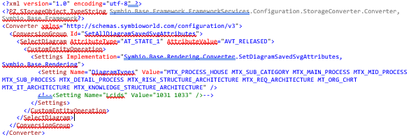

# 6.4 Administration settings - Services

## 6.4 Services

### 6.4.1 Automation

Automation tasks are used for example:
- importing of Active Directory users (useful to have all users in the database at once) 
- running of maintenance database tasks in case of configuration/method changes to avoid an extra Symbio Web update deployment
- rendering and storing of all existing diagrams for better performance especially in viewer mode
- handle events of Symbio using Automation hooks

#### 6.4.1.1 Set up an automation task

1. Please open the menu New, enter a name and click on New.

      

2. You can now describe the automation tasks.

3. Add the automation file to the group Automation actions. You can choose one of the following types:

   a. Task file (XML format): Plugins can be executed

   b. Conversion file (XML format): Here you can change units in the database

#### 6.4.1.2 Requirements for automation tasks via PowerShell etc.

If you do not want to start the automation task via the Symbio surface but via a link like e.g. PowerShell, an authentication token is necessary for the automation task to authorize the caller.

1. Please open the menu New, enter a name and click on New.

      

2. Furthermore, the token must have the appropriate rights. 
Please adjust the application roles in the detail area:

      

3. Due to safety reasons, the validity of the token must be configured, too. 
By default, the validity is 90 days. When the validity of the token has run out, the automation task cannot be started.  

      

      a. If emails are activated, the Symbio Administrator will receive an email as soon as the automation task is started from a new IP address for the first time

      b.	The token can be revoked for an IP address as well

      

#### 6.4.1.3 Run automation object

There are two ways to start an automation object:
- directly in Symbio
- Outside of Symbio via PowerShell, C# or JavaScript

##### 6.4.1.3.1 Run automation object in Symbio

Please click on Run automation to start it directly in Symbio.

##### 6.4.1.3.2 Run automation object outside of Symbio

The group Automation API offers some information for starting the action outside of Symbio. 
1. Automation via PowerShell is started as follows:
Please copy the text you see in the grey PowerShell box in a PowerShell and run it.

      

2. The automation is started and the export file can be downloaded via the closed task.

      a. It is also possible to see the result directly in the PowerShell or export it to save the way to Symbio. For this, the last line in the PowerShell has to be adjusted:

      Invoke-WebRequest -Uri $uri -Headers $headers -Method POST | select -expand Content

      b.	For an export into a file please use:

      Invoke-WebRequest -Uri $uri -Headers $headers -Method POST | select -expand Content | Out-File D:\temp\export.xml

      Note: Please adjust target directory and target file. 
      As the export of larger databases into a separate file can take some time, the default PowerShell TimeOut of 100 should be increased. See c.

      c. For an export from large databases which takes longer than 100 seconds please use:

      Invoke-WebRequest -Uri $uri -Headers $headers -Method POST -TimeoutSec [int]::MaxValue | select -expand Content | Out-File D:\temp\export.xml

3. As soon as the automation task has been started via the token, the IP address of the caller will be saved. In this case it is the local host address (IPv6).

      

#### 6.4.1.4 Examples of automation tasks

##### 6.4.1.4.1 Generating diagram graphics for caching in the database

An automation task can be used to generate diagram graphics for caching in the database. For this, please create an automation task as explained in Fehler! Verweisquelle konnte nicht gefunden werden. and link it to the example “Set_all_diagram_saved__svg_attributes.xml“.

The automation task can now be started as explained above.

Attention: All graphs are generated for all languages and diagrams, which can take a long time depending on the number of diagrams and their complexity. Therefore, it can be useful to generate the diagrams in several steps or only on one part of the diagrams. To do this, edit the task file or connect a customized file to the automation object. 

1. Possible restrictions/subdivisions are: By deleting diagram types in the line:

       <Setting Name="DiagramTypes" Value="MTX_PROCESS_HOUSE MTX_SUB_CATEGORY MTX_MAIN_PROCESS MTX_MID_PROCESS MTX_SUB_PROCESS MTX_DETAIL_PROCESS MTX_RISK_STRUCTURE_ARCHITECTURE MTX_REQ_ARCHITECTURE MT_ORG_CHRT MTX_IT_ARCHITECTURE MTX_KNOWLEDGE_STRUCTURE_ARCHITECTURE" />
      Generating can be limited to specific diagram types

2. By entering and editing the list of LCIDs in line:

       <Setting Name="Lcids" Value="1031 1033" />

      Generating can be limited to specific languages.

3. It is possible to select the diagrams for which the generation is to be carried out. For example, the following task content will be used to generate a generation for all released diagrams:

      

### 6.4.2 Converter

Feature to convert an existing process database (e.g. ARIS) into a Symbio database. Architecture, processes and objects are adopted or dropped according to predefined logic. Please contact us if you consider using that feature.

### 6.4.3 Selection list services

- will be published soon -

### 6.4.4 Storage connections

In case of specific company organizational structures, it is useful to “split” databases. For example, the master database can send released items to a slave database. A HTTPS connection is required.

By distributing data from the master to the slave, standardized contents can be maintained in the master and distributed to the slave DB. To do this, the databases must first be set up and then linked with each other. 

In the admin area under "Database Connections" the administrator creates a new slave database (IMPORTANT THE URL OF THE SLAVE DB AS ID e. g. https://url/Pundz/Slave1). The connection to the slave DB is then requested in Detail Content. In the same view the Admin of the Slave-DB accepts this request and both DBs are linked with each other. All released contents can now be copied to the slavedb by the admin by clicking on "Distribute". All contents of the master DB cannot be edited by the subordinate DBs.

### 6.4.5 Service Hooks

Service hooks are configured callbacks for specific events. The events are defined in Symbio and depend on the service hook type.

#### 6.4.5.1 Application Hooks

In case of an application hook the custom callback is a selected automation task. To create an application hook to the following steps:

1. Open the New menu, enter a name and click on New:

    

2. Define the event. The hook has to be a callback. You can select one of the following events:

    a. Process released

    b. Document released
3. Define the time of the execution, after or before the state change

4. Add the automation task in the Automation tasks group 

Once you have configured the settings the hook is active for the selected event. This means when you release a process all hooks of this event type Process released will be executed parallel during the state change phase.

### 6.4.6 ID Providers

#### 6.4.6.1 Before you start

After successful installation and connection of the ID Provider Service, a table with 2 columns is created in the ID Provider database. In this table, a new entry should be added for each consuming Symbio instance.

Simply use the following statement and replace the colored fields with your data:
insert into enter ID Provider Name.Subscribers (subscriber, token) values (NEWID (),'enter desired token name')

Now note the name of your token from the database and the URL to your ID provider services. For example, if you install the service under 'IDProvider' and create the token named "myToken", the script would look like this:
insert into IDProvider.Subscribers (subscriber, token) values (NEWID (),'myToken')

URL = https://IDProvider.com/
Token = myToken

#### 6.4.6.2 Create ID Provider

Navigate to a database in Symbio. Then click on the cogwheel at the top right into the admin area of Symbio.

Here you will find a tile with the name 'ID Providers'.

Now you are in the overview of your ID provider. Click New and choose a name for your ID provider.

Click on New to create it. In the next step, please select the provider you have created and enter the URL and token from chapter 1.1 on the right side of the detail content.

#### 6.4.6.3 Create ID Provider Configuration

There is a configuration to configure the ID provider, for example, which facets and objects it affects. A configuration is created under the service. Select the service and click on New to create the configuration.

If you select this created configuration, you can define in the detail content how this ID should look like and which facets or objects it concerns.

###### Format:

This item describes how the composite unique ID should look like.
In this field you can use various placeholders to create an individual ID. You will find hints and examples below in the detailed content.

 

To illustrate this, a prefix 'Role-ID-' is selected and '{0}' is set behind it.

Thus, for example, this prefix is always used with each newly created ID for a role, followed by an ascending number.

###### Facet and Type:

You can also configure under "Facet" and "Type" for which facet and underlying object this ID should be generated. For example, roles.

###### Valid for Attribute Type:

The field "Valid for Attribute Type" defines for which attribute this ID is entered in a role. In this example, the created ID is to be written to the ID attribute of the object.

It could also be written in the name field or some others. Clicking on the field displays all options.

###### Allow refresh:

Select this option if you want to allow this ID to be updated automatically after changing the connected objects in the ID.

###### Get ID on Creation:

This option should be selected if you want an ID to be assigned automatically when a new object is created.

#### 6.4.6.4 Last but not least

The configuration of your ID provider is successfully completed by automatically saving and entering all parameters.

Note: The ID provider must be installed separately. Details can be found under the following link:
http://docs.symbioworld.com/content/Articles/UniqueID/install-intro.html

### 6.4.7 Authentication providers

If the user management should be managed by the Microsoft Active Directory, then SAML settings need to be configured here. For SAML and ADFS configuration instructions, please refer to our Symbio Web installation manual and the SAML Check-List.
If the SAML group management is activated, the user’s application roles depend on the SAML user group where the user is member of. If the user is member of more than one group then highest role will win.

