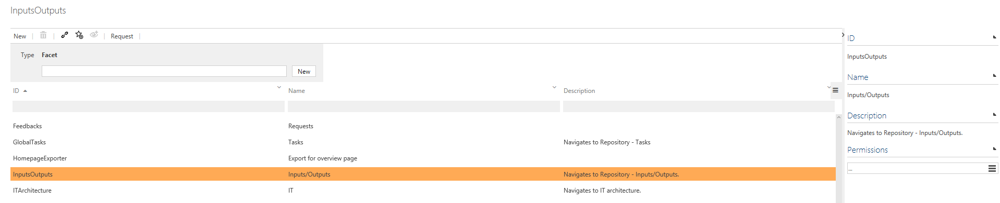
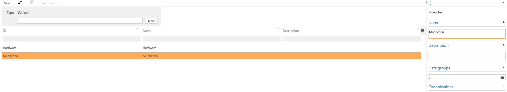
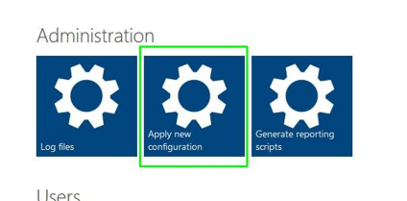
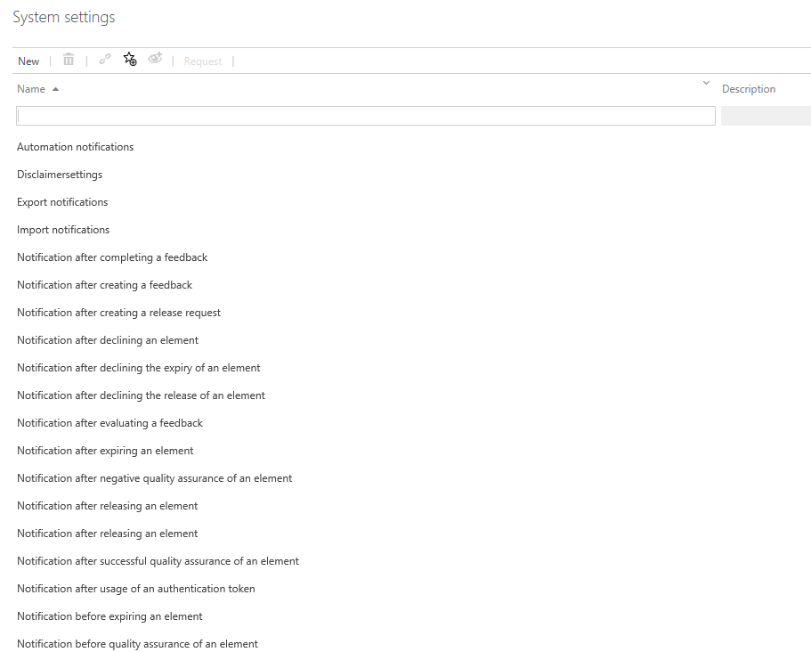
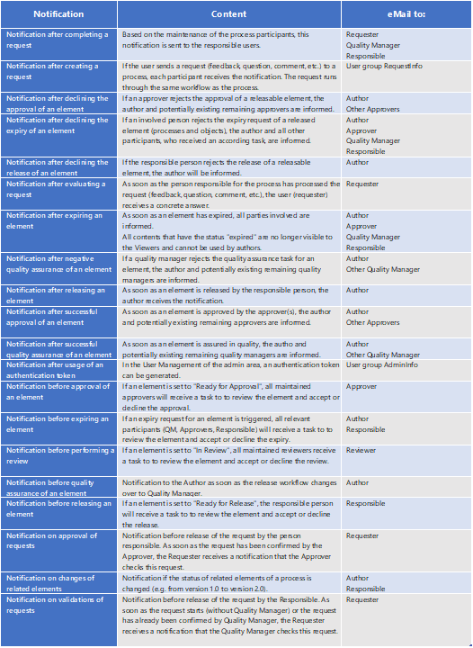
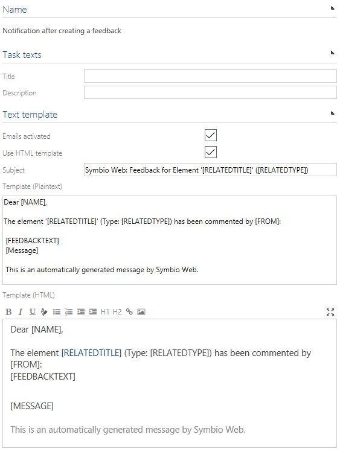
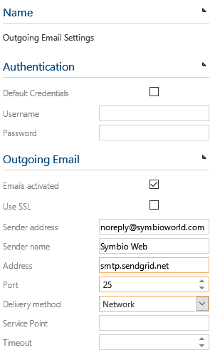
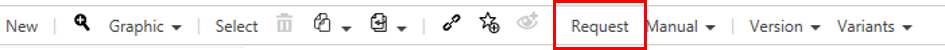
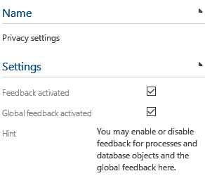
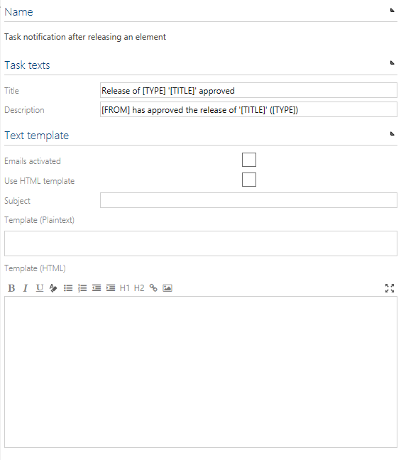

# Settings

## Facets

In Symbio, all Navigations and Sub Navigations are called "facets". They are used to display processes, organization, repository objects, etc. 

It is possible to set permissions so that only specific user groups can add or edit a facet.  

## Variants

Global and local variants are set up via the tile Variants on the administration page.

Additionally, the administrator can define tags via the tile Tags to be used together with variants.

## Tags

Only users with administration rights can create tags. Tags can be used in the user fly out menu to filter processes and repository items in list views (e.g. start page). Existing tags be connected to processes and repository objects.

## Languages

In Symbio, English (1033) and German (1031) are supported. The entire user interface (UI) is localized and the process data culture is activated for both languages. Releasing a process/repository item is only allowed if mandatory attributes are set for both cultures and in case of importing process data only configured cultures will be imported.
English (1033) is the default language.
Other languages can be added as well. It is also possible to remove a language here, except the default language.

Note: If the Symbio installation administrator has activated the translation feature via the Web.config, language-dependent attributes are **NOT automatically translated** online. Please use the Translate button in the Detail Content. The source language corresponds to the user's language settings.

After adding a new language it's required to __apply the new configuration__ so that out-of-the-box JavaScript strings are being compiled. Alternately, a restart of the application pool over night would work as well.

## System settings

The following is a short description of the Symbio system settings.

### Disclaimer settings

The disclaimer is disabled in Symbio default settings. 
Activate the checkbox Disclaimer activated to enable the disclaimer in the header bar and press F5 to refresh the Browser window. 
To add a disclaimer text, please use the disclaimer input box.

### Notifications

Feature to enable the following notifications. Customized mail template text can be configured.

Please note:

- Text can be added or removed
- Elements in square brackets [] should not be changed - copying of these blocks is not supported

Example for notification - notification after creating a feedback:

### Outgoing E-mail settings

Outgoing email settings need to be configured to make use of email task/request notifications. Mandatory fields are highlighted. Nevertheless, username and password for a mail server account should be used under Authentication instead of using an anonymous authentication mode.
Example:

### Privacy settings

The privacy settings currently consist of two settings which can be disabled if company guidelines require it because of work council or other reasons.

a. Request enables the option for users to provide feedback on process elements like main/sub processes and repository items. Even in Viewer mode.

b. Global feedback enables the option to provide general Symbio Web application feedback via survey by using the smiley in header bar.

### Process released notification of external systems

Feature to enable e-mail notifications about tasks. Customized mail template text can be configured.

### Region settings

The region settings are not set in Symbio default settings so the web server´s regional setting (region and time zone) are used. If regional settings are set, then time stamps in the user interface will reflect these, e.g. in attributes of processes or release tasks. The user can still overwrite these settings by setting user-dependent regional settings in the user’s profile in Symbio users management.

### Theme settings

The default Symbio theme can be customized by changing the colors of the header and navigation bars. It is also possible to replace the Symbio logo with your own logo.
To activate new theme settings, please press on Compile button and then press F5 to refresh the browser window to make the changes visible. To reset the theme back to the Symbio theme, press the Reset button.
We recommend, for example, embedding the corporate identity only in the productive database in order to make a clear difference to the testing system.

### SAP WPB connection

Feature to enable a plug-in which synchronizes SAP Workforce Performance Builder eLearning items to Symbio training repository objects. If you consider using this plug-in, please contact us.

### Task notifications

Feature to enable the following notifications about tasks. The notifications are enabled within Symbio and the email setting here has no effect.

- Task notification after completing a feedback
- Task notification after creating a feedback
- Task notification after declining the expiry of an element
- Task notification after declining the release of an element 
- Task notification after evaluating a feedback
- Task notification after expiring an element
- Task notification after negative quality assurance of an element
- Task notification after releasing an element
- Task notification after successful quality assurance of an element
- Task notification after usage of an authentication token
- Task notification before expiring an element
- Task notification before quality assurance of an element
- Task notification before releasing an element
- Task notification on approval of feedbacks
- Task notification on validation of feedbacks

Example for task notification - Task notification after releasing an element:

