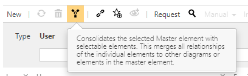

# 6.2 Administration settings - Users

## 6.2 Users

This chapter shows user administration, their assignment to individual user groups and permission sets.

### 6.2.1 User

#### 6.2.1.1 Set up users

By clicking on New, please enter a name for each new user and assign a password to each user (in the Detail Content).
You will also need to define the appropriate user roles for each user in the Detail Content by specifying if the user acts as Viewer, Author and/or Approver.
You can assign a user to a number of user groups.

In the case of an AD connection via SAML users are automatically created with Viewer rights.

#### 6.2.1.2 Consolidate users

Users can be consolidated via the consolidate button: 

In the dialog which then appears, please choose the elements you want to consolidate with the master element and click OK.

The process of consolidating users cannot be reversed.

### 6.2.2 User groups

#### 6.2.2.1 Set up user groups

You set up user groups in the same way as you create users. Click the User groups tile.
After you have created the user group using the New option and have assigned a name to the group, you can select the users for this group in the Detail Content area. Click the hamburger icon on the Users screen to display a list with all users. Select the required users and click OK.

SAML user groups additionally have Application Roles which sets the Application roles of their user/members if SAML group management is activated.

#### 6.2.2.2 Consolidate user groups

Users can be consolidated in the same way es users - via the consolidate button. 

In the dialog which then appears, please choose the elements you want to consolidate with the master element and click OK.

The process of consolidating user groups cannot be reversed.

### 6.2.3 Permissions

Please refer to [Permissions](../permissions/permissions.md)