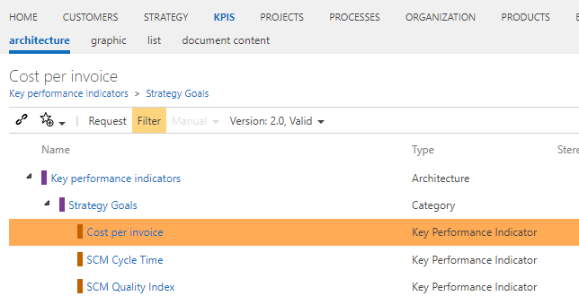

# Method: Key figures as a list (instead of architecture)

With this feature (activated by default), KPI's are - as usual - accessible as a list view in the strategy facet. Deactivating this feature leads to KPI's being available as a separate navigation facet entry "KPIS" in Symbio's navigation bar by removing the existing key figures in the strategy facet from the strategy viewpoint. It also brings an extension of the key figure management and the administration possibility as architecture.

With the new Symbio key figure system an even better control of the company is possible. The new key figure system offers the possibility to map key figures in driver trees (key figure architecture). In a first step, the corporate goals and strategy should be developed in Symbio. The strategy should then be linked to the top KPIs, because top KPIs are connected. By linking the strategy view and the KPI system, customers can establish a balance score card in Symbio and then continuously communicate this to the organization. By continuously measuring the key performance indicators, the achievement of targets is checked and the company can then react to changes at an early stage. Furthermore, the key figures can then be linked to the processes, IT application systems and other views in Symbio. The connection between the goals (the strategy), the key figures and the processes ensures the fastest possible implementation in the organization and for each employee.

The key figures can also be displayed as a profile and linked to the source systems from the IT architecture (IT application systems). Additional objects and new attributes are available.

In addition to the key figure driver tree, reports with report chapters can be displayed. This enables companies to map the business report chapter structure, for example, and link the necessary key figures in the various report chapters. This means that companies will also be able to generate company reports from Symbio in the future. Symbio is thus increasingly digitalizing corporate management.

Our recommendation:
1. Map company goals
2. Derive and define the most important key performance indicators according to the company's goals (strategy) and other company characteristics
3. Then break down the financial figures, e.g. along the structure of the contribution margin calculation
4. Then define the value drivers at the lowest level, which influence the financial key figures
5. The key figures should then be defined as a profile and a responsible person in the company should release this profile
6. It is now important that the key figures are linked to the processes in order to ensure that they can be implemented and measured in everyday life
7. It is important that the goals and key figures are further optimised every 3-6 months and then the processes in the company are also adjusted accordingly.
