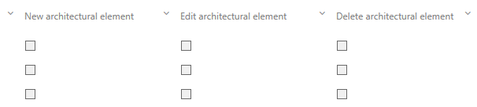

# Architectural permissions

This feature allows to dynamically assgin the role of the Architect to different users for individual areas. 

The Permission set has been extended by __architectural elements__ that can be newly created, edited or deleted. 

Please be aware that existing permissions, especially for Architects and Administrators, may be affected when activating this feature!

See Detail Content of this feature in Symbio Admin area for more details.