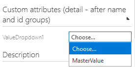
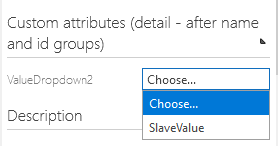
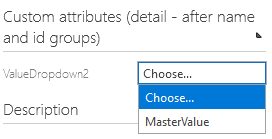

# Consolidation of extended configurations

## Description
With this feature activated, you have the possibility to consolidate two given customizations of the same type to one customization containing the settings of both customizations.

An exemplary use case for this feature is the usage of two identical **custom dropdown values** in two different **dropdown attributes**. You can now select one of the custom **values** as a **'master'** attribute with the other custom **value** as a **'slave'**. Consolidating these to values will result in the **master** overtaking the **attribute types** of the **slave** while the latter is deleted.

As a result, the **master** attribute will now be available on all **attribute types** the **slave** was available on.

### Before

### After

## Supported customizations
At the moment, this feature only supports the **'Add dropdown value'** customization.

## How to
1. Navigate into your **'Extended configurations'**
2. Find two configurations of the type **'Add dropdown value'**
3. Select the master configuration which should take over the valid attribute types of the slave configuration
4. Click the **'Consolidate'** () button in the toolbar
    1. A new dialog will show up, listing all the your customizations once more
    2. Select the slave configuration you want the master configuration to obtain the valid attribute typesfrom
    3. Click on the **'OK'** button
5. The slave configuration should now be deleted while the master configuration should contain the valid attribute types of the slave configuration. As a result, the master element will be available on all valid attribute types the slave was available on.