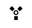

# Consolidation of extended configurations

This feature enables the possibility to consolidate two configurations with the same value into one single configurations with the value.

## Warning
Symbio won't check whether the values of the configurations you want to consolidate are identical. To prevent the loss of a configuration, you have to ensure the values are identical by yourself.

## How to
1. Navigate into your **'Extended configurations'**
2. Find two elements which are identical
3. Select one of the two elements
4. Click the **'Consolidate'** () button in the toolbar 
    1. A new dialog will show up, listing all the your customizations once more
    2. Select the second element with which you want selected element to consolidate with
    3. Click on the **'OK'** button
5. One of the elements should now disappear while the selected elements still remains