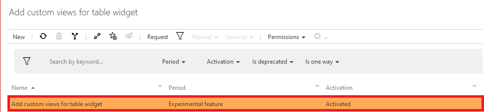
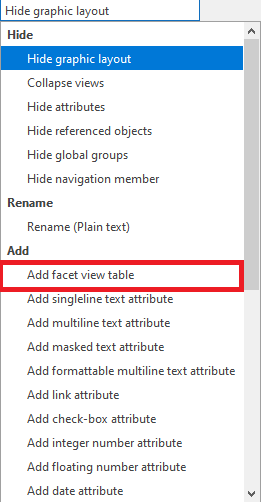
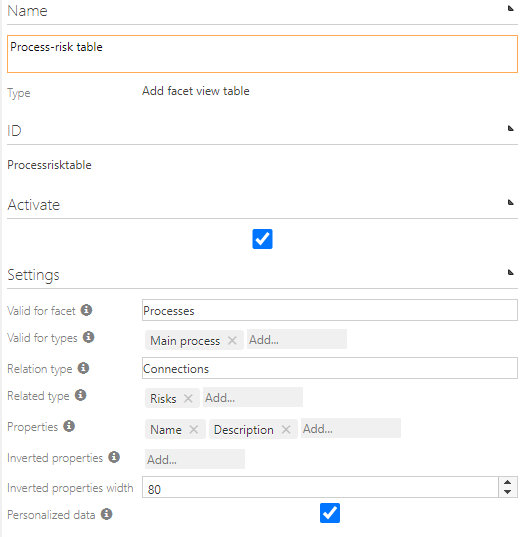
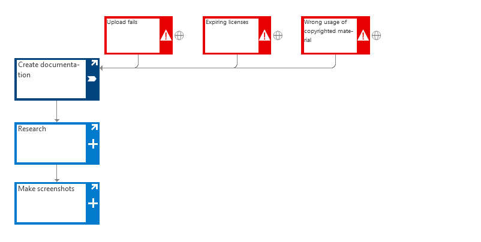
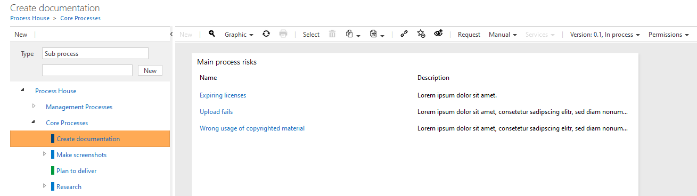
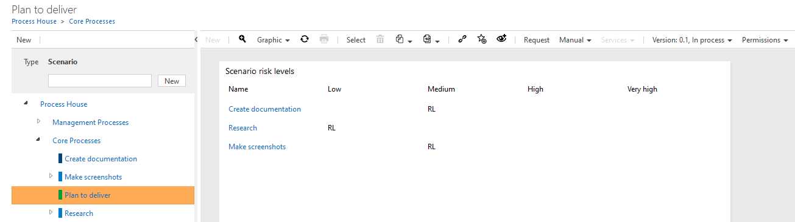

# Create a custom view for your table widget

Activating this feature enables the Author to create a customized table widget using fact sheets. If activated, you will be able to to create a new facet view table which can be used to display data withing a table widget.

To see further information regarding fact sheets, refer to the  [fact sheets documentation](../../../administration/fact-sheets/creating-factsheets.md).

## Activate feature
To see how you can activate a feature in general, please refer to the general documentation for [activating features](http://symbio-documentation-public-preview.azurewebsites.net/admin/administration/storage-configuration/storage-configuration/#features).

In this case, search for the feature with the name **'Add custom views for table widget'** as you can see in the screenshot below.

## Add the new customization

### Create customization
To see how to create a new customization in general, please refer to the general documentation for [creating customizations](../../../administration/storage-configuration/storage-configuration.md).

Create a new customization by selecting the **'Add facet view table'** type in the type dropdown. You can now chose a custom name for your new facet view table customization like you can see in the screenshot below.

### Configuration of the facet view table
Once you have created the new facet view table configuration, you are able to configure the facet view table in the detail content on the right while the configuration is selected.

The settings you can see are described in detail below. Please note that the values you select depend on the ones above. With that said, changing one of the above values, will have direct impact of the values you can select below.

#### Valid for facet / valid for types

The selection field **'Valid for facet'** describes for which facets the new customization is available. Dependent on that, **'Valid for types'** will change dynamically to the available types in the facet. Please note that you can select multiple values here.

#### Relation type / Related type

The selection field **'Relation type'** lets you choose between **'Connections'** und **'Content'**. 

##### Relation type: Connections
Connections are available on most of the given types you can select. It describes the relation of the element to the related type.

##### Relation type: Content
The selectable value content describes the content of the selected element. For example, if you selected a scenario as type and the scenario contains main process interfaces, the main process will be listed as content of the scenario

#### Related type

The selection '**Related Type**' depends on the Relation Type you selected earlier. Here you can either see the elements which are connected to the valid types **or** the elements which are contained in the valid type.

### Properties
Here you can select the properties of the the related type you would like to see in the table widget

### Inverted properties
Similar to properties, you can see the properties of the related type you would like to see. With the difference, that values of the property are listed as columns.

Once you have configured all the values inside of your cusomization, please remember to activate the customization and to click on **'Apply changes'** in the toolbar.

## Configure the fact sheet

After the successful configuration of the facet view table customization, you can proceed with the configuration of the actual fact sheet. For further information regarding the configuration of fact sheets in general, please visit the documentation entry for [fact sheets](../../../administration/fact-sheets/creating-factsheets.md).

### Procedure of the configuration

1. Navigate into the fact sheets facet in the administrative area of Symbio
2. Create a new fact sheet
3. Select the fact sheet
4. In the group **'Type settings'**, select the facet and type for which the fact sheet is available
5. Refresh the site
6. Select the **'New'**-Button in the toolbar of the graphics view
    1. In the dialog which opens up, select **'Table widget'**
7. Select the new created table widget
8. In the **'Table widget settings'** select the table type **'Facet views'**
9. In the **'Facet view settings'** group:
    1. Select the facet your customization is valid for
    2. In the facet views selection, select your newly created customization
10. The new table widget has been created now successfully

## Show the configured table widget

Implied that you were able to proceed this far without any trouble, you can now take a look at your configured widget.

1. Navigate to the facet you configured your table widget for (e.g. **'Processes'**)
1. Make sure you are located in the **'graphic'** view
1. Create a new element of the type you enabled the fact sheet for or select an already existing element
    1. Enter some of the properties you enabled the customization for if not already done(e.g. KPI, Risk level or similar)
1. Select the created or existing element
    1. In the toolbar, select the **'Graphic'**-button
    1. In the dialog which opens up, select the table widget which you created earlier
1. You should now see the configured table widget with the configured values inside

