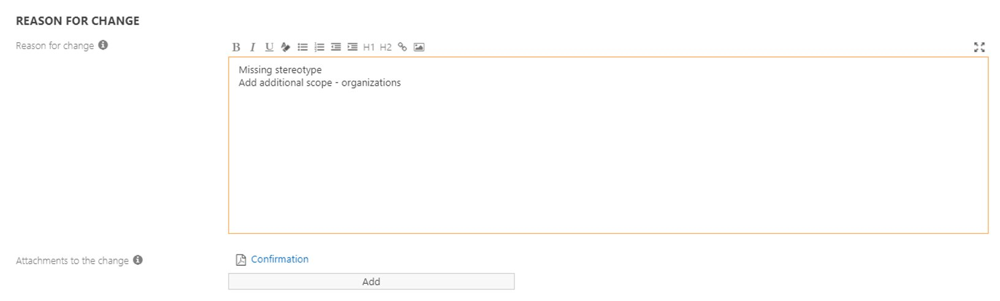
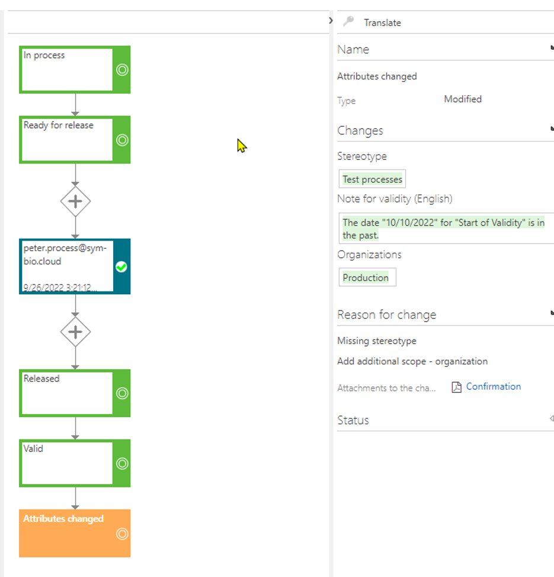

By activating the feature “Release cycle: Reason for change and attachments when editing attributes” Administrators and Architects must add a description for the change of  the attributes in the “Edit attributes” dialogue and can add an attachment containing for example, a confirmation for the performed change.​

- The performed changes are documented in the release cycle​

