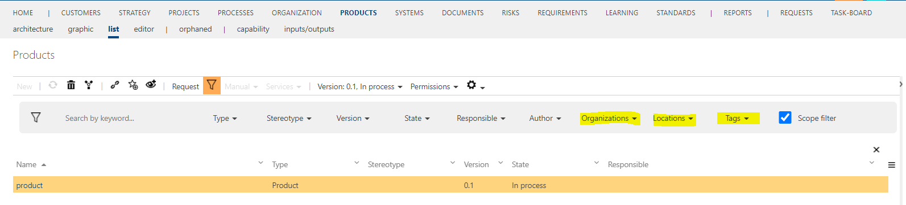

# Extended filter bar: individual scope filter selection

This feature extends the filter bar in both all BPMN lists and in the global search. 

There are three new filter drop downs which allow to filter for special scope filter criteria: Organization Filter, Location Filter and Tags Filter.

If you have already set a global scope filter in the header and the option "Scope Filter" is activated in the filter bar, the content of the dropdowns may not match the currently available (filtered) data. This should be considered when using the Scope Filter dropdowns.

