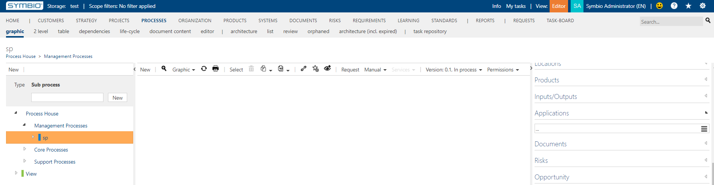

# Method: hide secondary application connections as inputs and outputs feature

With this feature activated secondary application connection will be hidden. 

For example secondary applications will be hidden on sub processes like in the image below:

