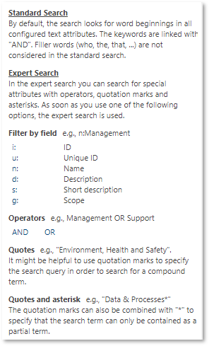

# Keyword search

With this feature, it is possible to search for keywords, case insensitive. Search items can be entered with wildcards (in front or behind) or just seperated by whitespaces. Known default search functionalities, e.g. Filter by field or search by AND/OR operators, remain unchanged.

This feature aims to improve performance. 

