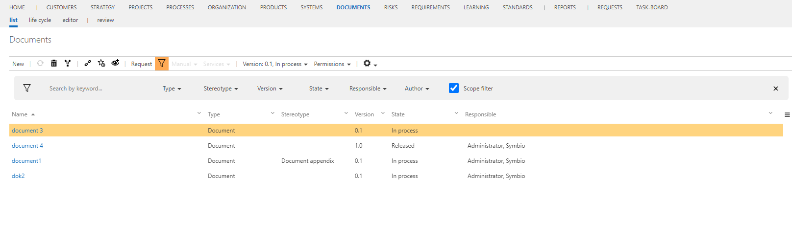

# Method: Documents as a list (instead of architecture)

With this feature, the Document facet has only a list view. The creation of document categories is not necessary any more. Structuring can be done by setting structuring attributes like stereo types. The filter and search functionalities which are available by default in the list view, helps finding relevant documents, without using a structure. 
Besides it is not necessary any more, to clean up the document structure, when a lot of document items are created by process authors, because the orphaned view is not needed any more. 

The existing structure of documents (the document categories) is still available in the background, but it is not shown any more. 
If the feature is deactivated again, the items are shown in the architecture as before. 

This feature should not be activated if there are any dependencies to external interfaces which use the document architecture or if the feature "Subscriptions on categories" is activated.

