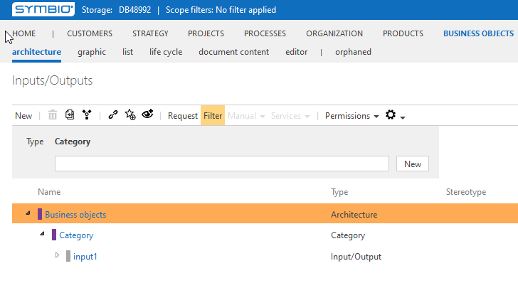

# Method: Inputs/Outputs as a list (instead of architecture)

With this feature (activated by default), inputs outputs are - as usual - accessible as a list view in the products facet. 
Deactivating this feature leads to inputs outputs being available as a separate navigation facet entry "Business Objects" in Symbio's navigation bar.
Existing inputs outputs are available in the orphaned view and can be moved to categories created in the newly available architecture.

