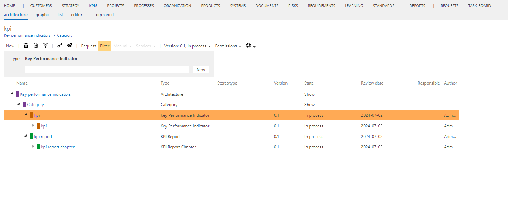

# Method: KPIs as a list (instead of architecture)

With this feature (activated by default), KPIs are - as usual - accessible as a list view. 
Deactivating this feature leads to KPIs being available as architecture, and 2 new element types are available, KPI Report, and KPI Report Chapter
Example of architecture is seen in the image below.

