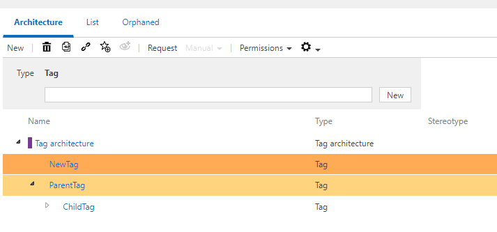

# Method: Tags as a list (instead of architecture)

With this feature (activated by default), Tags are - as usual - accessible as a list view in the Admin panel. 
Deactivating this feature leads to Tags being also available in the Architecture and Orphan view in addition to the existing list view.
The architecture and list views are also available when assigning the Tag filter as well as when assigning the scope filter it self.

