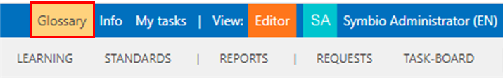
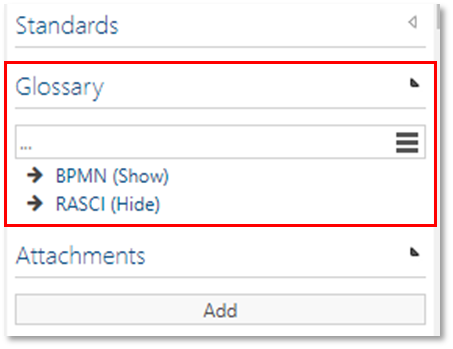

# Method: Glossary

This feature enables the creation of an individual glossary to centrally store the terms used in the process database and to add explanations and further details. 

After activation the navigation __Glossary__ appears in the header. 

Clicking on it opens a list in which glossary entries can be made by Authors. Entries in this list are not versionable, but can be shown or hidden for Viewers.

The stored glossary terms are then linked in Detail Content of processes or objects as common in the corresponding category.

