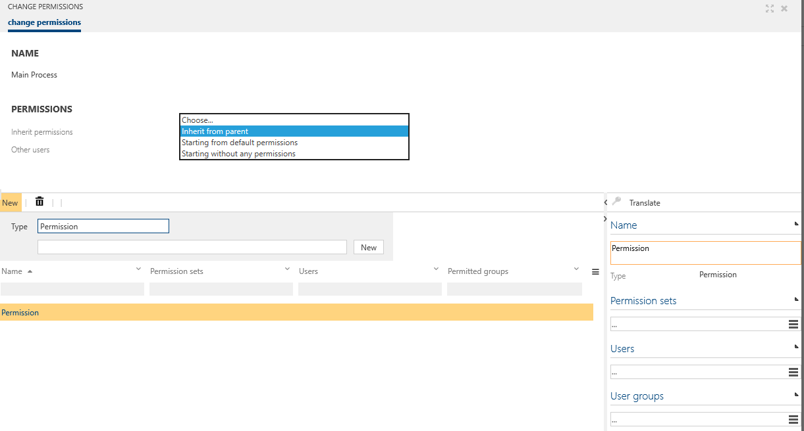

# Permissions maintenance extension

Please note that this feature can only be activated once (__Is one way__)!

By this new feature, the assignment of permissions is made more comfortable. The permissions are granted directly at the process or object itself - and not via the User Groups and their Permission sets assigned before. 

Please refer to [Permissions maintenance extension](https://docs.symbioworld.com/admin/administration/permissions/permissiions-maintenance-extension/) for more details.