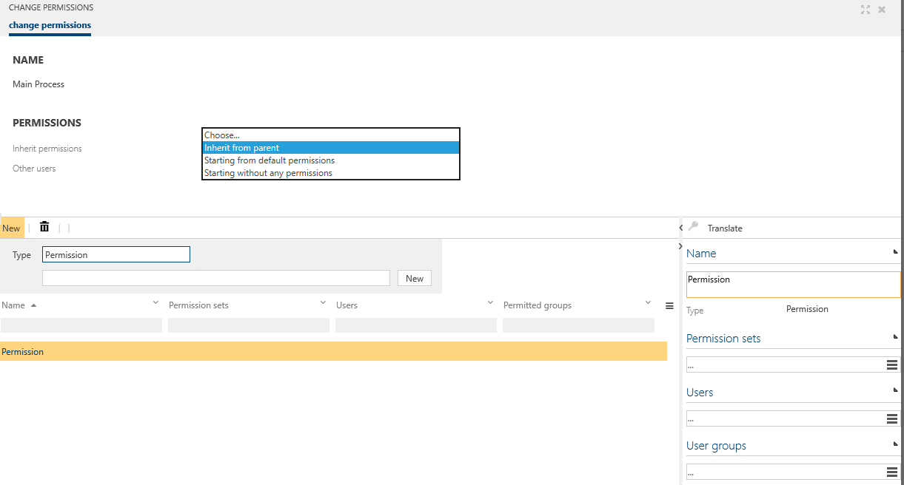

# Permissions for objects made more flexible (Preview feature)

Please note that this feature can only be activated once (__Is one way__)!

By this feature, the assignment of permissions is made more comfortable and flexible. The permissions are granted directly to users and user groups at the process or object itself.  

The Facet permission feature and the Architectural Permissions feature remain unaffected and may be activated separately if required.

Please refer to [Permissions maintenance extension](https://docs.symbioworld.com/admin/administration/permissions/permissions-maintenance-extension/) for more details.