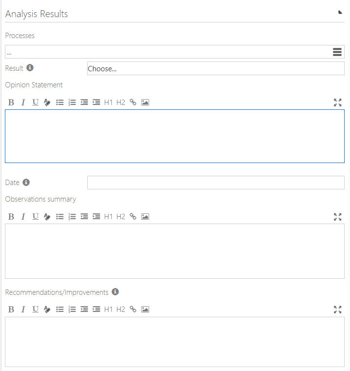
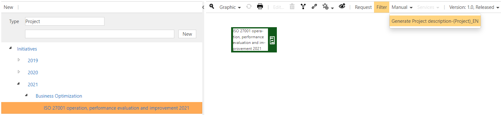

# Project process analysis document template

The *project* repository object has recently been extended to store analysis attributes (e.g. fom an *kai zen* project or an *ISO* project), as it can be seen in the image:

The *document template* for *project process analysis* has been designed to integrate all these extensions into a generated document.

The *document template* for *project process analysis* can be called via any *project* repository object, as it can be seen in the image:

