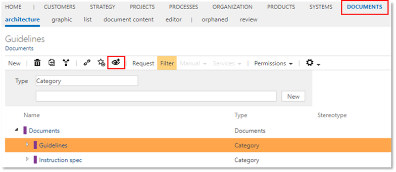

# Subscriptions for categories

This feature allows to subscribe to a ‘Category’ of the DOCUMENTS facet. In case of any new release of a document in this category, the user will be automatically notified by eMail - which corresponds to the usual behavior of the favorites function. However, if documents are only moved within the hierarchical structure, no notification is triggered. This feature is currently only applicable for document categories.  

