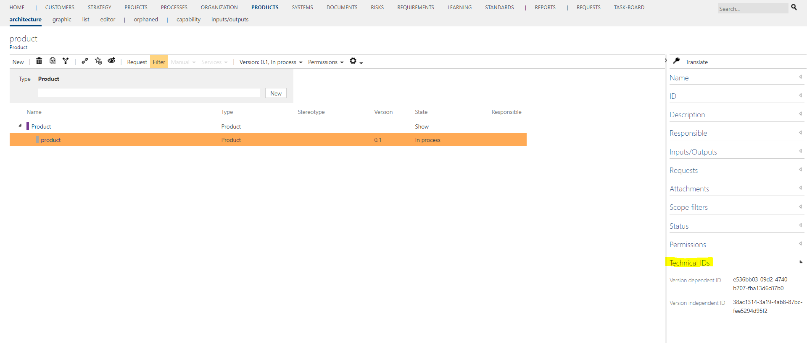

# Method: show technical IDs

This feature affects all versionable entities. After activation a new group "Technical IDs" is shown in the detail content. It contains the version independent id (Container ID) and the version dependent ID (Version ID) of each versionable item.

Both attributes are hiddenable, group and attributes are renameable.

This information is for example useable for synchronizing data between other applications and Symbio. 

