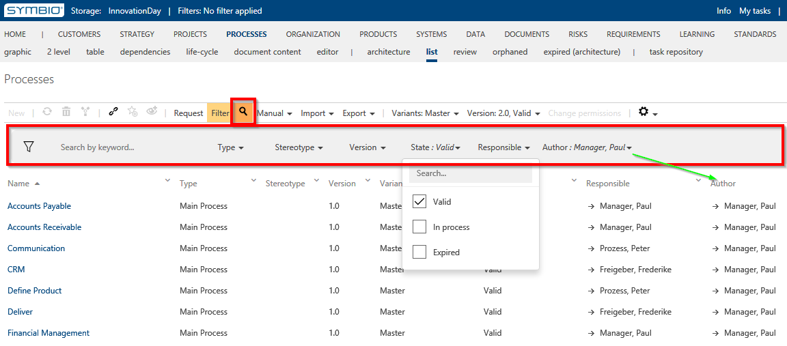

# Filter function: Filter by users (Released feature)

With this feature, Users can easily search for specific attributes (name, type, version etc.) in all list views. 

The filtering is activated through the magnifying glass in the toolbar.  

