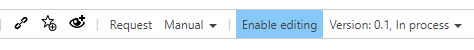

# Activate exclusive process editing

Please note that activating this feature causes a change in the common modelling procedure!

This is to prevent multiple Authors from editing a Main or Sub Process at the same time.  

Before process modelling can be started, the blue button __Enable editing__ has to be activated. If the selected process is already locked by another user, an error message occurs - but the modelling can still be taken over.

   

During this time, the process is read-only for the other users, whereas possibly assigned permission rights remain unaffected.

When the process modelling is completed, the blue button is to be clicked again, which has now been changed into __Disable editing__.
