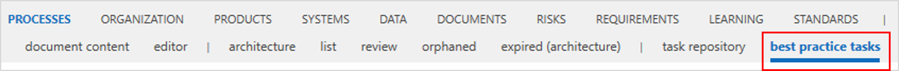

# Best practice tasks

_Best practice tasks_ are repository objects belonging to the _Processes_ facet.
By activating this feature, the sub navigation 'best practice tasks' is shown under the _Processes_ facet:

 _Best practice task_ can be connected to the _Task_ shape in process designer. This is a 1 to 1 relationship, meaning that only one _Best practice task_ is allow to be connected to the one _Task_.
 When connected to the _Task_, in the detail content of a _Task_, user can also see the _Application_ and _Application_ services connected to _Best practice task_.

Currently _Best practice tasks_ are used by **SAP Solution Manager Connector interface** and **Celonis Importer** service.

## Usage of Best practice tasks in SAP Solution Manager Connector interface

 In the use case of SAP Solution Manager interface, ***Process Step Originals*** from the connected SAP Solution Manager branch will be imported via the SAP Solution Manager Connector interface. Once imported they are available in Symbio and can be referenced to a process _Task_. Imported _Best practice tasks_ have a stereotype 'SAP Best Practice', they are in a 'Released' and read-only state and therefore editing or removal of such _Best practice tasks_ is not possible.

For more details, please refer to chapter [SAP Solution Manager Connector](https://docs.symbioworld.com/admin/services/sap-solution-manager-connector/Introduction_Overview/).  

## Usage of Best practice tasks in Celonis Importer

In the use case of Celonis Importer, the ***Celonis Activities*** will be imported as _Best practice tasks_ in Symbio. Once imported they are available in Symbio and can be referenced to a process _Task_. Imported Best practice tasks have a stereotype 'Celonis Activity', they are in a 'In Process' but read-only state. That means that the editing is prohibited, but the removal of these elements is allowed.

For more details, please refer to chapter [Celonis Importer](https://docs.symbioworld.com/admin/services/celonis-importer/usage/).
