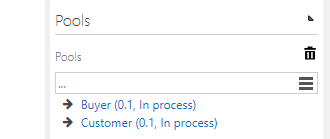
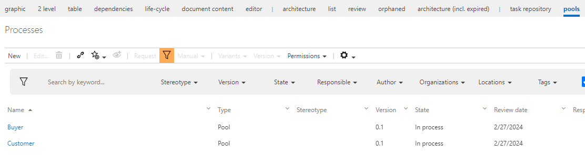

# Method: BPMN Pools
By activating this feature in _Business Manager_ there will be a new facet view _"Pools"_ available for you which allows you to create releasable pool objects.
These pools can then be assigned to processes and being given an order, after that you can assign any of these maintained pools to the flow objects (e.g. tasks, events) of the process.

####Hint:
The graphical representation of these pools can be seen in the new layouts created for the _Business Navigator_ (See [Diagram: External Layouting](../external-layouting/external-layouting.md) for details on the feature).

   
 